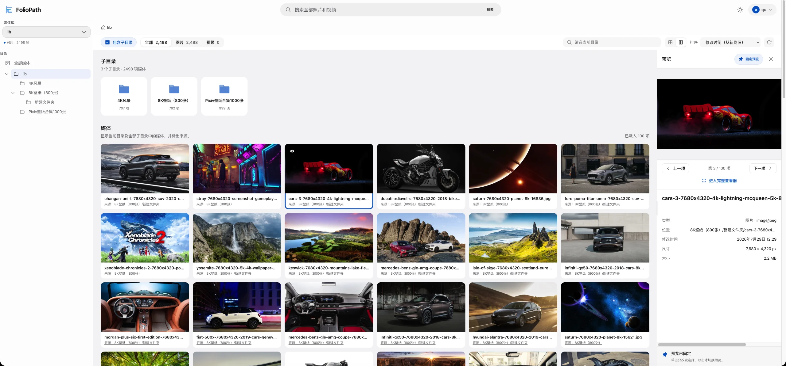
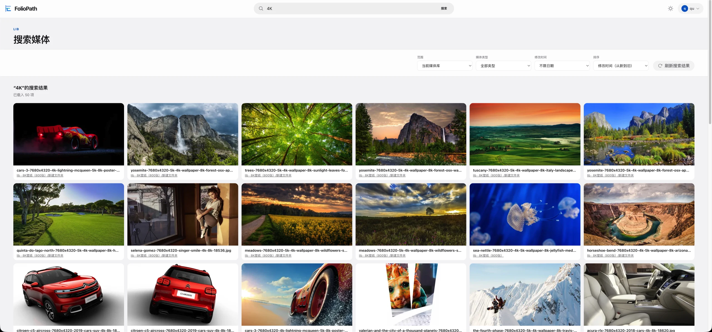
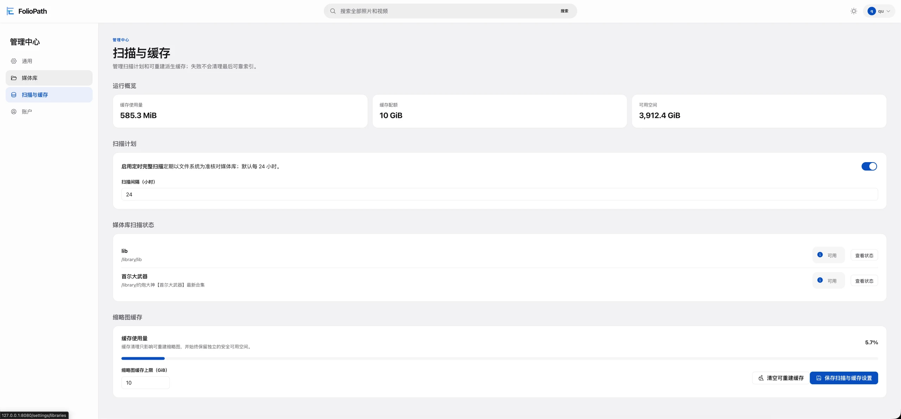
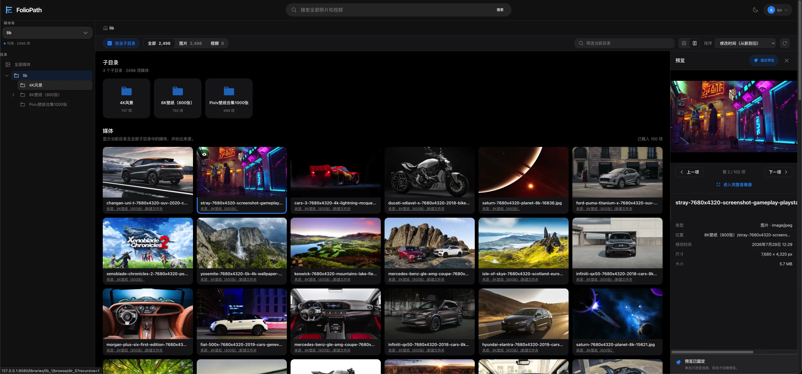

# FolioPath

<p align="center">
  <a href="README.zh-CN.md">简体中文</a> · <strong>English</strong> · <a href="CHANGELOG.md">Changelog</a>
</p>

<p align="center">
  
</p>

<p align="center">
  <strong>📚 A read-only, self-hosted media browser built for browsing photo sets</strong>
</p>

<p align="center">
  No imports. No reorganization. Browse complete photo and video sets through the folders you already have.
</p>

<p align="center">
  <a href="LICENSE"></a>
  <a href="https://hub.docker.com/r/evanqu/foliopath"></a>
  
</p>

FolioPath is for people who already organize folders by **project, trip, event, person, or date**.
It reads the existing directory tree and lets you browse a folder and all its descendants as one
complete set—without re-uploading files, creating albums, or changing your archive.

## 🖼️ Preview

### 🏠 Home



### 🔍 Search



### ⚙️ Administration



### 🌙 Dark Mode



## ✨ Better Browsing for Complete Sets

- **Browse through subdirectories:** See a complete set without opening every folder.
- **Keep source paths visible:** Know where each item came from in aggregated views.
- **Pin the preview:** Keep one item visible while selecting and comparing similar shots.
- **Grid and masonry layouts:** Adapt to mixed dimensions, orientations, and large libraries.
- **Search and filter:** Find media by filename, path, type, date, and scope.
- **Full viewer:** Zoom, pan, view at 1:1, move between items, enter fullscreen, and play video.

## 🛡️ Your Originals Stay Original

- `/library` is read-only: FolioPath never moves, renames, edits, or deletes your media.
- The filesystem is the source of truth; indexes, thumbnails, and video posters are rebuildable.
- Multiple non-overlapping libraries retain their existing hierarchy, including empty directories.
- If a library goes offline or a scan is interrupted, FolioPath preserves the last reliable index.
- A single-container, single-process SQLite design fits NAS devices, home servers, and personal archives.
- Direct concurrency settings bound combined background work and original-media reads within safe server limits.

## Supported Media

| Type | Formats |
| --- | --- |
| Images | JPEG (`.jpg`, `.jpeg`), PNG (`.png`), WebP (`.webp`), GIF (`.gif`) |
| Video | MP4 (`.mp4`), MOV (`.mov`), MKV (`.mkv`), AVI (`.avi`) |

Videos are never transcoded. Direct playback depends on the codecs supported by your browser.
FolioPath still preserves posters and file information for incompatible media.
SVG, HEIC/HEIF, AVIF, and RAW are not currently supported.

## 🚀 Quick Start

You need Linux on `amd64` or `arm64`, Docker, and Docker Compose v2.

Create an empty directory, save the following as `compose.yaml`, and change `/mnt/photos` to your
media directory:

```yaml
services:
  foliopath:
    image: evanqu/foliopath:latest
    restart: unless-stopped
    environment:
      TZ: Asia/Shanghai
    ports:
      - "8080:8080"
    volumes:
      - /mnt/photos:/library:ro
      - ./data:/app/data
```

Start FolioPath:

```bash
docker compose up -d
```

### Configuration

| Setting | What to change |
| --- | --- |
| `image` | `latest` is the simplest start. Pin a version tag or digest for controlled upgrades. |
| `restart` | `unless-stopped` restarts FolioPath after a failure or host reboot unless you stopped it manually. |
| `TZ` | Set your timezone, for example `Asia/Shanghai`. |
| `ports` | Change the left-hand `8080` to select the host port, for example `"9000:8080"`. |
| `/mnt/photos:/library:ro` | Replace `/mnt/photos` with the one host directory containing your media. Keep `/library:ro` unchanged. |
| `./data:/app/data` | Docker automatically creates this directory for the database, settings, jobs, and cache. Back it up before upgrades. |

Open `http://<your-server-LAN-address>:8080`, create the administrator account, and choose the
directories to browse under **Administration → Libraries**.

> Direct HTTP is intended for a trusted LAN. For public access, put FolioPath behind external HTTPS
> termination and appropriate access controls.

## 🧭 Is FolioPath for You?

**A good fit:** folder-based photo sets, photography archives, family media, NAS libraries, and
anyone who does not want an application to take ownership of original files.

**Not a fit:** photo backup and phone sync, multi-user albums, AI face recognition, image editing,
or video transcoding.

## 📖 More Documentation

- [Advanced deployment, `.env` overrides, upgrades, backup, and reverse proxy](docs/deployment.md)
- [Security and filesystem boundaries](docs/security.md)
- [Project documentation and development entry point](docs/README.md)
- [System architecture](docs/architecture/README.md)

## License

[GNU Affero General Public License v3.0 or later](LICENSE) (`AGPL-3.0-or-later`)

---

<p align="center">
  <strong>Your folders, beautifully browsed.</strong>
</p>
