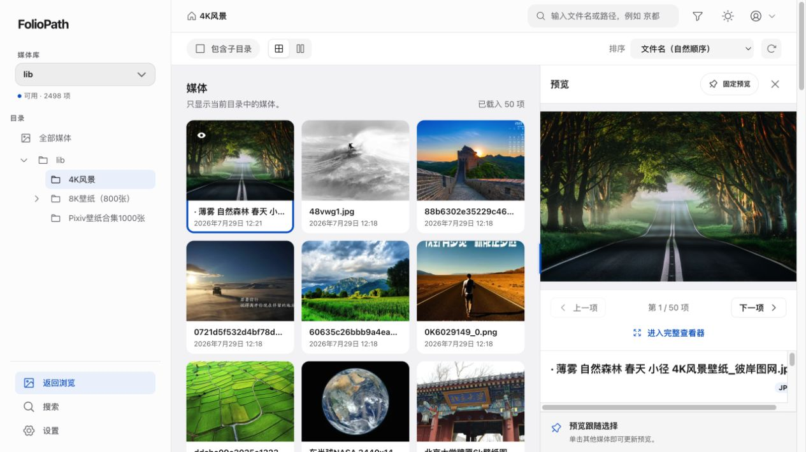

# FolioPath

<p align="center">
  
</p>

<p align="center">
  <strong>不导入，不重组。沿着你的文件夹，自由浏览所有照片和视频。</strong>
</p>

<p align="center">
  面向 NAS、家庭服务器和个人媒体归档的只读、自托管媒体浏览器。
</p>

<p align="center">
  <a href="LICENSE"></a>
  <a href="https://hub.docker.com/r/evanqu/foliopath"></a>
  
</p>



你的照片已经按年份、旅行、家人和设备整理在文件夹里，不应该为了“方便浏览”再上传一遍、
复制一份，或者交给另一个系统重新组织。

FolioPath 直接读取现有目录结构，让文件夹继续做文件夹，同时补上适合大媒体库的现代浏览体验。

## 两个真正改变浏览体验的功能

### 穿透子目录：不用一层层点进去

在任意目录打开 **“包含子目录”**，即可一次浏览该目录和所有后代目录中的媒体。

- `旅行/日本/京都`、`旅行/日本/东京` 可以汇总在同一个视图里。
- 每个结果仍显示来源路径，随时可以回到它真正所在的文件夹。
- 递归视图默认按修改时间倒序，更适合回看一整段旅程或多年的归档。
- 目录、递归范围、筛选和排序都保存在 URL 中，刷新、前进后退或复制地址不会丢失现场。

你保留了文件夹的秩序，也获得了跨层级浏览的自由。

### 固定预览：看着一张，继续挑下一张

点击媒体时，预览停靠在列表旁边，不会用遮罩盖住整个页面。找到想认真看的内容后，可以
**固定预览**：

- 固定后，单击其他媒体只改变选择，不会打断当前图片或视频。
- 双击才切换预览，适合边看、边比较、边继续浏览。
- 列表仍可滚动、筛选和切换目录；视频在固定期间可以继续播放。
- 取消固定后，预览重新跟随当前选择。

这尤其适合挑照片、比较相似镜头、浏览长视频列表，或者暂时把一张参考图留在旁边。

## 为什么选择 FolioPath

| 你关心的事 | FolioPath 的做法 |
| --- | --- |
| 不想迁移现有媒体 | 直接扫描现有目录，不要求导入、上传或重建相册 |
| 担心软件改坏原文件 | `/library` 只读；不移动、不重命名、不编辑、不删除媒体 |
| 文件散落在多层目录 | 保留完整目录树，并支持穿透全部后代目录浏览 |
| 想快速查看又不想离开列表 | 非模态预览、固定预览和完整查看器分层配合 |
| 媒体库很大 | 游标分页、虚拟化列表、有界扫描和后台缩略图任务 |
| NAS 性能有限 | 单容器、单进程、SQLite，缓存有配额并可安全重建 |
| 服务偶尔离线 | 不把离线误判为空库，保留最后可靠索引 |
| 希望全家局域网可用 | 内建单管理员认证，支持受信局域网直接访问 |

## 你会得到什么

- 多个互不重叠的媒体库，共用一个只读媒体根。
- 忠实的目录树，包括空目录、直接媒体数和递归媒体数。
- 自适应网格与可记忆的瀑布流布局。
- 当前目录过滤，以及图片、GIF 和视频类型筛选。
- 按文件名和相对路径搜索，可切换当前目录、当前媒体库或全部媒体库范围。
- 图片缩放、平移、1:1、前后切换、全屏和基本文件信息。
- 视频封面、原文件 HTTP Range 播放和不兼容编码的明确提示。
- 自动、定时和手动扫描；失败、取消或部分不可读时保留可靠索引。
- 可配置的缩略图缓存配额、用量摘要和 LRU 清理。
- 简体中文与英文、浅色与深色主题、桌面侧栏和移动端目录抽屉。
- 键盘操作、可见焦点、语义控件和减少动效支持。

## 适合与不适合

FolioPath 适合：

- 已经用文件夹整理照片和视频的人。
- 希望在 NAS 或家庭服务器上获得快速 Web 浏览体验的人。
- 不希望媒体管理软件接管、改名或移动原文件的人。
- 需要跨多层目录回看、筛选和比较媒体的人。

FolioPath 不是：

- 照片上传、备份或手机自动同步服务。
- 多用户分享、公开相册或权限协作平台。
- AI 人脸识别、语义分类、地图或时间线工具。
- 视频转码或自适应码率流媒体服务器。
- 图片编辑器、RAW 工作流或完整 EXIF 管理器。

## Supported Media / 支持的媒体

| 类型 | 扩展名 | 当前行为 |
| --- | --- | --- |
| 图片 | `.jpg`、`.jpeg`、`.png`、`.webp` | 索引、元数据、缩略图和原图查看 |
| 动图 | `.gif` | 静态缩略图和原文件动画播放 |
| 视频 | `.mp4`、`.mov`、`.mkv`、`.avi` | 元数据、封面、HTTP Range 原文件播放 |

扩展名匹配不区分大小写。视频不会转码，因此实际播放能力仍取决于浏览器是否支持文件内部的
音视频编码；不兼容内容会保留封面和信息，并显示明确原因。

SVG、HEIC/HEIF、AVIF 和 RAW 暂不属于支持范围。

## 快速开始

### 前置条件

- Linux `amd64` 或 `arm64`
- Docker 与 Compose v2
- 一个可以只读提供给 FolioPath 的共同媒体目录
- 一个位于可靠本地文件系统上的可写数据目录

### Docker Compose（推荐）

创建工作目录并下载官方 Compose 配置：

```bash
mkdir -p foliopath/foliopath-data
cd foliopath

curl -fsSLO https://raw.githubusercontent.com/HappyQuQu/foliopath/main/compose.yaml
curl -fsSL https://raw.githubusercontent.com/HappyQuQu/foliopath/main/.env.example -o .env

sudo chown -R 65532:65532 foliopath-data
chmod 750 foliopath-data
```

打开 `.env`，把媒体目录改成你自己的路径：

```dotenv
FOLIOPATH_IMAGE=evanqu/foliopath:latest
FOLIOPATH_LIBRARY_PATH=/mnt/photos
FOLIOPATH_DATA_PATH=./foliopath-data
FOLIOPATH_BIND_ADDRESS=0.0.0.0
FOLIOPATH_PORT=8080
TZ=Asia/Shanghai
```

启动 FolioPath：

```bash
docker compose up -d
docker compose ps
```

在浏览器打开：

```text
http://<服务器局域网地址>:8080
```

首次打开会引导你创建管理员。随后进入“管理中心 → 媒体库”，从 `/library` 中选择需要
浏览的目录；FolioPath 会自动开始扫描。

常用命令：

```bash
# 查看日志
docker compose logs -f foliopath

# 更新镜像
docker compose pull
docker compose up -d

# 停止
docker compose down
```

### Docker

不使用 Compose 时：

```bash
mkdir -p ./foliopath-data
sudo chown 65532:65532 ./foliopath-data
chmod 750 ./foliopath-data

docker run --detach \
  --name foliopath \
  --restart unless-stopped \
  --user 65532:65532 \
  --read-only \
  --security-opt no-new-privileges:true \
  --cap-drop ALL \
  --tmpfs /tmp:rw,noexec,nosuid,size=16m,uid=65532,gid=65532,mode=0700 \
  --env FOLIOPATH_LISTEN=0.0.0.0:8080 \
  --env TZ=Asia/Shanghai \
  --publish 8080:8080 \
  --volume /mnt/photos:/library:ro \
  --volume "$(pwd)/foliopath-data:/app/data" \
  evanqu/foliopath:latest
```

把 `/mnt/photos` 换成你的媒体根目录。只在本机或同机反向代理后使用时，把端口参数改为
`--publish 127.0.0.1:8080:8080`。

建议在受信局域网中使用；需要公网访问时，请在外部配置 HTTPS 反向代理和访问控制。
备份、恢复、固定版本升级和反向代理配置参阅[部署文档](docs/deployment.md)。

## 文件与数据边界

```text
宿主机媒体目录  ──只读──>  /library
                                  │
                                  ├── 家庭照片/
                                  ├── 手机备份/
                                  └── 工作素材/

应用数据库与缓存 ──可写──>  /app/data
```

- `/library` 是唯一媒体挂载目标，下面只能是普通目录，不能再嵌套其他挂载点。
- 管理员可以在 `/library` 下选择多个互不重叠的目录作为媒体库。
- 删除媒体库只删除配置、索引、任务和派生缓存，不会删除原文件。
- 媒体根暂时不可读时会标记为离线，旧索引继续保留。
- SQLite、设置、扫描状态和缓存保存在 `/app/data`。
- 缩略图和视频封面是可重建缓存，不是原始媒体。

FolioPath 在 Linux 上使用 `openat2` 将媒体访问锚定在 `/library`。如果运行环境无法提供所需
安全边界，应用会失败关闭，不会自动退回较弱的路径检查。详细说明见
[安全模型](docs/security.md)。

## 开发与贡献

后端使用 Go、SQLite、libvips、FFmpeg；前端使用 React、TypeScript、Vite、TanStack Query
和 TanStack Virtual。Go API 与 React SPA 由一个非 root 容器、一个 HTTP 进程交付。

开发入口见[项目文档](docs/README.md)、[系统架构](docs/architecture/README.md)和
[贡献约束](AGENTS.md)。

## 许可证

FolioPath 使用
[GNU Affero General Public License v3.0 or later](LICENSE)（`AGPL-3.0-or-later`）。

---

<p align="center">
  <strong>Your folders, beautifully browsed.</strong>
</p>
