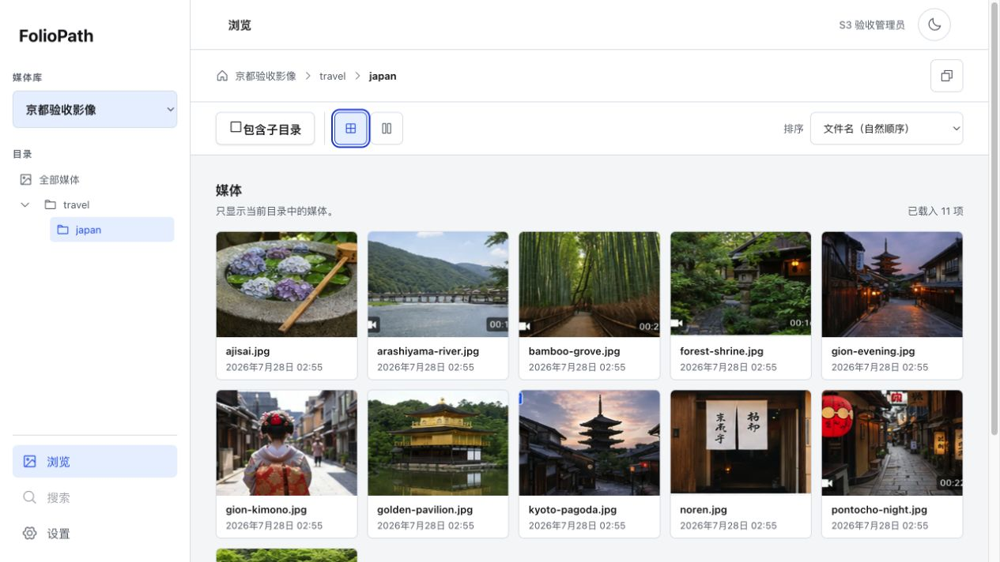
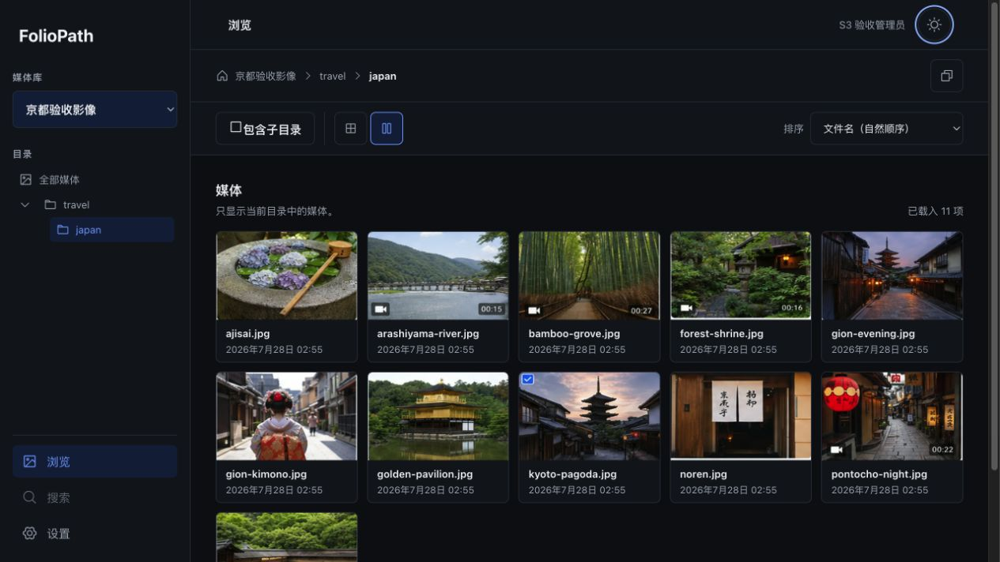
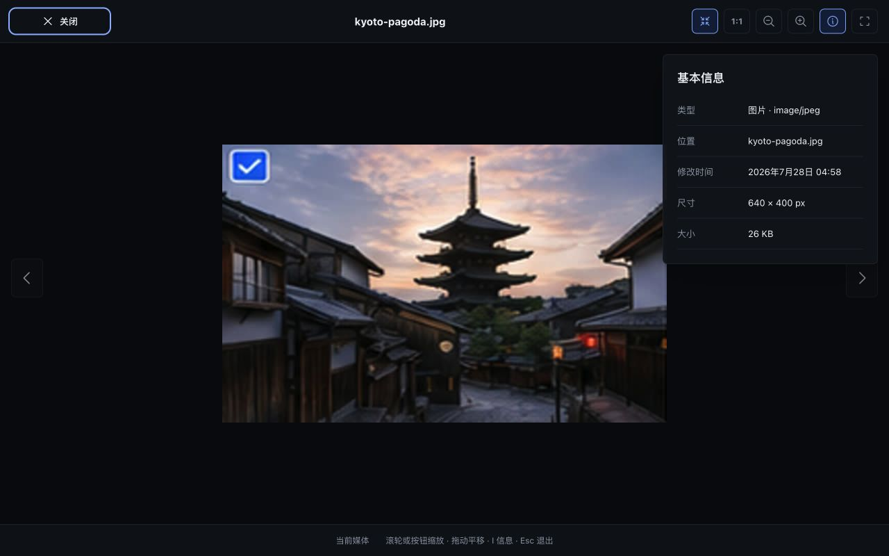
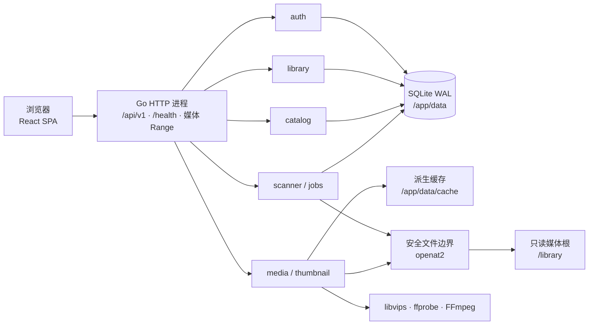

# FolioPath

<p align="center">
  
</p>

<p align="center">
  <strong>以文件夹为核心的自托管图片与视频浏览器</strong>
</p>

<p align="center">
  保留你已有的目录结构，只读扫描原始媒体，在浏览器中快速浏览、搜索与查看。
</p>

<p align="center">
  <a href="https://github.com/HappyQuQu/foliopath/actions/workflows/ci.yml"></a>
  <a href="LICENSE"></a>
  
  
</p>



> [!IMPORTANT]
> FolioPath 当前是 **Stage 5 发布候选，不是稳定版本**。Stage 0～4 的产品纵向切片已经完成，
> 候选容器、Compose、双架构运行、恢复、容量和浏览器自动化已有验证证据；最终不可变镜像
> digest、完整真实设备/辅助功能签署和供应链高危项处置尚未完成。当前 Release Candidate
> 判定为 **No-Go**。生产前端原型一致性 feature 已完成 UIF-401～407，仍须 UIF-408 和受影响
> Stage 5 Gate 重验。不要把当前 candidate 当作正式发布版用于关键数据或公网服务。

## 目录

- [FolioPath 是什么](#foliopath-是什么)
- [核心能力](#核心能力)
- [产品界面](#产品界面)
- [媒体格式](#supported-media--媒体格式)
- [快速开始](#快速开始)
- [媒体库与存储模型](#媒体库与存储模型)
- [安全与网络边界](#安全与网络边界)
- [技术架构](#技术架构)
- [开发与验证](#开发与验证)
- [项目状态与路线图](#项目状态与路线图)
- [贡献指南](#贡献指南)
- [许可证](#许可证)

## FolioPath 是什么

FolioPath 是一个面向 NAS、家庭服务器和个人媒体归档的 Web 图片/视频浏览器。它不要求
导入、复制或重组现有文件：只需把一个共同媒体根目录以只读方式挂载到容器的 `/library`，
再从 Web 设置中选择一个或多个普通子目录作为媒体库。

FolioPath 的基本理念是：

- **文件夹就是相册**：真实目录层级是主要导航方式，而不是数据库相册的附属视图。
- **原始媒体只读**：不移动、不重命名、不编辑、不删除用户文件。
- **文件系统是真相来源**：SQLite 索引和缩略图都是可恢复、可重建的派生状态。
- **面向大集合**：扫描、游标分页、虚拟化和后台任务都有明确边界。
- **单容器部署**：Go API 与 React SPA 通过一个进程、一个端口交付。

它适合希望保留既有文件夹组织方式，同时获得现代 Web 浏览体验的用户；它不是照片备份、
上传整理、AI 分类或视频转码平台。

## 核心能力

| 能力 | 当前候选行为 |
| --- | --- |
| 多媒体库 | 在 `/library` 下创建多个名称唯一、路径互不重叠的媒体库 |
| 目录浏览 | 展示完整可读目录树，包括没有媒体的空目录 |
| 递归视图 | 一次浏览当前目录及所有后代目录，并保留来源路径 |
| 媒体布局 | 默认自适应网格，可切换为记忆的瀑布流布局 |
| 搜索与过滤 | 按文件名、路径、媒体类型和日期搜索；支持库、目录和全局范围 |
| 全局导航 | 认证后页面共用全局 Header、居中搜索和管理员菜单；搜索页不重复侧栏 |
| 当前目录过滤 | 浏览页关键字由服务端过滤当前目录全部直接子目录和当前媒体范围，并写入 URL |
| 管理中心 | 通用、媒体库、扫描与缓存、账户使用四个独立 URL 和完整交互状态 |
| 账户维护 | 修改管理员显示名称和密码；改密保留当前会话并撤销其他会话 |
| 图片查看 | 适应窗口、缩放/平移、1:1、前后切换、全屏和基本文件信息 |
| 视频查看 | 原文件 HTTP Range 播放、poster、浏览器不兼容编码的明确降级状态 |
| 视频故事板（Post-MVP/1 候选） | 桌面精细指针悬停播放最多 10 帧均匀采样 sprite；触摸、键盘与 reduced-motion 回退 poster，尚未通过 Integrated Done |
| 扫描 | 创建时、启动时和默认每 24 小时完整校准；支持手动扫描与合作式取消 |
| 可靠性 | 失败、取消、离线或部分不可读扫描保留最后可靠索引 |
| 缩略图缓存 | 默认 10 GiB、可配置配额、用量摘要、安全清理、LRU 水位和磁盘余量 |
| 身份验证 | 首次启动创建单一管理员，会话、退出登录和 CSRF 防护 |
| 可访问性 | 语义控件、键盘操作、焦点可见、减少动效与响应式布局 |
| 本地化 | 简体中文与英文，默认跟随浏览器语言 |
| 外观 | 明暗主题；桌面固定目录栏，移动端目录抽屉 |

### 明确不属于 MVP

- 上传、备份、移动、重命名、删除或编辑原始媒体
- 多用户、角色权限、匿名访问和分享链接
- AI 分类、人脸/对象识别、语义搜索和重复文件检测
- 视频转码、自适应码率流媒体和兼容播放副本
- 收藏、评分、评论、地图、时间线和浏览历史
- RAW 工作流、完整 EXIF 面板和图片编辑
- 多实例共享写入、外部数据库或独立任务服务
- 依靠文件系统 watcher 保证索引正确性

这些方向若进入后续版本，需要独立的范围变更、架构评估和发布证据。

### 正在开发的 Post-MVP/1 能力

视频故事板悬停预览已完成后端与 Consumer/UI Ready Gate：支持视频会在 poster 后以低优先级
生成 4 或 10 帧 WebP sprite；桌面精细指针停留 300ms 后按 500ms/帧预览，触摸、键盘焦点
和 reduced-motion 保持 poster。该能力仍在目标双架构候选复验阶段，不属于当前 MVP 候选，
也未获准作为稳定功能发布。VSP-301 生产镜像纵向链已贯通；VSP-302 的同一
源码状态原生 linux/amd64 与 linux/arm64 候选复验仍受远端 runner 计费状态阻断，
VSP-303 文档收敛与 VSP-304 Integrated Done 因此前置条件保持 Pending。

## 产品界面

<table>
  <tr>
    <td width="50%">
      
      <br>
      <sub>深色主题与瀑布流布局</sub>
    </td>
    <td width="50%">
      
      <br>
      <sub>支持键盘操作的完整媒体查看器</sub>
    </td>
  </tr>
</table>

以上图片是当前产品候选的 QA 截图，使用仓库内的合成测试媒体，不代表稳定版已经发布。

## Supported Media / 媒体格式

| 类型 | 扩展名 | 服务端能力 | 浏览器行为 |
| --- | --- | --- | --- |
| 图片 | `.jpg`、`.jpeg`、`.png`、`.webp` | 索引、元数据、WebP 缩略图 | 查看原始内容 |
| 动图 | `.gif` | 索引、元数据、静态缩略图 | 使用原文件播放动画 |
| 视频 | `.mp4`、`.mov`、`.mkv` | ffprobe 元数据、FFmpeg poster、HTTP Range | 播放浏览器原生支持的编码 |

扩展名匹配不区分大小写。FolioPath 的视频支持指容器格式与服务端处理契约，不表示浏览器能
解码容器内的任意视频/音频 codec。视频不会转码；不兼容内容会显示可理解的降级状态。

SVG、HEIC/HEIF、AVIF 和 RAW 当前不属于索引与缩略图契约。

## 快速开始

### 前置条件

- Linux `amd64` 或 `arm64`
- 支持 Compose v2 的 Docker
- 一个可只读提供给 FolioPath 的共同媒体目录
- 一个位于可靠本地文件系统上的独立可写数据目录

Linux 运行环境必须允许 FolioPath 使用 `openat2` 及所需解析标志。若内核、seccomp 或 LSM
无法提供安全路径边界，应用会失败关闭，不会自动降级到较弱的路径检查。

### 1. 构建候选镜像

当前没有可直接拉取的稳定镜像。仅用于评估当前源码时：

```bash
git clone https://github.com/HappyQuQu/foliopath.git
cd foliopath
docker build --build-arg VERSION=stage5-local -t foliopath:stage5-local .
```

构建会生成 React SPA，并将 Go API、SQLite、libvips 和精简 FFmpeg 运行时打包到非 root
distroless 镜像中。

### 2. 准备配置与数据目录

```bash
cp .env.example .env
mkdir -p ./foliopath-data
sudo chown 65532:65532 ./foliopath-data
chmod 750 ./foliopath-data
```

编辑 `.env`，至少设置：

```dotenv
FOLIOPATH_IMAGE=foliopath:stage5-local
FOLIOPATH_LIBRARY_PATH=/mnt/photos
FOLIOPATH_DATA_PATH=./foliopath-data
FOLIOPATH_BIND_ADDRESS=0.0.0.0
FOLIOPATH_PORT=8080
TZ=Asia/Shanghai
```

不要使用浮动的 `latest` 标签。正式发布后应使用发布说明给出的明确版本或不可变 digest。

### 3. 启动并完成首次设置

```bash
docker compose up -d
docker compose ps
docker compose logs -f foliopath
```

容器健康后，在受信局域网中访问：

```text
http://<服务器局域网地址>:8080
```

首次打开时创建唯一管理员；密码至少 8 个字符，不强制大小写、数字或特殊字符组合。然后从
全局 Header 的管理员菜单进入“管理中心 → 媒体库”，从 `/library` 中选择目录并创建媒体库。
创建成功后会立即安排一次完整扫描。

只在本机或同机反向代理后使用时，可在 `.env` 中设置：

```dotenv
FOLIOPATH_BIND_ADDRESS=127.0.0.1
```

### 常用运维命令

```bash
# 查看状态
docker compose ps

# 查看日志
docker compose logs --tail=200 foliopath

# 重启
docker compose restart foliopath

# 停止
docker compose down
```

备份、恢复、升级、回滚、代理和故障处理请以[部署与运维文档](docs/deployment.md)为准。
SQLite 使用 WAL 模式；应用运行时不要只复制 `foliopath.db` 而忽略可能存在的
`foliopath.db-wal` 和 `foliopath.db-shm`。

## 媒体库与存储模型

Compose 只定义 FolioPath 有权读取的共同媒体边界。具体媒体库由管理员在 Web UI 中创建，
无需为每个库增加 volume 或重启服务。

```text
宿主机
├── /mnt/photos/                    只读媒体呈现根
│   ├── family/
│   ├── mobile/
│   └── work/
└── /srv/foliopath-data/            可写应用数据

容器
├── /library/                       唯一媒体挂载目标，只读
│   ├── family/                     可创建为“家庭照片”
│   ├── mobile/                     可创建为“手机备份”
│   └── work/                       可创建为“工作素材”
└── /app/data/
    ├── foliopath.db                SQLite 数据库
    ├── foliopath.db-wal            运行时可能存在
    ├── foliopath.db-shm            运行时可能存在
    ├── cache/                      可重建缩略图与视频 poster
    └── tmp/                        受控临时文件
```

### 必须遵守的约束

- `/library` 是唯一媒体挂载目标，其后代必须是普通目录。
- 不得在 `/library/family` 等后代路径嵌套 volume、bind mount 或其他 mount point。
- 媒体库根目录必须互不重叠，避免重复索引。
- 选择 `/library` 本身作为媒体库会覆盖整个允许根，因此不能再创建其他库。
- 库根创建后在 MVP 中不可修改；需要换根时移除配置并重新创建。
- 删除媒体库只删除配置、索引、任务和派生缓存，不修改原始目录。
- 媒体根暂时不可读时，库会标记为离线并保留旧索引，不会被当作空库清理。
- `/app/data` 必须由单一 FolioPath 实例独占，不支持把活动 SQLite 放在 SMB/NFS 上。

如果媒体分布在多个宿主卷，部署者需要先在宿主机侧提供一个没有后代 mount crossing 的
共同呈现根，再把它一次性挂载到 `/library`。完整理由见
[ADR-0009：Linux openat2 与单一媒体根](docs/adr/0009-linux-openat2-single-media-root.md)。

## 安全与网络边界

FolioPath 把媒体文件和元数据视为不可信输入，并以失败关闭为默认策略：

- 所有真实媒体访问集中通过 `internal/files` 的内核锚定边界。
- Linux 使用 `openat2` 和
  `RESOLVE_BENEATH | RESOLVE_NO_SYMLINKS | RESOLVE_NO_XDEV`。
- API 只接受媒体库 ID、媒体 ID 和库内相对路径，不接受任意绝对路径。
- 拒绝路径穿越、重复编码穿越、NUL、符号链接逃逸和嵌套挂载。
- 容器以 UID/GID `65532:65532` 运行，根文件系统只读，丢弃全部 capabilities，并启用
  `no-new-privileges`。
- 图片/视频处理具有超时、取消、输入保护和全局并发限制。
- 管理 API 与媒体 API 默认要求身份验证，状态修改受 session-bound CSRF 保护。
- API 错误和日志不得泄露宿主绝对路径、SQL、子进程输出或堆栈。

### 局域网 HTTP 与公网访问

推荐 Compose 支持通过受信局域网直接使用带单管理员认证的 HTTP。这不是匿名模式，但 HTTP
本身不提供链路机密性，只适用于你确认可信且有边界控制的家庭/办公局域网。

如果服务会经过公网、访客网络或其他不可信链路，必须在 FolioPath 外部配置 TLS 反向代理、
防火墙或访问控制，并阻止绕过代理直连应用端口。显式配置可信代理后，应用只接受严格的单跳
HTTPS 转发语义。详细威胁模型参阅[安全文档](docs/security.md)和
[ADR-0010：经认证的局域网 HTTP](docs/adr/0010-authenticated-lan-http.md)。

## 技术架构

FolioPath 是一个模块化 Go 单体。React 生产产物嵌入 Go 二进制，由同一个 HTTP 进程同时
提供 SPA、REST API、媒体内容和健康检查。



### 技术栈

| 层 | 技术 |
| --- | --- |
| 后端 | Go、`net/http`、模块化 capability/service 边界 |
| API | REST `/api/v1`、OpenAPI、统一错误结构、opaque keyset cursor |
| 数据 | SQLite WAL、只追加迁移、sqlc 生成查询 |
| 图片 | libvips，通过 govips 获取元数据并生成 WebP 缩略图 |
| 视频 | ffprobe 元数据、FFmpeg poster、原文件 HTTP Range |
| 前端 | React、TypeScript、Vite、React Router |
| 服务端状态 | TanStack Query |
| 大列表 | TanStack Virtual、游标分页 |
| UI 工程 | Storybook、Vitest、Testing Library、Playwright、axe |
| 发布 | 多阶段 Docker 构建、distroless、单进程非 root 容器 |

### 代码边界

```text
cmd/foliopath        最小进程入口
internal/app         依赖组装、配置、生命周期与优雅退出
internal/api         HTTP handler、DTO 与 middleware
internal/auth        管理员、会话与 CSRF
internal/library     媒体库配置、状态与重叠规则
internal/catalog     目录、浏览、搜索与 cursor 语义
internal/scanner     增量遍历、扫描代次与校准
internal/thumbnail   派生任务、缓存配额与淘汰
internal/media       元数据、图片/视频处理与原内容服务
internal/jobs        有界、可恢复、幂等后台任务
internal/files       /library 的真实文件系统安全边界
internal/pathpolicy  纯相对路径词法规则
internal/store/sqlite SQLite adapter 与生成查询
internal/webassets   嵌入 Vite 生产产物
web                  React 产品应用与组件工作台
api/openapi.yaml     权威公开 API 契约
migrations           只追加 SQLite migration
```

业务能力不依赖具体 SQLite、HTTP DTO 或真实文件系统实现；具体适配器只在 `internal/app`
组合。完整设计入口见[系统架构档案](docs/architecture/README.md)。

## 开发与验证

### 工具链

- Go `1.26.5`
- Node.js `22.22.x`
- npm（锁文件当前使用 npm `10.9.7`）
- Docker + Compose v2
- 完整图片适配器开发需要 libvips；视频集成测试需要 FFmpeg

### 后端

```bash
go mod download
go test ./...
go test -race ./...
```

普通 Go 测试不应读取开发者的真实媒体库；集成测试使用临时目录与合成 fixture。生产
libvips 适配器使用 `libvips` build tag。

### 前端

```bash
cd web
npm ci
npm run dev
```

Vite 默认把 `/api` 与 `/health` 代理到 `http://127.0.0.1:8080`，可通过
`FOLIOPATH_API_ORIGIN` 修改后端地址。

常用前端检查：

```bash
npm run test
npm run check
npm run storybook
npm run test:e2e
```

### 生成代码

公开 API 以 [`api/openapi.yaml`](api/openapi.yaml) 为权威来源。修改契约或 SQL 查询后，
修改源文件并重新生成，不要手工编辑生成结果：

```bash
make generate
make generate-check
```

### 完整验证面

仓库约定的完整检查入口是：

```bash
make fmt
make arch-check
make generate-check
make lint
make test
make test-integration
make test-e2e
```

部分发布、浏览器、容量与双架构验证需要 Docker、Playwright 浏览器、特定宿主机或显式环境
变量。测试层次与要求见[测试策略](docs/testing-strategy.md)，所有 Make 目标见
[`Makefile`](Makefile)。

### 文档导航

| 主题 | 文档 |
| --- | --- |
| 文档总索引 | [`docs/README.md`](docs/README.md) |
| 产品范围与验收 | [产品需求](docs/product-requirements.md) |
| 当前冻结范围 | [MVP scope revision 2](docs/releases/MVP-2026-07-23-scope-r2.md) |
| 系统架构 | [架构档案](docs/architecture/README.md) |
| OpenAPI | [`api/openapi.yaml`](api/openapi.yaml) |
| 数据与迁移 | [数据模型](docs/data-model.md) |
| 安全 | [安全模型](docs/security.md) |
| UI 与可访问性 | [界面设计规范](docs/ui-design.md) |
| 部署与恢复 | [部署文档](docs/deployment.md) |
| Gate 与发布证据 | [Gate 索引](docs/gates/README.md) |
| 风险 | [风险登记](docs/risk-register.md) |
| 路线图 | [项目路线图](docs/roadmap.md) |

## 项目状态与路线图

截至 2026-07-28：

- [x] Stage 0：需求、架构、关键安全/容量/媒体可行性与基础 Gate
- [x] Stage 1：运行骨架、SQLite migration、健康检查、单管理员认证与应用壳
- [x] Stage 2：安全媒体库、可靠扫描与对应产品 UI
- [x] Stage 3：目录树、当前/递归浏览、缩略图、网格/瀑布流与非模态预览
- [x] Stage 4：搜索、过滤、完整图片查看器、视频 Range 与降级状态
- [x] Stage 5 候选：容器、Compose、双架构运行、恢复、升级/回滚和容量验证
- [ ] 完成最终不可变镜像 digest 与干净提交 provenance
- [ ] 完成真实 Firefox、读屏、缩放、触摸与移动物理设备签署
- [ ] 清理或正式限时接受当前供应链扫描中的 `1 Critical / 8 High` 发现
- [ ] 通过最终 Release Candidate Gate 并发布首个稳定版本

权威机器可读判断位于
[`docs/releases/MVP-2026-07-23-rc-readiness.json`](docs/releases/MVP-2026-07-23-rc-readiness.json)。
完成的阶段不等同于稳定发布；只有全部版本 Gate 和发布阻断风险关闭后才能标记为 Released。

未来功能（watcher、分享、更多格式、收藏/评分、重复检测、地图/时间线等）不属于当前 MVP，
详细排序以[路线图](docs/roadmap.md)和后续 Change Record 为准。

## 贡献指南

FolioPath 采用契约驱动、后端优先的纵向切片交付方式。提交代码前请：

1. 阅读仓库级 [`AGENTS.md`](AGENTS.md) 与[开发就绪评审](docs/development-readiness.md)。
2. 先通过 Issue 描述问题、需求 ID、目标版本和验收证据。
3. 用户可见能力、架构变化或高风险切片必须有可追踪的 Change Record/Gate。
4. API 变化先修改 OpenAPI；数据变化通过新的 migration，不改写可能已经发布的迁移。
5. 保持原始媒体只读，并为路径、离线、取消、恢复和损坏媒体等失败语义补充回归测试。
6. 运行与改动范围相称的检查，并准确报告实际执行结果。

请勿提交真实私人媒体、运行时数据库、日志、缓存、Vite 构建产物或来源/许可证不清晰的素材。

## 灵感来源

FolioPath 的产品方向受到以下开源项目启发：

- [Immich](https://github.com/immich-app/immich)：高性能、自托管的照片与视频管理平台。
- [FlowVision](https://github.com/netdcy/FlowVision)：以瀑布流、目录导航和递归浏览见长的
  macOS 图片查看器。

FolioPath 是独立项目，与上述项目没有从属或官方关联，也不以复制它们的完整产品范围为目标。

## 许可证

FolioPath 采用
[GNU Affero General Public License v3.0 or later](LICENSE)（`AGPL-3.0-or-later`）。

你可以使用、研究、修改和分发本项目。分发原始或修改版本时，需要按照许可证提供对应源代码；
如果修改后的程序通过网络向用户提供服务，也需要向这些用户提供相应版本的源代码。第三方组件
仍适用各自许可证，发布镜像的 notices、SBOM 和合规材料以对应版本发布物为准。

---

<p align="center">
  <strong>FolioPath — Your folders, beautifully browsed.</strong>
</p>
