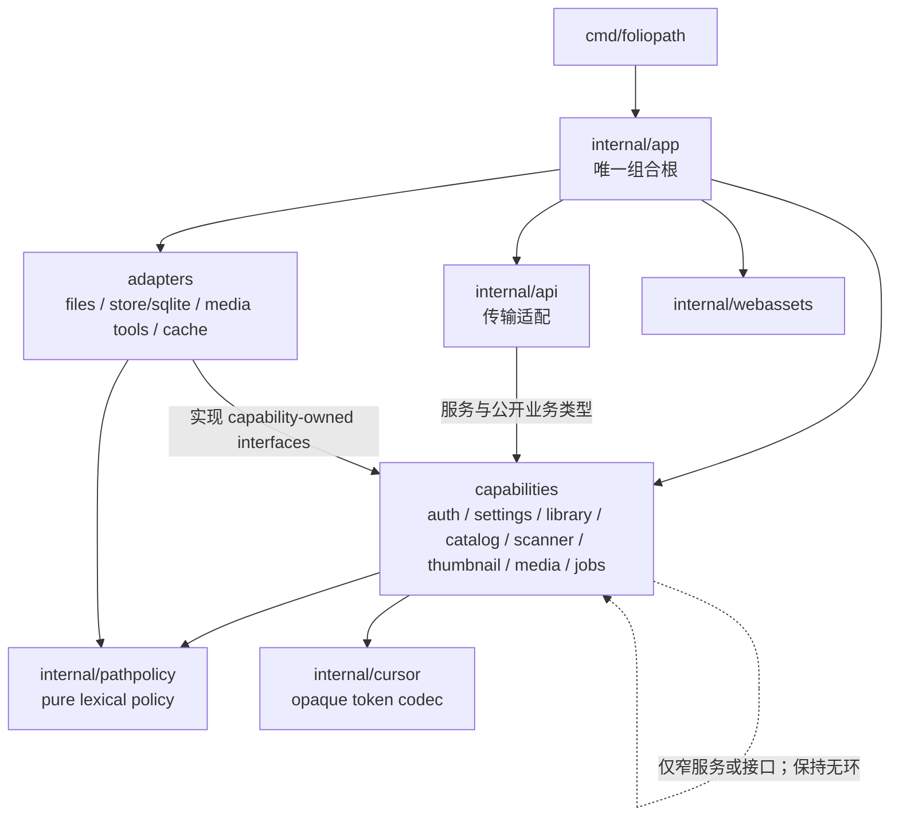

# FolioPath 模块、所有权与系统边界

## 状态

本文定义首个可用版本的目标模块所有权和依赖规则，补充[项目目录与依赖约束](../project-structure.md)，不替代根目录 `AGENTS.md`、已接受 ADR、未来的 `api/openapi.yaml` 或已发布迁移。冲突按[交付与架构治理](delivery-governance.md)暂停并修正权威来源；改变部署单元、依赖方向或核心一致性边界需要先接受 ADR。

当前仓库已建立认证、媒体库生命周期、扫描执行与设置聚合等后端能力；目录存在仍不等于对应产品能力已经完成，准确状态见[开发就绪评审](../development-readiness.md)。

## 所有权原则

1. **能力拥有语义。** 业务类型、状态机、不变量、服务入口和所需端口接口由对应 capability 包拥有。
2. **适配器拥有机制。** SQLite、操作系统文件访问、缓存文件和媒体工具实现 capability 定义的窄接口，不反向定义业务流程。
3. **传输只做翻译。** `internal/api` 负责 HTTP、DTO、中间件和错误映射；handler 不执行 SQL、不解析真实路径、不启动媒体工具。
4. **组合只有一处。** `internal/app` 是唯一知道完整具体实现图、全局资源预算和生命周期顺序的包。
5. **策略只有一个权威实现。** 路径规范化、媒体格式契约、游标、错误码、重试、缓存键和 generation 不能在多个 feature 或 adapter 中各写一份近似逻辑。
6. **持久记录优先于内存信号。** 扫描和媒体任务的 durable state 是恢复事实；channel、goroutine 和内存队列只是有界的执行加速器。
7. **I/O 不跨事务。** 文件遍历、媒体解析、缓存写入和 HTTP 流式传输不得持有 SQLite 事务或全局业务锁。

## 模块与能力所有权

| 模块 | 独占所有权 | 对外入口 / 所需端口 | 不属于该模块 |
| --- | --- | --- | --- |
| `cmd/foliopath` | 进程入口、版本命令和把启动控制交给 `internal/app` | 一个最小 `main` | 依赖组装、迁移、业务规则、HTTP 路由和后台 worker |
| `internal/app` | 启动配置、具体依赖组装、根取消上下文、启动/就绪/停机顺序、全局资源配额 | `Run` 或等价应用生命周期入口 | capability 业务规则、HTTP DTO、SQL 查询细节 |
| `internal/api` | `/api/v1` 路由、请求解码与上限、响应 DTO、认证/CSRF 中间件接线、HTTP 状态和公开错误映射、请求 ID、Range 协议适配 | 只调用 capability service；OpenAPI 是结构化契约 | SQL、任意绝对路径、目录遍历、缓存路径、libvips/FFmpeg 调用 |
| `internal/auth` | 唯一管理员原子初始化、凭据验证、会话生命周期、退出/撤销、CSRF 与认证限流语义 | 用户/会话 repository、密码哈希器、时钟、随机源、审计端口 | Cookie/HTTP 头序列化、具体 SQLite 查询、代理头解析 |
| `internal/settings` | typed 设置的读取、原子更新和 revision 语义；聚合由消费 capability 注入的字段校验器 | settings repository、字段校验器、变更通知端口 | 任意 key/value、消费方范围规则副本、HTTP DTO、具体 SQLite 查询 |
| `internal/library` | 媒体库名称唯一性、允许根下的库根值、重叠拒绝、改名、根不可变、离线/删除业务语义 | library repository、根检查端口、扫描请求端口 | OS 路径打开、扫描遍历、直接删除缓存文件 |
| `internal/catalog` | `Directory`/`Asset` 领域模型、indexed root 公开映射、库/目录/递归 scope normalization、目录计数语义、浏览/搜索/排序、keyset cursor payload 与查询指纹 | catalog repository、媒体可用性/派生状态的窄读接口、`internal/cursor` codec | 请求时递归文件系统、HTTP 查询参数 DTO、SQLite FTS 语句 |
| `internal/scanner` | 完整/增量校准、generation 状态机、遍历批次、成功清理资格、取消与跳过统计 | walker、scan repository、媒体分类器、派生任务发布端口、时钟 | 无界 goroutine、媒体解码、HTTP 轮询、失败扫描的陈旧清理 |
| `internal/thumbnail` | 缩略图/封面 variant、源失效、transform version、缓存键、派生状态、配额与 LRU 业务语义 | asset reader、processor、cache、thumbnail repository、job handler | 原媒体写入、SQLite BLOB、shell 命令、HTTP 占位响应决定 |
| `internal/media` | MVP 媒体格式注册表、魔数/类型验证策略、编码大小/解码维度/像素限制、元数据探测、原媒体内容服务语义、媒体工具限制 | safe opener、probe/poster processor、catalog reader | HTTP handler、任意客户端路径、视频转码、无界子进程 |
| `internal/jobs` | durable job 的领取/租约、幂等、重试退避、取消、恢复、公平调度与全局 admission | job repository、注册的 capability handler、时钟、并发门 | 具体缩略图/扫描业务、文件路径解析、无限内存队列 |
| `internal/pathpolicy` | 不接触 I/O 的相对路径词法规范、编码歧义和 dot/separator/NUL 拒绝 | 纯值函数，供 library、scanner 与 files 使用 | OS 文件访问、真实路径身份、HTTP、数据库或业务状态 |
| `internal/cursor` | 加密认证的 opaque token 编解码机制 | 纯 codec，供拥有资源查询语义的 capability 使用 | cursor payload、查询指纹、排序、分页规则、HTTP 参数 |
| `internal/files` | `/library` 与库根身份、真实路径包含性校验、安全目录枚举/遍历/打开、symlink 和特殊节点策略 | 实现 capability 所需的 root inspector、walker、safe opener | 媒体库名称/重叠业务、索引写入、HTTP DTO、缓存和原媒体修改 |
| `internal/store/sqlite` | SQLite 连接、WAL/外键/busy timeout、嵌入迁移、事务实现、SQL 查询与 capability repository adapter | 实现 capability-owned repository 接口 | 业务状态机、HTTP 错误、在事务内执行文件或媒体 I/O |
| `internal/webassets` | Vite 生产产物的 `go:embed` 包装和静态资源读取 | 只暴露嵌入文件系统/handler 所需最小入口 | React 源码、业务 API、运行时生成或手改 `dist` |
| `web/` | React 应用壳、路由、feature UI、URL 导航状态、TanStack Query 服务端状态、虚拟化和无障碍交互 | 只通过统一生成 API client 与 `/api/v1` 协作 | 复制后端校验、拼接媒体绝对路径、直接依赖数据库或临时 mock 契约 |

### 当前过渡代码的归属

- 纯词法策略已按 [ADR-0008](../adr/0008-composition-root-and-path-policy.md) 从文件适配器命名空间收口到 `internal/pathpolicy`。它是内层、无 I/O 的策略叶子，不是可继续扩张的通用共享包；不得加入 OS 文件访问、数据库、HTTP 或业务状态。
- `internal/media/formats.go` 已成为 MVP 扩展名、格式与 MIME 的单一注册表；scanner 通过
  `media.ClassifyPath` 使用它，系统状态通过只读副本公开同一组 MIME 能力。不得再在 scanner、
  API 或前端维护第二套独立 allowlist。
- `internal/cursor` 是 authenticated opaque token 的唯一加密机制 owner；library、scanner、
  catalog 等资源 capability 只定义各自 payload、query binding、排序和有效性规则，不再复制
  AES-GCM、nonce 或 Base64 编解码。
- `internal/store/sqlite/queries/` 已成为迁移到生产 adapter 的 SQL 唯一来源，`dbgen/` 只由
  固定版本 sqlc 生成。媒体库与 scanner adapter 已完成迁移；不得在迁移后的 adapter 中
  保留同组 SQL 副本。

## 依赖矩阵

符号含义：`✓` 表示允许直接依赖；`△` 表示只允许依赖稳定的公开服务/类型或 capability-owned 窄接口，且必须保持无环；`W` 表示仅用于组合和生命周期接线；`—` 表示禁止。

| 导入方 ↓ / 被导入方 → | `app` | `api` | capability 包 | policy/mechanism 叶子 | adapter 包 | `webassets` |
| --- | ---: | ---: | ---: | ---: | ---: | ---: |
| `cmd/foliopath` | ✓ | — | — | — | — | — |
| `internal/app` | — | W | W | — | W | W |
| `internal/api` | — | — | ✓ | — | — | — |
| capability 包 | — | — | △ | ✓ | — | — |
| `internal/pathpolicy` / `internal/cursor` | — | — | — | — | — | — |
| adapter：`files`、`store/sqlite`、媒体工具/缓存实现 | — | — | ✓ | ✓ | △¹ | — |
| `internal/webassets` | — | — | — | — | — | — |

¹ 同一 adapter 内部可以拆分实现子包；不同 adapter 之间不得形成隐藏的业务编排。需要同时使用 SQLite、文件系统和媒体工具的流程应回到 capability service，并在 `internal/app` 完成接线。

跨 capability 协作优先由调用方定义它所需的最小接口。例如 scanner 需要“分类一个目录项”和“登记派生任务”，不应导入 media 或 jobs 的具体 repository；`internal/app` 把相应实现注入。出现循环依赖时重新划分所有权，不能创建 `common` 或把类型搬到 `pkg/` 掩盖循环。

## 单一策略来源

| 系统策略 | 权威所有者 | 允许消费者 | 禁止的重复实现 |
| --- | --- | --- | --- |
| 相对路径词法规则 | `internal/pathpolicy` | library、scanner、files 直接使用纯值函数 | handler、store 或各 capability 自行 `Clean`、解码或维护第二套规则 |
| 真实路径包含性、根身份、symlink/特殊节点策略 | `internal/files` | capability 通过 root inspector、walker、safe opener 窄端口 | handler、store 或业务包打开真实路径、做字符串前缀判断 |
| 媒体库名称、重叠与根不可变 | `internal/library` | API、scanner、设置 UI | path picker 或数据库约束单独充当最终业务校验 |
| 媒体格式、魔数和工具路由 | `internal/media` | scanner、thumbnail、catalog | scanner/thumbnail/UI 各维护一套扩展名或 MIME 表 |
| Asset/Directory 身份、源指纹语义 | `internal/catalog` | scanner、media、thumbnail、store adapter | 以 inode、主机绝对路径或缓存文件名另造媒体身份 |
| indexed root、breadcrumb 与 direct/recursive browse scope | `internal/catalog` | API 只翻译 DTO；SQLite adapter 实现查询端口 | handler/store 各自映射空 root、跨库目录或递归范围 |
| 完整扫描 generation 和清理资格 | `internal/scanner` | library、jobs、store adapter、API 只读状态 | store trigger、watcher 或 API handler自行清理陈旧记录 |
| opaque token 加密认证机制 | `internal/cursor` | 资源 capability 把 payload 交给 codec | capability 各复制 AES-GCM、nonce 或 Base64 编解码 |
| 游标 payload、查询绑定与稳定排序 | 对应资源 capability（如 `library`、`scanner`、`catalog`） | API、生成客户端把游标视为 opaque | handler、前端自定义分页 token；大型列表使用 `OFFSET` |
| 派生 variant、cache key、transform version 和 LRU 语义 | `internal/thumbnail` | API、jobs、cache/store adapter | API URL、文件适配器或媒体工具自行推导另一种键 |
| job 领取、租约、重试、退避和取消协议 | `internal/jobs` | scanner/thumbnail/media 注册 handler | 每个 capability 建自己的无限队列和不同重试算法 |
| 认证、会话和 CSRF 业务语义 | `internal/auth` | API 中间件、设置/状态接口 | handler 直接查 session 表或 feature 自己判断认证状态 |
| 公开错误 shape、HTTP 映射和 request ID | `internal/api` + `api/openapi.yaml` | Web 生成客户端 | adapter 直接构造 HTTP 响应或前端按本地化 message 分支 |

## 数据与事务边界

SQLite 写入串行化、批次有界，任何事务都不得覆盖目录遍历、媒体处理、网络写入或缓存文件生成。数据表及索引的目标结构由[数据模型](../data-model.md)维护；下表定义的是跨模块一致性边界。

| 用例 | 同一短事务内必须成立 | 必须在事务外完成 | 所有者与恢复规则 |
| --- | --- | --- | --- |
| 数据库启动/迁移 | 一个 migration 版本完整提交或完整失败；外键和 schema 可验证 | 容器健康报告、备份、媒体库校准 | `app` 编排、SQLite adapter 执行；失败不进入 ready |
| 首次管理员初始化 | “仍未初始化”的检查、唯一用户创建和必要会话状态原子化 | 密码哈希可先计算；Cookie 只在提交成功后写响应 | `auth`；数据库唯一约束是最后防线，重复请求安全失败 |
| 创建媒体库 | 唯一名称、不可变规范根、库记录和 durable 首次扫描请求一致提交 | 真实路径解析、可读性检查和重叠所需的文件身份检查先完成；提交后再唤醒 worker | `library`；重试依赖幂等键/唯一约束，不靠内存去重 |
| 媒体库改名 | 名称唯一、版本/条件更新和 `updated_at` 一致 | 无文件系统操作，不改变根、ID、索引或缓存 | `library`；并发冲突返回稳定错误 |
| 移除媒体库 | 每一批派生记录删除保持引用完整；最终配置删除点明确 | 缓存文件清理必须幂等且在事务外；绝不触碰原媒体 | `library` 编排 jobs/store；是否异步及响应语义在 OpenAPI/迁移前固定，禁止一个无界大事务 |
| 扫描批次 | 当前 generation 的目录/asset upsert、父子引用、FTS 和计数增量保持一致 | 目录遍历、stat、分类和派生任务唤醒 | `scanner`；批次提交可保留，失败不赋予全库清理资格 |
| 扫描成功 finalize | 删除旧 generation、最终聚合、推进 `current_generation`、扫描/库成功状态作为一个一致提交点 | 后续缓存清理和 UI 通知 | `scanner`；任意错误回滚整个 finalize，旧索引继续可靠 |
| 扫描失败/取消/offline | 记录运行结果和安全错误；不得执行旧代次删除 | 重试、重新挂载和下一次完整扫描 | `scanner`；offline 是库可用性状态，不等价于空库 |
| 任务领取与转换 | 条件领取、attempt/lease 或等价所有权、下一状态和时间戳一致 | handler 的文件/媒体工作 | `jobs`；过期 running 必须可安全恢复，确切状态由迁移固定 |
| 缩略图提交 | 最终缓存文件已经可见后，才把对应 fingerprint/version 标为 ready | 工具运行、临时文件写入、fsync/原子 rename | `thumbnail`；文件与 DB 之间崩溃窗口通过幂等重建/孤儿清理收敛 |
| 设置更新 | schema 已知值的类型、范围、版本检查和写入一致 | 重新配置 scheduler/cache limiter 在提交后发生 | 值的业务校验归消费 capability，SQLite adapter 只持久化 |

禁止把“做了数据库事务”当作跨 SQLite 与文件系统的分布式事务。跨边界操作使用明确顺序、幂等键、源指纹、原子 rename 和启动/定期 reconciliation 收敛。

## 任务与调度边界

### 两类持久工作

| 工作类型 | 领域事实 | 执行与恢复 | 关键不变量 |
| --- | --- | --- | --- |
| 完整扫描 `scan_runs` | library、generation、阶段、统计、成功清理资格 | jobs 负责 admission/领取，scanner 执行状态机 | 同一库最多一个排队或运行的完整扫描；只有完整成功可清旧代次 |
| 媒体派生 `media_jobs` | asset、kind、source fingerprint、attempt 和安全错误 | jobs 管理租约/退避，thumbnail/media handler 执行 | 幂等；过期源结果不得发布；损坏媒体有限重试，不能永久占队列 |

内存 channel 不能成为唯一任务记录。HTTP 请求只创建/查询/请求取消 durable 工作，不持有请求直到整库扫描或媒体处理完成。任务 payload 只包含 ID、variant、fingerprint 等领域值，不保存客户端绝对路径、宿主机路径或可执行 shell 文本。

取消是协作式状态转换：停止领取新子工作，把 context 传播到遍历、数据库批次和子进程，在安全提交点退出。取消扫描允许保留已安全提交的新增记录，但不允许 stale cleanup；取消派生任务不得发布部分文件。进程退出时未完成工作进入 `interrupted`、租约过期或其他由 schema 明确定义的可恢复状态，不能假装成功。

### 调度职责

- `internal/jobs` 负责全局 admission、跨媒体库公平性、重试/退避、租约、取消信号和 worker 生命周期。
- scanner、thumbnail、media 各自负责 handler 的领域幂等与成功条件；jobs 不解释 generation 或缓存键。
- `internal/app` 创建共享的资源 limiter 并决定启动、停机和依赖顺序；capability 不能偷偷创建第二套无界池。
- SQLite adapter 通过条件更新实现领取与状态转换，不在数据库锁内运行 handler。
- 媒体派生使用 2 个全局 worker、最多 3 次尝试和 5/10 秒 transient 退避；跨媒体库选择由
  durable fairness cursor 决定。缓存 90% 触发并回收到 80%，发布后至少保留 512 MiB。
- scheduler 的定期完整扫描只是触发器；启动、手动和计划 reconciliation 才是正确性基线，watcher 永远不能成为唯一事实来源。

精确 job 状态枚举、租约时长、心跳、队列容量和退避参数必须在实现前由迁移、OpenAPI、容量/恢复 spike 固定；本文只锁定上述不变量。

## 配置边界

| 配置类别 | 示例 | 来源与所有者 | 变更方式 |
| --- | --- | --- | --- |
| 启动/信任配置 | 监听地址、固定数据目录、固定允许媒体根、可信代理、时区、安全启动模式 | 监听等允许项：环境/参数 → `internal/app`；`/library` 与 `/app/data`：代码固定边界；安全相关值在启动时验证 | 通常重启生效；UI 不得扩大 `/library`、`/app/data` 或代理信任范围 |
| 媒体库配置 | 名称、`root_rel_path`、状态 | `internal/library` + SQLite | UI/API 创建和改名；MVP 根路径不可更新 |
| 用户可调应用设置 | 完整扫描周期、缓存配额、语言偏好 | 消费该值的 capability 拥有 schema/default/范围，SQLite adapter 持久化，API 聚合展示 | 认证后的 typed API；不允许任意 key/value |
| 认证秘密与会话 | 密码哈希、session token hash、CSRF 状态 | `internal/auth` + SQLite | 专用认证流程；不通过普通 settings API 暴露 |
| 构建/派生版本 | 应用版本、schema 版本、thumbnail transform version、cursor version | 构建元数据或对应 capability 常量 | 随发布和迁移变化，不由用户任意修改 |
| 运行时资源预算 | 遍历、DB writer、libvips、FFmpeg、缓存 GC 和请求限额 | `internal/app` 组装，具体默认值由性能/安全证据支持 | 只开放产品明确允许且有安全上限的子集到 UI |

不得为每个新增媒体库增加环境变量或 Compose 配置；只要路径已位于 `/library` 内，媒体库配置属于 Web/SQLite。也不得把 `/app/data` 放到未验证的 SMB/NFS，或让 settings 成为执行命令、写绝对路径和启用任意模块的通道。

## 错误与可观察性边界

| 层 | 可以产生/保留的错误信息 | 不得跨越的内容 |
| --- | --- | --- |
| capability | 稳定领域 code、是否可重试、必要的安全资源 ID/字段 | SQL、绝对路径、原始 errno 文本、媒体 stderr、HTTP status |
| adapter | 包装后的内部 cause、分类后的 I/O/SQLite/工具错误 | 把底层字符串直接变成公开 message 或持久安全摘要 |
| jobs / 持久状态 | 稳定 error code、attempt、时间和受限摘要 | 完整命令、秘密、宿主机路径、无上限 stderr |
| API | OpenAPI error shape、HTTP status、本地化 message、request ID | 任意扩展字段、stack、SQL、内部路径、Cookie/token、原始工具输出 |
| 日志/指标 | request/library/job ID、阶段、耗时、队列深度、相对路径的必要安全摘要 | 密码、session/CSRF token、主机绝对路径、高基数原始元数据 |

前端只能按稳定 `error.code` 和 HTTP 契约分支，不能解析本地化 `message`。库离线、媒体当前缺失、扫描失败、认证失败和内部故障必须是不同的安全语义，不能都折叠成“空列表”或 `500`。

## 并发与资源所有权

| 资源类别 | admission / owner | 必须保证 |
| --- | --- | --- |
| HTTP 交互请求 | API 中间件 + `internal/app` 全局限制 | 后台扫描不能饿死健康、认证、目录首屏和取消请求；流式响应传播客户端取消 |
| 目录遍历 | scanner 使用 app 注入的全局/每库预算 | 流式读取、固定 worker 数、有界结果队列；不为每个条目建 goroutine |
| SQLite 写入 | SQLite adapter 的串行 writer 或等价单一写入策略 | busy timeout、短批次、无文件/网络/媒体 I/O；读请求不被长事务长期阻塞 |
| 图片/libvips | `app` 生命周期 + media 资源策略 + 2-worker 全局 limiter | 256 MiB 输入、32,768 px/100 MP、native concurrency 1、64 MiB/32 entry cache；调用返回后取消不得发布 |
| ffprobe/FFmpeg | media 资源策略 + 2-worker 全局 limiter | 1 TiB 视频源、32,768 px/100 MP、参数数组、单 decoder/filter thread、进程组取消、probe/poster 各 60 秒和 8 MiB 输出上限；超限与内容损坏分开诊断 |
| 缓存写入与 GC | thumbnail/cache limiter | 临时与 DB 保留安全磁盘余量；GC 不删除原媒体、不与发布同一 key 竞争 |
| 定时与重试 | jobs 调度器 | 跨库公平、退避带上限、启动风暴受控、同一逻辑任务不并发重复执行 |

共享 limiter 是进程级资源，不按 feature 私自复制。若多个步骤同时需要资源，先完成短数据库领取并释放事务，再申请较昂贵的文件/媒体资源；禁止持有 DB transaction 等待 worker slot，避免锁顺序反转和资源饥饿。

`Post-MVP/1` 的 [FTR-VID-001](../features/video-storyboard-preview.md)沿用上述所有权：
`internal/thumbnail` 拥有 storyboard variant、采样计划、派生键、发布和 LRU；
`internal/media` adapter 只实现有界 seek/解码；`internal/jobs` 唯一拥有 grid 高于
storyboard 的 claim 优先级和跨库公平；共享 `MediaCollection` 唯一拥有 hover 生命周期。
这项计划不授权建立第二个媒体队列、独立 worker 服务或 feature-local MediaCard。

## 明确禁止项

- 任何移动、重命名、编辑、覆盖或删除原始媒体的代码路径。
- API、Web URL、数据库、日志或任务 payload 接收/暴露宿主机绝对路径；公开接口只使用 ID 和安全相对路径。
- handler 直接 import SQLite/files/媒体工具，或 capability import API DTO、具体 repository/SQL 实现。
- 在扫描失败、取消、offline、部分不可读或中断时执行媒体库级 stale-generation 清理。
- 目录扫描依赖 watcher 保证正确性，或把整棵树/完整媒体列表一次载入内存。
- 无界 goroutine、channel、任务重试、FFmpeg 子进程、HTTP 列表或前端 DOM；大型列表禁止 `OFFSET`。
- 在数据库事务或全局锁内进行目录遍历、媒体探测、缓存文件写入或 HTTP streaming。
- 在 SQLite 保存缩略图 BLOB，或先把 DB 标为 ready 再写派生文件。
- 用字符串前缀代替组件级/真实路径包含检查，跟随目录 symlink，或让 path picker 的结果替代创建时复核。
- 为相同策略建立第二个 allowlist、cursor codec、retry loop、cache key 或 error registry；发现复用需求先确认权威 owner。
- 创建 `utils`、`common`、`helpers`、`base`，或在没有仓库外消费者时创建 `pkg/`。
- 未经 ADR 引入第二进程/容器、Redis、PostgreSQL、独立 worker、GraphQL、SSR、WebSocket、Nginx 或多实例共享写入。

## 可自动验证的边界

以下规则应逐步由架构测试或 CI fitness functions 执行，而不是只靠评审记忆；当前哪些检查已经落地、部分落地或仍是计划，以[架构适配度检查](fitness-functions.md)为准：

- Go import graph：`cmd` 只进 `app`；API 不导入 adapters；capabilities 不导入 API/app/具体 adapters；只允许 `app` 组装完整实现。
- OpenAPI/生成代码漂移检查：handler 和 Web client 不得成为第二事实来源。
- 迁移检查：从空库升级、外键、WAL、已发布迁移不可修改和失败不 ready。
- 路径与扫描不变量：遍历/编码/symlink 逃逸、重叠库、offline/取消/中断保留、成功 finalize 原子性。
- 资源边界：队列容量、worker 数和媒体子进程必须可观察且有上限；race、取消和故障注入测试覆盖关键状态机。
- 仓库卫生：不提交运行时数据库、缓存、日志、真实媒体或生成的 Vite `dist`；不手改标记为 generated 的源。

完整验证层次和当前可执行命令以[测试策略](../testing-strategy.md)为准。
