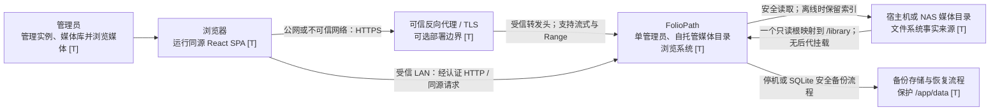
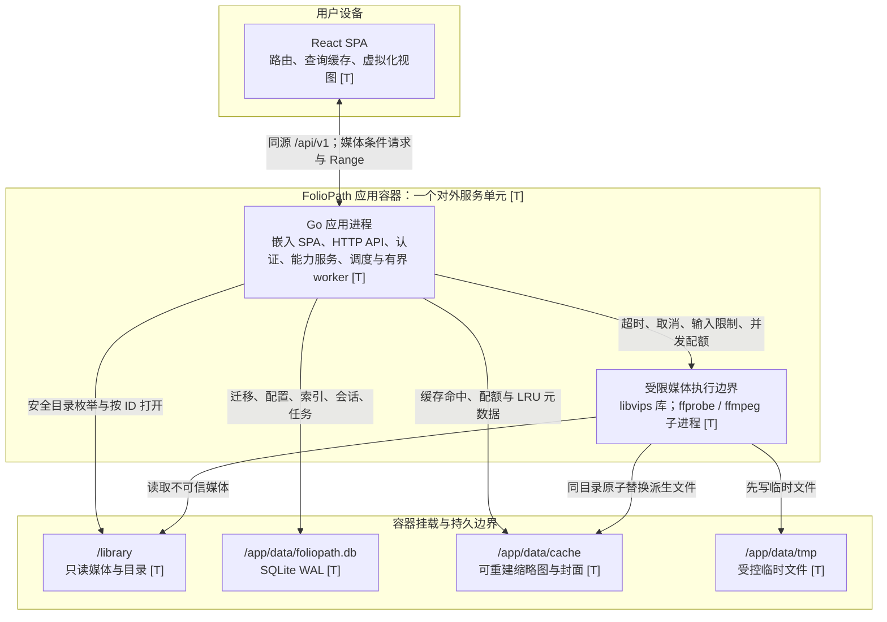
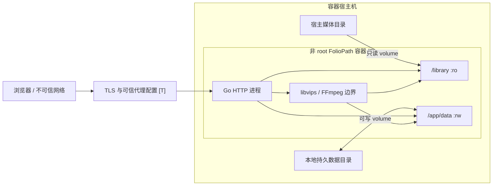
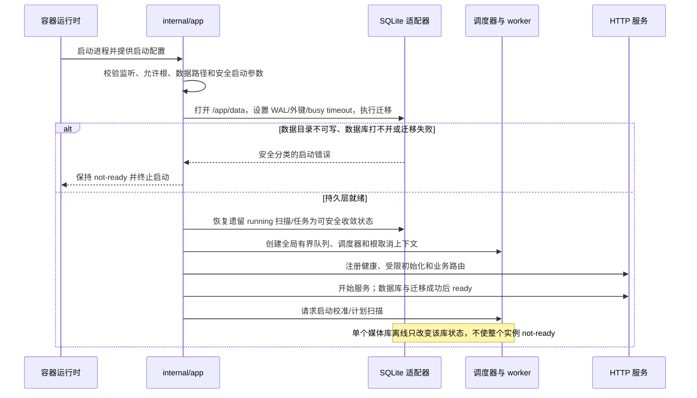
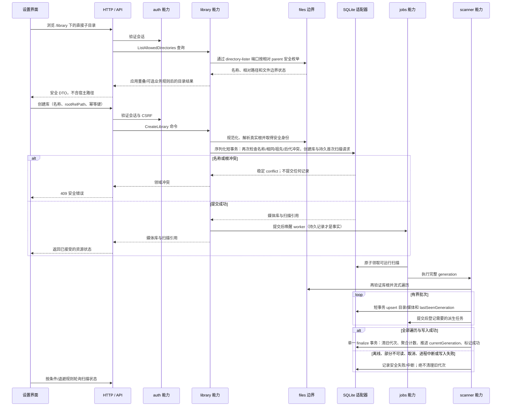
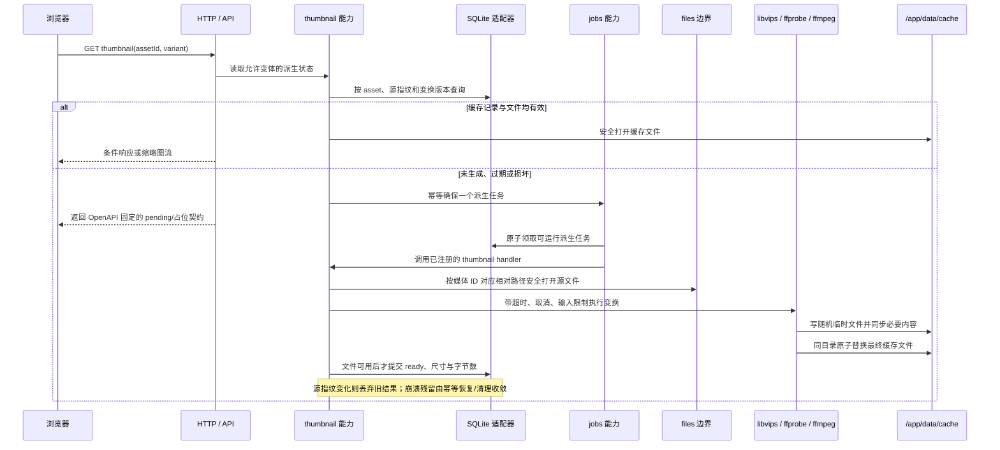
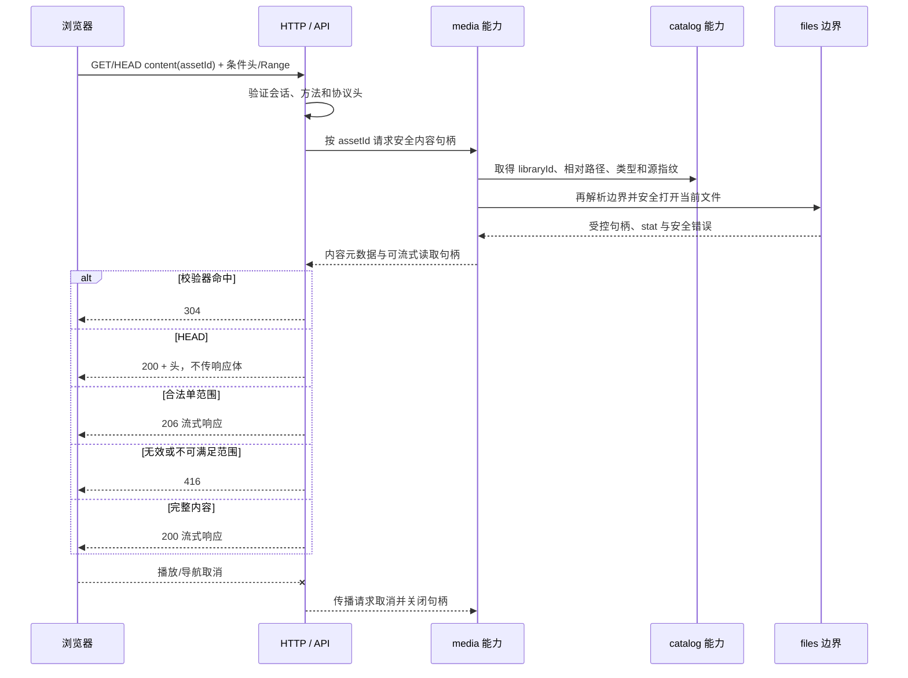
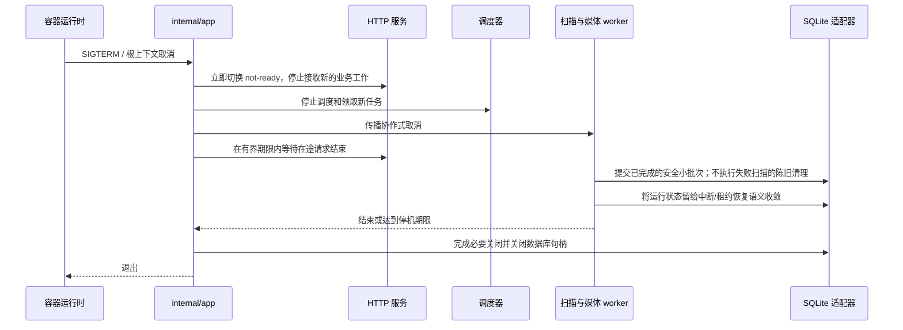

# FolioPath 系统上下文与运行视图

## 状态与读法

本文给出 FolioPath 的系统级导航视图：它把已有的产品约束、ADR、部署边界和关键运行流程放到同一上下文中，但不替代这些权威文档，也不新增 API、数据表或部署承诺。

图和表使用以下状态标记：

| 标记 | 含义 | 使用规则 |
| --- | --- | --- |
| **[C] Current** | 当前仓库中已经存在的代码或可执行检查 | 只能描述仓库可直接确认的事实，不能据此宣称完整产品已可运行 |
| **[T] Target** | 已接受决策所指向的首版目标架构 | 在对应实现和验证完成前仍是目标，不是交付证明 |
| **[S] Spike** | 有明确范围、环境和局限的可行性证据 | 只证明 spike 报告声明的范围，不能外推为生产能力或容量结论 |

当前快照是：`internal/pathpolicy`、`internal/files`、`internal/library`、`internal/scanner` 和
`internal/store/sqlite` 已有 [C]/[S] 代码与测试；FS-01 已取得 Darwin、Linux/arm64
`openat2` mount-boundary 与 HTTP test harness 子范围证据，SQLite/generation 通过当前
正确性范围，`api/openapi.yaml` 已成为 HTTP 结构权威。最小进程入口已经存在并把控制交给
`internal/app.Run`；应用组合根已拥有固定 `/library`、`/app/data` 与认证前回环监听配置，以及
根取消、顺序启动、失败回滚、运行故障传播、反向关闭和有界停机。正式 SQLite adapter 与嵌入
migration 已接入数据库 → HTTP → readiness 启动链路。
HTTP 运行边界已具备单 listener、服务端 request ID、统一安全错误、JSON 日志和
在途请求排空、liveness/readiness 和受保护系统状态路由；只有数据目录可用、数据库打开且
migration 成功后才进入 ready，失败时进程不提供业务服务。系统状态在认证实现前默认拒绝；
真实组合测试与测试专用应用容器已覆盖取消、重复启动、非 root、固定 volume 和内部 health；
认证 HTTP 与 `users`/`sessions` 数据契约已达到 S1-101 Contract Ready，但当前还没有业务
路由或认证 service。React 产品应用、
完整媒体工具链与正式发布容器仍未形成产品。生成 TypeScript
契约/client 与本地验证入口已建立；历史原生 amd64/arm64 结果保留，当前不运行自动 CI。准确状态以
[开发就绪评审](../development-readiness.md)和[可行性研究](../feasibility-study.md)为准。

发生冲突时，先按[交付与架构治理](delivery-governance.md)暂停受影响工作：已确认产品基线决定范围，
已接受 ADR 决定结构，当前 `api/openapi.yaml` 与已发布迁移决定可执行契约，`AGENTS.md`
约束实施，本文图示只作系统导航。改变单进程部署、路径模型、扫描一致性、认证边界或模块依赖方向前，
必须先新增或替代 ADR。

## 架构驱动因素

| 优先级 | 驱动因素与质量场景 | 目标策略 | 权威依据与验证方向 |
| --- | --- | --- | --- |
| P0 | 原始媒体即使在删除媒体库、扫描失败或缓存故障时也不能被修改 | `/library` 只读挂载；所有原媒体访问集中在文件边界；删除仅作用于配置、索引、任务和缓存 | [产品需求](../product-requirements.md)、[安全模型](../security.md)、只读容器与删除流程测试 |
| P0 | 用户在 Web 中创建多个媒体库，只选择已映射根目录下的子目录，并默认包含后代 | Docker 只声明一个 `/library` 媒体根和 `/app/data`；拒绝后代嵌套挂载；库根保存为安全相对路径；拒绝重叠；根路径在 MVP 中不可变 | [ADR-0002](../adr/0002-library-path-model.md)、[ADR-0004](../adr/0004-library-root-immutable.md)、[ADR-0009](../adr/0009-linux-openat2-single-media-root.md)、路径/mount/重叠测试 |
| P0 | 挂载离线、权限错误、取消或进程中断不能把可靠索引误判为空 | 文件系统是存在性与层级事实来源；SQLite 是派生状态；完整扫描使用 generation，只有全程成功才清理旧代次 | [ADR-0003](../adr/0003-scan-consistency.md)、故障注入和恢复测试 |
| P0 | 私人媒体不能因默认网络配置而匿名暴露 | 稳定版内建单管理员、会话、退出和 CSRF；认证完成后可直接服务受信 LAN HTTP，公网 TLS/代理由部署者提供 | [ADR-0005](../adr/0005-built-in-single-admin-auth.md)、[ADR-0010](../adr/0010-authenticated-lan-http.md)、[安全模型](../security.md)、认证与 transport 测试 |
| P0 | 路径、文件名、媒体编码和元数据均视为不可信输入 | 相对路径先经唯一词法策略；Linux 实际打开由根 FD 锚定的 `openat2` 原子执行并拒绝 symlink/mount crossing；原生媒体处理有超时、取消、大小限制和并发上限 | [安全模型](../security.md)、FS-01 与 FS-03 |
| P1 | 在四核、4 GiB 的主要验收环境中处理约 10 万媒体和 1 万目录，且交互请求不被后台工作饿死 | 流式遍历、有界队列、批量短事务、写入串行化、游标分页、虚拟化和按资源类别限流 | [测试策略](../testing-strategy.md)、FS-04；该规模是验收目标，不是已证明性能 |
| P1 | 自托管部署、升级、备份和故障排查保持简单 | 一个应用容器、一个 Go 服务端口、嵌入式 SPA、本地 SQLite、两个主要 volume；不引入额外服务 | [ADR-0001](../adr/0001-go-react-sqlite.md)、[部署草案](../deployment.md)、FS-05 |
| P1 | 大型列表在数据变化时仍能稳定翻页，媒体可以按浏览器协议流式读取 | 索引查询、稳定唯一 tie-breaker 的 keyset cursor、条件请求、`HEAD` 和单范围 Range；不在请求中递归文件系统 | [API 设计](../api-design.md)、游标与 HTTP 集成测试 |
| P1 | SQLite、索引和缓存故障可恢复，且不可重建的账号与设置可备份 | WAL 位于受支持的本地文件系统；迁移只追加；派生缓存可重建；数据库备份与恢复必须演练 | [数据模型](../data-model.md)、[部署草案](../deployment.md)、迁移和恢复门禁 |

## C4 L1：系统上下文 [T]

系统之外的管理员和部署平台决定哪个单一宿主呈现根映射到 `/library`；FolioPath 只能在
这个容器内允许根之下工作，并拒绝其后代的嵌套 mount。Web 设置可以创建 `/library`
普通子目录对应的多个媒体库，但不能扩大 Docker 已授予的文件系统能力。

## C4 L2：容器与数据边界 [T]

“一个应用进程”指一个 Go 服务进程和一个对外 HTTP 端口；FFmpeg/ffprobe 是由该进程受控启动的短生命周期子进程，libvips 是原生库边界，不是额外部署服务。SQLite、缓存和媒体目录是数据存储，不是可独立扩展的服务。未经 ADR，不增加 Redis、外部数据库、独立 worker、Nginx、GraphQL、WebSocket 或第二个可部署单元。

## 部署与信任边界

| 边界 | 进入边界的数据 | 强制控制 | 失败语义 |
| --- | --- | --- | --- |
| 浏览器 → HTTP | Cookie、CSRF、ID、查询、游标、Range 和显示文本 | 同源会话、CSRF、限流、结构化校验、统一安全错误、请求 ID | 拒绝请求而不泄露 SQL、绝对路径、堆栈或原始 stderr |
| 代理 → 应用 | `Forwarded` / `X-Forwarded-*`、客户端地址、协议 | 只信任显式配置的代理来源；稳定网络暴露使用 TLS | 非受信来源的转发头不参与安全判断 |
| `/library` → 文件边界 | 路径组件、symlink、mount、权限、目录项、文件内容 | 单一只读根；Linux 从根 FD 使用 `openat2` 的 `BENEATH`、`NO_SYMLINKS`、`NO_XDEV` 原子解析；扫描不跟随目录 symlink 或跨越后代挂载 | 边界能力不可用时失败关闭；单库不可读时标记离线并保留可靠索引 |
| Go → 媒体工具 | 不可信媒体与解析参数 | 参数数组而非 shell；超时、取消、大小/像素/帧限制和全局并发上限 | 记录稳定错误，有限重试，不阻塞整个队列 |
| Go → `/app/data` | 账号、会话、配置、索引、任务、缓存和临时文件 | 明确权限、本地文件系统、WAL、短事务、磁盘余量和原子文件提交 | 不可写或迁移失败时不进入业务就绪；派生数据可重建 |

容器的目标 Compose、安全选项、权限、备份与升级流程由[部署草案](../deployment.md)维护；威胁和输入控制由[安全模型](../security.md)维护。本文不固定尚未验证的镜像 UID/GID、healthcheck 间隔、端口或资源数值。

## 关键动态流程 [T]

以下序列图表达所有权、提交点和失败传播；精确字段、状态码和枚举最终由 OpenAPI 与迁移固定。

### 启动与就绪

首次启动是否进入管理员初始化状态由持久认证状态决定；不存在默认密码。精确认证流程见[ADR-0005](../adr/0005-built-in-single-admin-auth.md)。

### 创建媒体库与首次完整扫描

目录遍历不能把完整树加载到内存，也不能按条目启动无界 goroutine。扫描状态、generation 和删除语义以[数据模型](../data-model.md)和[ADR-0003](../adr/0003-scan-consistency.md)为准；
创建、轮询与取消的精确 HTTP 结构由当前权威 `api/openapi.yaml` 固定，[API 设计](../api-design.md)
只解释动机与实现参数。

### 缩略图与视频封面

缩略图文件不进入 SQLite。缓存键、默认配额和 LRU 语义以[数据模型](../data-model.md)及[架构总览](../architecture.md)为准；“未就绪”响应方式仍是 OpenAPI 落地前需要固定的技术参数。

### 原媒体条件请求与 Range

MVP 不转码视频，也不因读取失败在请求路径中执行大范围索引清理。Range、缓存校验器、安全响应头和错误码的精确行为由 OpenAPI 与 HTTP 集成测试固定。

### 优雅停机与重启恢复

停机不能依赖无限等待，也不能强行把部分扫描标记成功。具体优雅期限、任务租约和强制退出后的恢复细节需要在 jobs 设计、部署验证与 FS-05 中固定。

## 本文有意不固定的事项

- Cookie、CSRF、密码哈希、会话期限和可信代理参数：由安全设计、OpenAPI 和认证测试固定。
- API 分页上限、幂等键期限、轮询退避、缩略图 pending 响应和 Range 的精确表达：由[API 设计](../api-design.md)列出的 spike 与 OpenAPI 固定。
- worker 数量、队列容量、内存/CPU 水位、p95 延迟和停机期限：由 FS-03～FS-05 与容量基线给出可重复证据后写回。
- 镜像 UID/GID、端口、healthcheck 间隔和只读根文件系统兼容性：由最终镜像测试和[部署草案](../deployment.md)固定。
- 未来 watcher、SSE、多用户、分享、转码或外部服务：不属于 MVP；若改变当前约束，必须先经过需求与 ADR。
