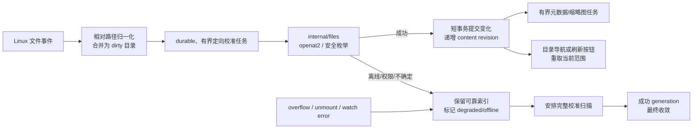

# FTR-SCN-001：媒体库自动发现

## 文档状态

- Feature ID：`FTR-SCN-001`
- 状态：[WCH-S2 Backend Evidence Ready](../gates/POST-MVP-2/wch-s2-backend-evidence-ready.md)，
  消费语义以 [POST-MVP-2 revision 3](../releases/POST-MVP-2-scope-r3.md) 为准
  当前 No-Go，仅等待原生 Linux/amd64
- Change Record：[CR-2026-005](../changes/CR-2026-005-automatic-library-discovery.md)
- 提案需求：`FR-SCN-010～014`、`NFR-REL-002`、`NFR-PERF-003`
- 验收：`WCH-AC-001～012`
- 目标版本：`POST-MVP-2` / `Post-MVP/2`；
  [scope revision 3](../releases/POST-MVP-2-scope-r3.md)
- 交付切片：`WCH`
- 产品负责人：产品用户
- 架构负责人：FolioPath maintainers
- Capability Owner：`internal/scanner`
- 文件系统 Adapter Owner：`internal/files`
- 任务 Owner：`internal/jobs`
- 前端 Consumer：browse/search feature，经统一 TanStack Query query-key 与 invalidation owner

本 feature 回应“把文件或文件夹放入已有媒体库后，后台自动索引，并在进入目录或点击刷新
后立即看到”的用户结果。
它不进入 `MVP-2026-07-23`，也不改变已冻结的 `POST-MVP-1`。目标版本 scope 已冻结；
ADR-0011 与 WCH-S1 已接受，当前仅授权生产后端与证据；WCH-S2 签署前仍不授权产品 UI。

## 决策摘要

FolioPath 采用两条互补路径：

1. **快速路径**：Linux 文件事件把发生变化的目录标记为 dirty，经过短暂合并后执行有界、
   安全的定向校准；成功提交的变化递增内容 revision，可见相关页面以条件请求检测变化，
   目录导航或显式刷新仍可立即重新获取页面。
2. **正确性路径**：创建、启动、手动和定时完整 generation 扫描继续作为唯一完整性基线，
   负责纠正丢失、乱序、溢出或停机期间未收到的事件。

监听事件只是提示，不是文件存在、删除成功或路径安全的证据。新增、修改和删除都必须通过
`internal/files` 的 Linux 锚定边界重新确认。任何无法确认的状态都保留旧索引，不执行推测性
删除。

## 用户结果与服务目标

- 用户向本地、可监听的已有媒体库复制、原子移动或创建受支持媒体后，无需点击“重新扫描”。
- 新建空目录自动进入索引，并在目录导航或刷新后出现在目录树中。
- 对本地文件系统上的 `close-write` 或原子 `move-in`，从事件发生到索引提交的目标为
  `P95 <= 10s`；缩略图可随后异步完成，媒体项先以 pending 状态出现。
- 索引提交后，用户进入/切换目录或点击刷新时，页面沿用现有浏览查询预算反映变化。
- 上述是 Contract Ready 要用真实 Linux fixture 冻结的提案预算，不是当前性能声明。
- 网络文件系统、事件不转发的宿主挂载和内核 watch 资源不足时，不承诺近实时；产品必须显示
  降级状态并继续依赖完整扫描。

## 提案需求

| ID | 需求 |
| --- | --- |
| `FR-SCN-010` | 在受支持的 Linux 本地文件系统上，系统默认自动监听已启用媒体库的目录变化，并把新增、修改、删除和重命名提示转换为有界的定向校准任务；用户无需手动发起扫描。 |
| `FR-SCN-011` | 新建目录必须在安全确认后加入监听范围并进入目录索引，包括空目录；删除或移动目录只能在父目录可可靠枚举、媒体库根身份未变化且目标缺失已确认后清理对应索引子树。 |
| `FR-SCN-012` | 监听溢出、错误、资源不足、程序停机、根目录不可用或事件无法确认时，系统必须保留已有索引，显示 degraded/offline 状态，并安排或等待下一次完整扫描恢复一致性。 |
| `FR-SCN-013` | 管理员必须能查看自动发现的 `active`、`degraded`、`unsupported` 或 `disabled` 状态以及经过净化的原因；关闭自动发现不得关闭启动、手动或定时完整扫描。 |
| `FR-SCN-014` | 每次成功的定向校准必须递增独立的内容 revision；相关页面可见时以有界 ETag 条件检查检测变化，浏览和搜索页仍提供键盘可用的刷新操作；变化、进入或切换目录时重新获取目标范围，并从第一页重建 cursor 链。 |
| `NFR-REL-002` | 文件事件不参与完整 generation 的成功清理资格；事件丢失、重复、乱序、溢出或进程终止后，下一次成功完整扫描必须最终收敛。 |
| `NFR-PERF-003` | watcher、dirty 集合、任务 admission、定向枚举、SQLite 写入和前端刷新都必须有界；10 万媒体／1 万目录目标档不能因每文件常驻 watcher、无界事件队列或刷新风暴失效。 |

这些 ID 已由 `POST-MVP-2` revision 3 冻结，但不修改 MVP PRD 中现有
`FR-SCN-001～009` 或 `MVP-NG-008`。

## 范围

### 包含

- Linux `inotify` 或 Go 封装的等价内核事件机制；
- 每个已安全发现的目录一个 watch，不为每个媒体文件创建常驻 watch；
- 新增、写入完成、属性变化、移入、移出、删除和重命名提示；
- 新目录递归纳管和空目录索引；
- 事件合并、去重、背压、durable admission、重启恢复和跨媒体库公平；
- 单文件或单目录的定向校准；
- 内容 revision、目录导航重取与浏览/搜索页刷新按钮；
- active/degraded/unsupported/disabled 状态、错误码和运维说明；
- 完整扫描兜底，以及 watcher 恢复后的校准。

### 不包含

- 用 watcher 代替启动、手动或定时完整扫描；
- 保证 SMB、NFS、FUSE、云盘同步目录或其他不可靠事件源近实时；
- 轮询整个文件树来伪装实时监听；
- WebSocket、独立 worker、Redis、外部消息队列或新增部署单元；
- 修改、移动、重命名或删除原始媒体；
- 根据单个 `delete`/`unmount` 事件直接清空媒体库或目录子树；
- macOS/Windows 的发布级等价承诺；非 Linux adapter 只提供开发证据；
- 让用户配置 debounce、队列、watch 数量等内部资源参数。

## 事件与定向校准语义

### 监听注册

1. 应用启动后仍先安排现有启动完整扫描。
2. watcher 只为状态正常且根身份已由 `internal/files` 验证的媒体库注册。
3. 初始 watch 集合来自安全枚举得到的目录，不把“注册成功”当作目录已索引的证明。
4. 新目录事件先校验 library-relative 路径，再通过 `/library` 锚定 FD 和
   `RESOLVE_BENEATH | RESOLVE_NO_SYMLINKS | RESOLVE_NO_XDEV` 重新打开；成功后才注册 watch。
5. 媒体库移除、应用停机或根身份变化时，先停止接受新事件，再释放对应 watches；原媒体不变。

watcher adapter 只向 `internal/scanner` 返回媒体库 ID、规范相对目录/名称、事件类别、内核
cookie（若有）和时间。它不得返回可由 API 暴露的绝对路径，也不得直接修改 SQLite。

### 合并与背压

- 事件按 `library_id + nearest_dirty_directory` 合并，而不是每次事件创建一个独立全扫描。
- 同一路径的重复 `create/change/attrib` 合并为一次校准；重命名 cookie 只用于减少重复工作，
  不能成为删除证明。
- `close-write`、`move-in` 可立即进入短 debounce；只有普通 change 提示时，需确认大小与精确
  mtime 在约定窗口内稳定，避免读取仍在复制的大文件。
- dirty 集合、待提交批次、每库并发和全局并发必须有硬上限。达到上限时停止吸收细粒度事件，
  将媒体库标记为需要完整校准并合并为最多一个完整扫描请求。
- 精确 debounce、batch、watch 和队列上限由 `WCH-S1 Contract Ready` 的 10k 目录 burst
  spike 冻结；实现前不得把示例数值当作已验证预算。

### 新增和修改

1. 取事件所在目录作为最小校准范围。
2. 通过 `internal/files` 安全枚举该目录；每个返回项仍按现有媒体格式、隐藏项和维护目录策略分类。
3. 对新增目录 upsert 目录记录并安全注册 watch；根据有界 admission 继续枚举其后代。
4. 对新增媒体按现有 `library_id + normalized relative path` 身份 upsert，并创建现有媒体派生任务。
5. 对已有媒体比较源 fingerprint；变化时复用现有元数据/缩略图失效规则。
6. SQLite 只做短批次提交；枚举、stat、媒体探测和 watch 注册期间不持有事务。
7. 提交成功后递增内容 revision；派生任务失败不回滚已经可靠确认的目录/资产存在性。

### 删除、移出和重命名

删除提示不得直接删除索引。定向校准必须同时满足：

- 媒体库根可以通过原锚定边界重新打开，身份未变化；
- 事件目标的父目录可完整、可靠地枚举；
- 目标在该父目录中确实不存在；
- 没有权限错误、I/O 错误、mount crossing、watch overflow 或取消。

满足后，增量事务只能清理“本次明确检查范围”内的记录：

- 单文件缺失：清理该路径的资产索引与可重建派生状态；
- 单目录缺失：清理已确认缺失目录的索引子树，但不触碰其兄弟目录；
- 重命名：按路径身份模型表现为新路径 upsert 加旧路径确认删除；不承诺保留路径绑定的应用元数据。

任一条件失败时保留旧索引，媒体库标记 degraded/offline，并安排完整扫描。若整个 `/library`
挂载消失或不可读，任何批量 `delete/unmount` 事件都不得获得清理资格。

### Overflow、watch 失效与恢复

以下情况使媒体库进入 `degraded`：

- `IN_Q_OVERFLOW` 或等价事件；
- watch 数量达到应用上限或内核返回 `ENOSPC`；
- watch 被内核移除、目标目录身份改变或收到 unmount；
- 事件消费 goroutine、adapter 或 durable admission 失败；
- 网络/特殊文件系统不提供可靠事件。

处理顺序：

1. 停止根据当前事件流执行删除性校准；
2. 保留可靠索引和现有浏览能力；
3. 记录稳定、脱敏的原因和首次/最近发生时间；
4. 合并安排一次完整扫描；已有完整扫描时不并行创建第二次；
5. 只有完整扫描成功且 watches 重新建立后才恢复 `active`。

如果根目录本身不可打开，状态使用现有 `offline`，而不是把媒体库视为空。

## 持久化与任务模型

`WCH-S1` 已选择新增专用 `catalog_reconcile_jobs`，仍复用 `internal/jobs` 的 lease、唤醒、
重试和公平规则，但不让定向任务获得完整 generation 的陈旧清理资格。任务以
`library_id + relative_dir_path` 唯一，使用 `requested_revision/claimed_revision` 水位：
运行期间到达的新事件递增 requested revision，完成者只有在两者仍相等时才能删除任务，否则
必须把它重新排队。

首版完整扫描与定向校准按库互斥。完整扫描不吸收或删除 queued/running 定向任务；它完成后
任务仍幂等执行。这样可能重复枚举，但不会把扫描期间的新事件错误视为已经覆盖。任务模型保证：

- 唯一/幂等键阻止同库同目录重复排队；
- running lease 过期后可恢复，重复执行安全；
- 完整扫描和定向校准不能在同一媒体库并行提交；
- 媒体库移除使相关任务失效，只删除配置、索引、任务和缓存；
- dirty 任务不保存宿主机绝对路径；
- migration 只追加，不修改已发布 migration。

另增加独立于 reliable generation/cursor revision 的单调 `content_revision`：

- 每个成功的增量提交至少递增一次；
- 完整 generation 发布也递增；
- 它只用于通知客户端“重新获取”，不改变正在翻页的 keyset cursor 绑定规则；
- 客户端重新获取第一页后使用新查询链，不能把新旧 cursor 链拼接；
- revision 不为每个文件逐次写放大，按提交批次递增。

## API 与前端刷新

权威结构已由 `WCH-S1` 写入 `api/openapi.yaml`，最小扩展为：

- Settings 增加 `automaticDiscoveryEnabled`，受现有 ETag/If-Match 原子更新保护；
- Library 增加：
  - `automaticDiscoveryStatus`：`active | degraded | unsupported | disabled`
  - `automaticDiscoveryErrorCode`
  - `lastAutomaticDiscoveryAt`
  - `contentRevision`
- 新增轻量、认证的 `GET /api/v1/catalog/state`，返回全局内容 revision，并支持
  `ETag` / `If-None-Match` / `304`。

前端不增加 WebSocket、SSE 或 catalog revision 轮询：

1. 浏览页与搜索页提供明确、键盘可达的刷新按钮。
2. 进入或切换目录时重新获取目标目录详情、直接子目录和当前媒体查询。
3. 刷新前丢弃已载入的后续 cursor 页，只保留首屏锚点并从第一页建立新 cursor 链。
4. URL、目录、递归范围、类型、排序、布局和有效焦点保持不变。
5. 自动发现正常工作不显示 toast；只有持续 degraded/offline 才显示固定小型横幅。
6. `GET /api/v1/catalog/state` 保留为已实现合同，但 revision 2 的产品 UI 不定时消费它。

## 模块与所有权

| 规则或行为 | 唯一 Owner | Adapter / Consumer |
| --- | --- | --- |
| watcher 状态、事件合并、定向范围、清理资格、content revision | `internal/scanner` | API、SQLite |
| Linux watch 注册、相对事件、安全枚举/打开、根身份 | `internal/files` | Linux inotify adapter |
| durable claim、lease、重试、取消、公平和全局 admission | `internal/jobs` | SQLite queue adapter |
| 媒体格式和源 fingerprint 后续处理 | 现有 `internal/media` / `internal/thumbnail` | scanner 发布任务 |
| HTTP DTO、认证、错误映射和 ETag | `internal/api` | generated client |
| revision 轮询与 query invalidation | Web 统一 server-state owner | browse/search/settings |
| 具体 SQL、migration 和短事务 | `internal/store/sqlite` | capability repository interfaces |

`cmd/foliopath` 保持最小；生命周期和 watcher 启停由 `internal/app` 组装。handler 不注册
watch、不枚举目录、不查询 SQLite。`internal/files` 不决定产品状态或索引清理。

## 安全与隐私

- inotify 返回的名称和事件顺序视为不可信输入；
- 所有事件路径先经 `internal/pathpolicy`，再由 `internal/files` 的锚定边界重新解析；
- 不以 lexical join、realpath 或先检查后打开证明 containment；
- 拒绝 NUL、`.`/`..`、分隔符歧义、symlink、特殊节点和 nested mount；
- watch 注册成功不授权读取；实际媒体读取仍重新通过安全 opener；
- API、日志和持久任务只保存 library-relative path 或安全摘要，不泄露宿主机路径；
- 自动发现开关只控制派生索引行为，不获得写原媒体权限；
- watcher 失败不得降低应用认证、CSRF 或同源要求。

该方案扩展文件系统运行机制和增量任务一致性。实现前需要新增 Proposed ADR，并在
`WCH-S0` 接受；若 ADR 结论改变本方案，应先更新本文件和 Change Record。

## 质量属性场景

### 正常复制

- 刺激：用户向已监听目录复制一张支持的图片并正常关闭文件。
- 环境：本地 Linux 文件系统，页面正在浏览该目录。
- 系统响应：事件合并后安全确认文件稳定，提交资产并排队缩略图；目录导航或刷新重取页面。
- 可测结果：索引 `P95 <= 10s`，用户刷新后沿用浏览请求预算；原文件 hash、mtime 和内容不变。

### 新建空目录

- 刺激：用户创建一个空子目录。
- 环境：1 万目录目标档，其他媒体库也有事件。
- 系统响应：安全确认、建立目录索引、注册一个目录 watch，并递增 content revision。
- 可测结果：目录导航或刷新后目录树出现；watch、goroutine、队列和 RSS 不超过冻结预算。

### 大文件慢速写入

- 刺激：视频在多秒内分块写入并产生多个 change 事件。
- 环境：媒体 worker 正忙，写入尚未稳定。
- 系统响应：事件合并，不在文件稳定前探测；最终只创建一个当前 fingerprint 的任务链。
- 可测结果：不发布半文件缩略图，不产生无界重复任务；最终文件被一次可靠收敛。

### 删除与掉盘

- 刺激：先删除一个文件，随后模拟整个 `/library` 不可用。
- 环境：删除事件、unmount 和 I/O 错误可能乱序。
- 系统响应：单文件仅在父目录可靠可枚举时清理；掉盘后停止删除性校准，保留其他索引并标记
  offline。
- 可测结果：挂载恢复和成功完整扫描前，未被可靠确认的资产不被清理。

### 事件溢出

- 刺激：burst 超过内核或应用事件容量。
- 环境：10 万媒体批量移动，队列接近上限。
- 系统响应：进入 degraded，合并为一次完整扫描，不无限排队。
- 可测结果：内存、goroutine、SQLite 写入保持有界；成功完整扫描后恢复 active 并最终一致。

## 验收标准

| ID | 验收 |
| --- | --- |
| `WCH-AC-001` | 本地 Linux 上新增受支持文件无需手动扫描即可进入索引，并在目录导航或点击刷新后显示。 |
| `WCH-AC-002` | 新增空目录自动进入目录树；新目录后续新增媒体也能被发现。 |
| `WCH-AC-003` | 分块写入、原子 rename 和重复/乱序事件不会导入半文件或创建无界重复任务。 |
| `WCH-AC-004` | 单文件/目录删除只有在根身份与父目录枚举可靠时才清理明确范围。 |
| `WCH-AC-005` | unmount、权限失败和根替换保留可靠索引并显示 offline/degraded。 |
| `WCH-AC-006` | overflow、ENOSPC 和 watcher error 合并触发完整扫描，队列与内存保持有界。 |
| `WCH-AC-007` | 应用在事件后、任务提交前或增量事务中被强杀，重启扫描仍可恢复并最终收敛。 |
| `WCH-AC-008` | watcher 关闭或 unsupported 时，创建、启动、手动和定时完整扫描行为不变。 |
| `WCH-AC-009` | 事件路径 traversal、symlink、nested mount、特殊节点和根身份变化全部失败关闭。 |
| `WCH-AC-010` | 10 万媒体／1 万目录和 burst fixture 满足冻结的 watch、RSS、goroutine、队列、SQLite 与浏览 P95 预算。 |
| `WCH-AC-011` | 没有导航或刷新时不产生 catalog revision 轮询；目录导航和刷新只重取当前范围，从第一页重建 cursor 链，并保持 URL、滚动与焦点语义。 |
| `WCH-AC-012` | 中英文状态、键盘、焦点、离线/degraded 横幅和 reduced-motion 通过共享组件与 E2E 验证。 |

## Gate 与交付顺序

1. `WCH-S0 Architecture Ready`
   - 冻结目标版本、需求、非目标和可测预算；
   - 完成 inotify/安全 watch/overflow spike；
   - 接受增量一致性与 watcher 生命周期 ADR。
2. `WCH-S1 Contract Ready`
   - 修改并评审 OpenAPI；
   - 选择 durable queue/schema 方案并新增只向前 migration；
   - 冻结错误码、状态、content revision、资源上限和测试 fixture。
3. 后端实现
   - `internal/scanner` capability、`internal/files` Linux adapter、jobs/SQLite/app 接线；
   - unit、race、Linux mount、integration、恢复和容量证据。
   - 2026-07-29 已实现 migration 12、durable reconcile queue、Linux inotify adapter、
     锚定直接目录校准、content revision、状态/API 与应用生命周期接线；
   - 已通过 Linux/arm64 的真实 inotify → durable task → 目录校准 → catalog 发布纵向测试，
     包括普通文件等待 close-write、新空目录及其后续媒体、符号链接安全跳过；受控
     `max_user_watches` 耗尽已在隔离 Linux/arm64 中确认映射为稳定资源错误并回滚部分
     watch 注册；原生 amd64 证据仍待完成。
   - 100,000 条进程内事件 burst 已验证缓冲保持在 8,192 并发布单一 overflow 提示；
     SQLite 已在事务内强制 4,096 dirty 目录上限，双 worker 已验证每库最多一个 running
     reconcile 且可转向其他媒体库。
   - watcher 根目录移动会产生失效提示；overflow/资源上限会降级并合并 fallback scan，
     只有同一媒体库 generation 推进后才重建 watch；认证 catalog state 的
     401/200/304 已通过真实应用组合测试；运行中 reconcile 的过期 lease 已验证可在
     SQLite 连接关闭并重开后保留同一任务与 watermark、遵守退避并以递增 attempt 重新领取；
     独立子进程领取任务后被操作系统强杀的测试也验证了同一恢复链。
   - catalog state 使用统一请求限流 owner，以每客户端 120 次/分钟保护轮询；
     第 121 次请求在调用 catalog service 前返回带 `Retry-After` 的脱敏 `429`，注入的
     repository 错误返回不泄漏内部细节的 `500 internal_error`。
   - 四核、4 GiB Linux/arm64 的 10,000 目录/100,000 媒体主档通过：完整扫描
     55.3 秒、峰值 RSS 51.2 MiB且无既有容量预算违规；同一档上注册 10,001 个
     directory watch 用时 1.35 秒且不会按目录保留进程 FD，100 个跨目录新增从写入到
     全部 catalog revision 发布用时 1.37 秒，单目录 reconcile P95 13.3 ms。该增量
     阶段进程写调用约 55.6 MB（约 556 KB/变更），低于 1 MiB/变更的证据守卫线。
   - 隔离 mount namespace 中的真实 bind mount 覆盖会被 `NO_XDEV` 拒绝，失败的定向
     校准不会删除既有索引；真实 `umount` 后同一 durable 任务按退避以 attempt 2 重试并
     成功收敛。该测试覆盖运行时 nested mount/unmount 边界，不把 lazy detach 未发布
     `IN_UNMOUNT` 的行为当作 watcher 事件证据。
4. `WCH-S2 Backend Evidence Ready`
   - 通过安全、数据、恢复、资源、契约、生成和架构检查后，才允许产品 UI 接入。
5. 前端实现与 `WCH-S3 Consumer/UI Ready`
   - settings/status、revision 轮询、统一 invalidation、中英文/可访问性。
6. `WCH-S4 Integrated Slice Done`
   - 真实候选容器从文件事件到目录导航/刷新后页面出现的纵向 E2E；
   - 双架构、掉盘、overflow、强杀、容量和文档收敛。

## 风险与回退

- 新增风险 `R-019`：事件丢失、overflow、网络盘、watch 上限或误判删除导致内容延迟或索引损失。
- 资源回退顺序：
  1. 加大事件合并范围并降低定向并发；
  2. 单库 degraded 并退回完整扫描；
  3. 全局禁用自动发现，保留现有可靠扫描能力。
- 数据安全回退不可放宽：任何不确定删除都保留索引；不能用“更实时”交换离线保留和
  generation 清理不变量。

## Immich 参考与差异

Immich 的 external library watcher 使用 Chokidar，监听 add/change/unlink，忽略初始事件，
并等待写入稳定后进入任务队列；同时保留周期完整扫描。FolioPath 借鉴双轨结构，但不复制
“unlink 事件直接移除资产”的行为，也不为每个文件创建 watch：

- [Immich External Libraries](https://immich.app/docs/features/libraries)
- [Immich LibraryService](https://raw.githubusercontent.com/immich-app/immich/main/server/src/services/library.service.ts)
- [Immich StorageRepository](https://raw.githubusercontent.com/immich-app/immich/main/server/src/repositories/storage.repository.ts)

外部实现只作为调研输入；FolioPath 的产品、安全和一致性合同仍以本仓库已确认的需求、ADR、
OpenAPI 和 Gate 为准。
