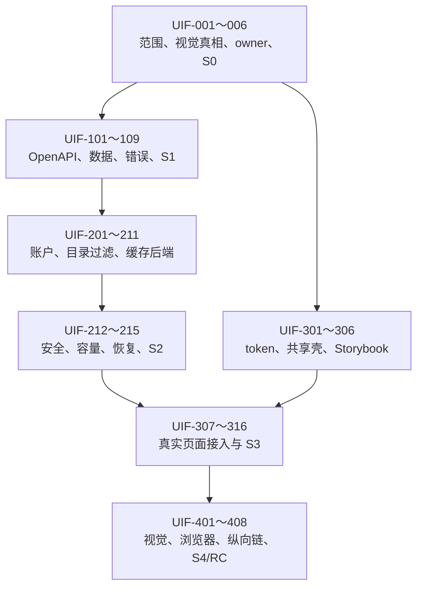

# FTR-UIF-001：生产前端原型一致性开发任务清单

## 状态与执行规则

- Feature：[FTR-UIF-001](frontend-prototype-fidelity.md)
- Change Record：[CR-2026-009](../changes/CR-2026-009-frontend-prototype-fidelity.md)
- Scope：[MVP revision 4](../releases/MVP-2026-07-23-scope-r4.md)
- 当前状态：S0 Go；S1 Contract Ready Pending
- 强制顺序：S0 → S1 Contract → 后端 → S2 Backend Evidence → 前端 → S3 → S4

只有实现、自动证据和文档同步都完成的任务才能勾选。原型完成、页面能打开、build 成功或截图
存在都不能单独视为 feature 完成。

## 依赖图

## Phase 0：Architecture Ready

- [x] `UIF-001` 确认 feature、目标版本、需求和非目标。
  - 输入：`FR-AUTH-005`、`FR-BRW-010`、`FR-UI-009～010`、`NFR-UIF-001`。
  - 输出：feature spec、CR-2026-009、MVP scope revision 4。

- [x] `UIF-002` 冻结视觉真相和四档比较矩阵。
  - 来源：`prototypes/apple-redesign` 与 `qa/` 证据。
  - 视口：1440×900、1265×800、768×1024、390×844。
  - 规则：原型与生产必须同主题、语言、数据和交互状态。

- [x] `UIF-003` 固定 capability 与前端共享 owner。
  - auth：管理员资料、密码与会话撤销。
  - catalog：目录 query、cursor 与可靠索引语义。
  - thumbnail：缓存摘要与安全清理。
  - web shared：token、Header、壳、菜单、媒体集合和预览模式。

- [x] `UIF-004` 完成 API/data/安全影响分析。
  - 已确认三个合同缺口：账户维护、目录 `q`、缓存摘要/清理。
  - 当前没有新部署、技术、信任或持久化类型，不需要 ADR。

- [x] `UIF-005` 登记 R-021 并固定 fallback。
  - fallback：逐页切换；未通过视觉/功能 Gate 的页面保留现有生产实现。
  - 禁止以功能降级、假接口或全量客户端加载换取视觉完成。

- [x] `UIF-006` 签署 `UIF-S0 Architecture Ready`。
  - 结论：Go，只授权 `UIF-101～109` 和不依赖业务合同的共享视觉基础。

## Phase 1：Contract Ready

- [ ] `UIF-101` 冻结管理员资料更新 use case。
  - 正常：修改显示名称，返回新 session 表示和强 ETag/revision。
  - 边界：空值、Unicode 规范化、长度、无变化、并发更新。
  - 错误：validation、precondition、authentication、CSRF、rate limit、internal。

- [ ] `UIF-102` 冻结密码修改 use case。
  - 输入：当前密码、新密码；确认密码只由前端校验但服务端独立验证新密码。
  - 成功：当前 session 保持，其他 sessions 原子撤销。
  - 失败：当前 verifier 和所有 session 不变。
  - 安全：统一凭据错误、Argon2id、限流、no-store、日志脱敏。

- [ ] `UIF-103` 冻结目录关键字查询合同。
  - 为 direct-child directory list 增加 `q`。
  - 绑定 library、parent、query、sort、limit 和 cursor。
  - 明确 Unicode、literal substring、大小写、空 query、offline 和 stale generation。

- [ ] `UIF-104` 完成目录搜索查询计划 spike。
  - Fixture：10k 目录、深层目录、中英文、组合字符、数字自然排序。
  - 比较：现有索引查询与只追加目录搜索索引。
  - 记录 P50/P95、扫描行数、内存、cursor 稳定和并发扫描影响。

- [ ] `UIF-105` 冻结缓存摘要合同。
  - 字段：usage、quota、waterline/pressure、安全余量状态、最近清理的安全摘要。
  - 不返回实际 cache path、文件列表或原始媒体路径。

- [ ] `UIF-106` 冻结最小缓存清理 operation。
  - 认证、CSRF、Idempotency-Key、active coalesce、状态读取和稳定错误。
  - 只调用现有 LRU/cache owner；不包含 missing/all rebuild。
  - 决定同步或 durable async 表示，并记录重启/取消边界。

- [ ] `UIF-107` 更新权威 OpenAPI 与生成 client 源。
  - 增加 account、directory q、cache summary/cleanup。
  - 补 `x-requirements`、逐状态错误、ETag/If-Match/Location/幂等语义。
  - 运行 lint、兼容比较、generate-check 和契约 fixture。

- [ ] `UIF-108` 固定数据与 migration 决定。
  - 优先复用 users/session/auth_version 与现有 cache 状态。
  - 若目录索引或 cleanup run 需要持久化，只追加 migration。
  - 覆盖 fresh、upgrade、rollback/failure 和 integrity_check。

- [ ] `UIF-109` 签署 `UIF-S1 Contract Ready`。
  - Owner：产品、架构、auth/catalog/thumbnail、API、安全、数据、QA。
  - Go 后才授权 `UIF-201～211`。

## Phase 2：后端实现与 Backend Evidence

- [ ] `UIF-201` 实现 auth 管理员资料更新 service。
- [ ] `UIF-202` 实现当前密码验证、密码更新和其他 session 原子撤销。
- [ ] `UIF-203` 实现 auth SQLite adapter 与适用只追加 migration。
- [ ] `UIF-204` 实现账户 HTTP handler、CSRF、ETag/错误映射和限流。
- [ ] `UIF-205` 实现 catalog direct-directory `q` 领域参数与 cursor payload。
- [ ] `UIF-206` 实现 SQLite 目录关键字 keyset 查询和适用索引。
- [ ] `UIF-207` 实现目录 HTTP 参数、错误映射和生成契约测试。
- [ ] `UIF-208` 实现 thumbnail/cache summary service。
- [ ] `UIF-209` 实现最小缓存清理、active coalesce、磁盘余量和重启恢复。
- [ ] `UIF-210` 实现 cache SQLite/文件 adapter；所有删除只限可重建缓存。
- [ ] `UIF-211` 实现 cache HTTP handler 与幂等/状态合同。

- [ ] `UIF-212` 完成后端正常、边界、失败和并发矩阵。
  - 账户：错误当前密码、Unicode、并发、hash 失败、事务失败、session race。
  - 目录：空/长 query、Unicode、cursor mismatch、offline、scan publish 并发。
  - 缓存：空缓存、活动清理、盘满、权限、重启、重复请求。

- [ ] `UIF-213` 完成安全与隐私证据。
  - 密码/secret/log 脱敏、CSRF、rate limit、request body、no-store。
  - 不接受路径；原媒体 sentinel 逐字节不变。

- [ ] `UIF-214` 完成容量与恢复证据。
  - 100k 媒体/10k 目录、四核/4 GiB。
  - 目录过滤 P95、cache cleanup 写放大、浏览并发、RSS、SQLite busy、重启恢复。

- [ ] `UIF-215` 签署 `UIF-S2 Backend Evidence Ready`。
  - Go 后将评审后 OpenAPI、生成 client、fixture 和运行服务交给前端。

## Phase 3：Consumer/UI Ready

### 可在 S1/S2 同期推进的共享视觉基础

- [ ] `UIF-301` 建立逐页 reference manifest 和确定性截图 fixture。
- [ ] `UIF-302` 映射字体、字号、间距、颜色、圆角、阴影、层级和动效到唯一 token。
- [ ] `UIF-303` 实现唯一 `GlobalHeader`、全局搜索和管理员菜单。
- [ ] `UIF-304` 实现唯一 `BrowseShell` 与移动目录抽屉。
- [ ] `UIF-305` 实现唯一 `ManagementShell` 与移动横向分类条。
- [ ] `UIF-306` 更新 Storybook 与共享组件行为、axe、键盘和视觉基线。

### 必须等待 S2 的真实页面接入

- [ ] `UIF-307` 还原认证与欢迎页。
- [ ] `UIF-308` 拆分并还原通用设置页。
- [ ] `UIF-309` 还原媒体库、新建媒体库和扫描详情页。
- [ ] `UIF-310` 实现扫描与缓存独立页并接真实 cache 合同。
- [ ] `UIF-311` 实现账户独立页并接真实资料/密码合同。
- [ ] `UIF-312` 还原浏览面包屑、工具栏、当前目录过滤和 URL codec。
- [ ] `UIF-313` 修复单滚动容器、底部空白、自适应网格和预览宽度。
- [ ] `UIF-314` 还原 Search 无侧栏、命令区、结果状态和全局搜索跳转。
- [ ] `UIF-315` 还原非模态预览与完整查看器，不复制 controller。
- [ ] `UIF-316` 完成所有 loading/empty/offline/error/conflict/cancel/pending/success 状态。

- [ ] `UIF-317` 完成中英文、浅色/深色、390/768/1265/1440 响应式和键盘/触摸矩阵。
- [ ] `UIF-318` 签署 `UIF-S3 Consumer/UI Ready`。

## Phase 4：Integrated Slice Done

- [ ] `UIF-401` 完成每页原型/生产同视口组合比较。
  - 保存 comparison artifact 和 history。
  - 关闭全部 P0/P1/P2；P3 单独记录。

- [ ] `UIF-402` 扩展 `web/tests/e2e/visual-regression.spec.ts`。
  - Header、管理中心四页、浏览顶部/底部、Search、预览、Viewer。
  - Linux-owned、确定性 fixture、动态区域最小遮罩。

- [ ] `UIF-403` 完成真实纵向 E2E。
  - setup/login → 管理资料/改密 → 建库/扫描 → 目录过滤 → 搜索 → 预览/Viewer →
    settings/cache cleanup → logout/login。

- [ ] `UIF-404` 完成 Firefox、WebKit、Chromium、axe、键盘、触摸、forced-colors、
  reduced-motion 和物理辅助功能适用复验。

- [ ] `UIF-405` 完成 100k/10k 前端容量、滚动、DOM、FPS/RSS 和后端并发复验。

- [ ] `UIF-406` 运行并记录完整仓库验证：
  - `make fmt`
  - `make arch-check`
  - `make generate-check`
  - `make lint`
  - `make test`
  - `make test-integration`
  - `make test-e2e`

- [ ] `UIF-407` 同步 PRD、UI、用户流程、API/data/security/testing、traceability、风险和
  发布文档，把计划链接替换为实际证据。

- [ ] `UIF-408` 签署 `UIF-S4 Integrated Slice Done` 并重跑受影响 Stage 5 RC Gate。

## Feature 完成定义

只有 `UIF-001～408` 适用项完成、`UIF-AC-001～012` 有实际证据、S4 Go 且 Stage 5 受影响
Gate 重跑后，才能称 `FTR-UIF-001` 完成。不得因为原型已完成、共享壳已合并或某个页面通过
截图而提前关闭 feature。
