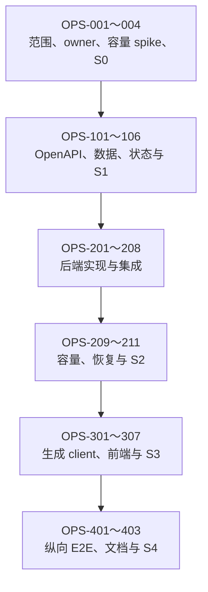

# FTR-OPS-001：后台任务中心开发任务清单

## 状态与执行规则

- Feature：[FTR-OPS-001](task-center.md)
- Change Record：[CR-2026-008](../changes/CR-2026-008-task-center.md)
- 目标版本：`POST-MVP-3` / `Post-MVP/3`
- 当前状态：Scope Proposed；S0 未签署
- 当前获准：规格、spike 计划、风险与 Architecture Ready 评审
- 强制顺序：S0 架构 → S1 契约 → 后端 → S2 Backend Evidence → 前端 → S4 Integrated

只有存在可链接代码、测试或 Gate 证据的任务才能勾选。原型、讨论或文档草案不能替代后端
证据。

## 依赖图

## Phase 0：Architecture Ready

- [ ] `OPS-001` 冻结 `POST-MVP-3` scope manifest revision 1。
  - Owner：产品负责人、架构负责人。
  - 输入：`FR-OPS-001～006`、`NFR-OPS-002`、`OPS-AC-001～008`。
  - 决定：是否只交付 task center，明确不混入系统维护、备份和 AI。
  - 完成：scope manifest、版本预算、被延期项或明确 scope-budget exception。

- [ ] `OPS-002` 固定跨 capability owner 与任务投影边界。
  - Owner：架构负责人、`internal/scanner`、`internal/thumbnail`、`internal/jobs` owners。
  - 决定：`internal/operations` 只拥有聚合/read projection/dispatch；scanner 与 thumbnail
    继续拥有状态转换。
  - 证明：handler 不查询 SQLite，operations 不读取路径，不复制 retry/lease/generation。
  - ADR：若改变部署、事务 owner、任务一致性或持久化边界，先新增 ADR。

- [ ] `OPS-003` 完成 100k 媒体 derived-run admission spike。
  - Owner：`internal/thumbnail`、SQLite、性能负责人。
  - Fixture：100k 媒体、10k 目录、图片/视频代表比例、ready/missing/stale/permanent-failed。
  - 测量：missing/all 资格枚举、keyset batch、写放大、queue depth、RSS、浏览 P95、取消延迟。
  - 故障：重启、ENOSPC、offline、源变化、active scan、重复请求。
  - 输出：batch、active/pending 上限、优先级、轮询和退避预算。

- [ ] `OPS-004` 签署 `OPS-S0 Architecture Ready`。
  - Owner：产品、架构、API、安全/数据、性能负责人。
  - 依赖：`OPS-001～003`。
  - Go 后只授权 Contract Ready，不授权后端或前端实现。

## Phase 1：Contract Ready

- [ ] `OPS-101` 固定高层 task、状态、阶段、计数和 allowed-actions 语义。
  - Owner：`internal/operations`，底层映射由 scanner/thumbnail owners 评审。
  - 覆盖：scan、derived missing、derived all、unknown progress、offline、cancelled、
    interrupted、retry-of。
  - 测试先行：状态映射、允许操作、终态轮询、错误优先级 table tests。

- [ ] `OPS-102` 决定公共 task ID 和 cursor 编码。
  - Owner：`internal/operations`、`internal/cursor`、安全负责人。
  - 比较：版本化 source encoding 与持久 public ID mapping。
  - 要求：不可碰撞、可直达、客户端不解析、删除源后历史行为明确、cursor 绑定 filters。

- [ ] `OPS-103` 修改权威 OpenAPI。
  - Owner：`internal/api`、API reviewer。
  - 依赖：`OPS-101～102`。
  - 增加：list/detail/derived-run/cancel/retry operation、schema、ETag、Location、
    Idempotency-Key、稳定错误和 `x-requirements`。
  - 不修改既有 scan operation 语义；operations DTO 必须证明映射一致。
  - 验证：lint、semantic/breaking compare、generate-check、contract fixtures。

- [ ] `OPS-104` 设计只追加 migration 与升级/恢复语义。
  - Owner：`internal/thumbnail`、`internal/store/sqlite`、数据负责人。
  - 决定：operation_runs 字段、partial unique active、revision、eligibility cursor、
    counters、cancel、retry-of、lease、覆盖索引。
  - 不复制逐资产 `media_jobs`，不保存路径或无界错误。
  - 验证：fresh、逐版本 upgrade、非法状态、active duplicate、crash window、integrity_check。

- [ ] `OPS-105` 固定 bulk admission、优先级和取消契约。
  - Owner：`internal/thumbnail`、`internal/jobs`。
  - 使用 `OPS-003` 实测预算；定义 missing/all eligibility、永久失败、active coalesce、
    child completion、cancel checkpoint、retry。
  - 证明浏览和日常 poster/grid 不被 rebuild 饥饿。

- [ ] `OPS-106` 签署 `OPS-S1 Contract Ready`。
  - Owner：产品、架构、capability、API、安全/数据、QA。
  - 完成：OpenAPI、migration 设计、状态、错误、资源、fixture 和威胁全部接受。
  - Go 后只授权 `OPS-201～208` 后端实现。

## Phase 2：后端实现

- [ ] `OPS-201` 实现 operations task projection。
  - Owner：`internal/operations`。
  - 代码：task ID、filter、cursor payload、scan/derived mapping、allowedActions、detail。
  - 测试：跨 kind 稳定排序、filter/cursor 绑定、状态映射、unknown denominator、source missing。

- [ ] `OPS-202` 实现 derived run 领域服务。
  - Owner：`internal/thumbnail`。
  - 代码：missing/all eligibility、admission cursor、coalesce、cancel、retry-of、counters、
    terminal result。
  - 测试：ready/missing/stale/permanent/transient、source version、重复请求、取消竞态。

- [ ] `OPS-203` 实现只追加 migration 和 SQLite repositories。
  - Owner：`internal/store/sqlite`。
  - 代码：operation run CRUD、active uniqueness、keyset list、claim/heartbeat/recovery、
    bounded child admission、聚合计数。
  - 测试：fresh/upgrade、约束、并发创建、lease、late worker、覆盖索引 query plan。

- [ ] `OPS-204` 接入 existing media_jobs，不复制 worker。
  - Owner：`internal/thumbnail`、`internal/jobs`、SQLite adapter。
  - 关联 parent run 与 child admission；保持 fingerprint/version CAS、fairness、retry backoff、
    atomic publish 和 LRU。
  - active child 完成/失败以幂等方式推进 parent counters。

- [ ] `OPS-205` 实现 cooperative cancellation 与 restart recovery。
  - Owner：`internal/thumbnail`、`internal/jobs`。
  - queued 直接取消；running 停止 admission；shutdown/lease 恢复；late completion 不能把
    cancelled run 改成 succeeded。
  - 已安全 ready 的派生结果保留。

- [ ] `OPS-206` 实现 operations API handler 与 DTO。
  - Owner：`internal/api`。
  - handler 只调用 operations service；认证、CSRF、ETag、304、Location、Idempotency-Key、
    400/401/403/404/409/429/500。
  - 错误脱敏，不返回 path、SQL、stderr、lease 或内部 priority。

- [ ] `OPS-207` 接入 composition、worker lifecycle 与 wake signal。
  - Owner：`internal/app`。
  - 启动先恢复 derived runs，再启动有界 worker；shutdown 协作取消。
  - 不新增进程、端口、队列服务或 handler-owned goroutine。

- [ ] `OPS-208` 完成 unit/race/contract/migration 测试。
  - Owner：后端与 QA。
  - 覆盖：状态/操作、cursor、idempotency、migration、cancel/retry、offline、source change、
    disk full、corrupt cache、library removal、只读原件 hash/mtime。

- [ ] `OPS-209` 完成真实纵向后端集成。
  - Owner：后端、QA、安全负责人。
  - 环境：认证 HTTP + operations + scanner + thumbnail + jobs + SQLite + internal/files +
    libvips/FFmpeg。
  - 场景：scan 投影、missing/all、条件详情、取消、重启、retry、cache repair、原媒体不变。

- [ ] `OPS-210` 完成目标容量与优先级证据。
  - Owner：性能负责人。
  - 使用 `OPS-003` 冻结档；证明 admission/查询有界、浏览/扫描不饥饿、RSS/DB/cache 可控。
  - 失败时缩减 batch/并发或功能范围，不提高无界资源。

- [ ] `OPS-211` 签署 `OPS-S2 Backend Evidence Ready`。
  - Owner：架构、后端、API、安全/数据、QA、性能负责人。
  - 只有 Gate Go 后，生成 client 和业务前端才能开始。

## Phase 3：Consumer/UI

- [ ] `OPS-301` 重新生成 TypeScript client 并建立唯一 operations adapter。
- [ ] `OPS-302` 实现任务中心列表、URL filter、cursor 与有界轮询。
- [ ] `OPS-303` 实现任务详情、ETag polling、cancel/retry 和焦点恢复。
- [ ] `OPS-304` 实现 missing/all 创建流程与 all 二次确认。
- [ ] `OPS-305` 完成 loading/empty/error/offline/cancelled/interrupted/terminal 状态。
- [ ] `OPS-306` 完成中英、键盘、axe、深浅主题、reduced-motion 和响应式矩阵。
- [ ] `OPS-307` 签署 `OPS-S3 Consumer/UI Ready`。

## Phase 4：Integrated Slice Done

- [ ] `OPS-401` 在候选容器完成真实管理员纵向 E2E 和只读原件哨兵。
- [ ] `OPS-402` 同步 PRD、用户流程、UI、API、数据、安全、部署、测试、风险和 release notes。
- [ ] `OPS-403` 签署 `OPS-S4 Integrated Slice Done`，更新 readiness 机器事实。

## 当前禁止

- 在 `OPS-S1` 前修改生产 OpenAPI、migration 或 capability 代码；
- 在 `OPS-S2` 前把原型 localStorage 状态接入生产前端；
- 用通用 `/jobs` CRUD 暴露内部队列表；
- 顺带实现系统维护、备份、诊断包、AI/OCR/人脸或并发设置。
