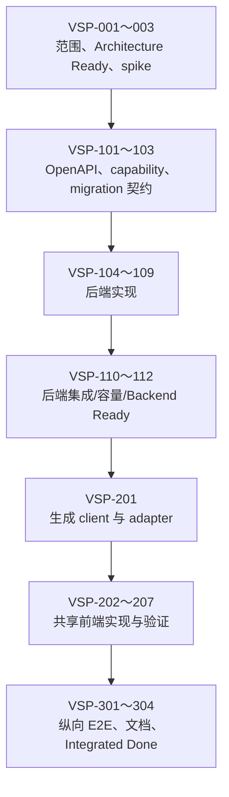

# FTR-VID-001：视频故事板悬停预览开发任务清单

## 状态与执行规则

- Feature：[`FTR-VID-001`](video-storyboard-preview.md)
- Change Record：[CR-2026-004](../changes/CR-2026-004-video-storyboard-preview.md)
- 目标版本：`POST-MVP-1` / `Post-MVP/1`
- 当前状态：Consumer/UI Ready；纵向集成与版本交付获准
- 当前获准：`VSP-301～304` 真实纵向 E2E、目标平台复验、发布文档与 Integrated Done
- 强制顺序：架构/契约 → 后端 → Backend Ready → 前端 → Integrated Done

`[x]` 只用于已有可链接代码、测试或 Gate 证据的任务。讨论、设计稿、局部 package 测试或
未执行的命令不能标为完成。

## 总依赖图



## Phase 0：范围与 Architecture Ready

- [x] `VSP-001` 确认 feature 基线和目标版本。
  - Owner：产品负责人、架构负责人。
  - 输入：`CR-2026-004`、`FR-MED-009～011`、`FR-UI-008`、`VSP-AC-001～008`。
  - 完成：`POST-MVP-1` revision 1 已冻结，明确不进入当前 MVP。
  - 证据：[scope manifest](../releases/POST-MVP-1-scope.md)、
    [CR-2026-004](../changes/CR-2026-004-video-storyboard-preview.md)。

- [x] `VSP-002` 完成 FFmpeg 抽帧与 sprite 有界 spike。
  - Owner：`internal/media` / `internal/thumbnail` capability owners。
  - 依赖：`VSP-001`。
  - Fixture：2s、4s、10s、10min、2h；横/竖屏、VFR、长 GOP、黑屏、损坏、不可 seek。
  - 比较：多次 fast seek 与可证明不全片解码的单命令方案。
  - 测量：wall/CPU/RSS、读取量、输出大小、取消延迟、部分帧失败。
  - 完成：选定提取/拼接方案、单帧与总 job 上限、超时、质量和最少成功帧规则。
  - 证据：[VSP-002 spike 报告](../spikes/vsp-002-video-storyboard.md)和隔离
    [`spikes/video-storyboard`](../../spikes/video-storyboard/)；不得把 spike adapter
    直接当生产实现。

- [x] `VSP-003` 记录 `VSP-S0 Architecture Ready` Gate。
  - Owner：架构负责人、产品负责人、安全/数据负责人。
  - 依赖：`VSP-001～002`。
  - 必须确认：唯一 owner、依赖方向、无新部署单元、migration 方向、资源预算、风险与 fallback。
  - ADR 判断：预期无需新 ADR；若改变任务一致性/所有权、核心技术或部署边界，先新增 ADR。
  - 完成：[VSP-S0 Architecture Ready](../gates/POST-MVP-1/vsp-s0-architecture-ready.md)
    为 Go，只允许进入 `VSP-101～105` Contract Ready。

## Phase 1：Contract Ready

- [x] `VSP-101` 固定 capability use case 与失败语义。
  - Owner：`internal/thumbnail`。
  - 依赖：`VSP-003`。
  - 定义：eligibility、frame count/timestamp、variant/version、最少成功帧、发布条件、源变化、
    offline、取消、重试、backfill admission、cache missing。
  - 测试先行：采样纯函数、派生键、variant 验证、状态转换 table tests。
  - 证据：[VSP-S1 Contract Ready](../gates/POST-MVP-1/vsp-s1-contract-ready.md)。

- [x] `VSP-102` 修改权威 OpenAPI 源并通过契约评审。
  - Owner：`internal/api`、API reviewer。
  - 依赖：`VSP-101`。
  - 修改：允许 `variant=storyboard`；增加 storyboard derived state/layout schema；
    固定 200/202/304/404/409/422/429/500、ETag、cache 和认证语义。
  - 生成：从源重新生成客户端；禁止手改生成文件。
  - 验证：OpenAPI lint、breaking/semantic comparison、generate-check、contract fixtures。
  - 证据：权威 OpenAPI、生成 client、storyboard contract test 及通过的 lint/compatibility/
    contract/generate 检查。

- [x] `VSP-103` 设计只追加 migration 与升级策略。
  - Owner：`internal/store/sqlite` adapter、数据负责人。
  - 依赖：`VSP-101`。
  - 修改：重建 migration 8/9 所建表的现行副本，不修改历史 migration；放宽 variant CHECK；
    增加 layout 元数据和有界优先级字段/索引。
  - 升级：覆盖空库、migration 10 旧库、ready/failed/pending grid、running lease、cache deletion。
  - Backfill：有界分批 admission，不在单事务创建所有历史视频任务。
  - 验证：fresh install、逐版本 upgrade、约束、FK、rollback/fail-closed、`integrity_check`。
  - 证据：VSP-S1 的 replacement-table migration、layout CHECK、priority 与 128 项 batch
    设计；执行证据归 `VSP-107`。

- [x] `VSP-104` 固定 job 调度和资源预算契约。
  - Owner：`internal/jobs`。
  - 依赖：`VSP-002～103`。
  - 定义：grid 高于 storyboard；跨库公平不被破坏；全局并发、lease、attempt、退避、取消；
    扫描/浏览 admission 不被后台任务拖慢。
  - 完成：明确 claim tuple 和索引，不复制 scheduler 状态机。
  - 证据：VSP-S1 的 claim tuple、grid/storyboard priority、并发、deadline 与字节/像素上限。

- [x] `VSP-105` 记录 `VSP-S1 Contract Ready` Gate。
  - Owner：架构、capability、API、安全/数据负责人。
  - 依赖：`VSP-101～104`。
  - 完成：OpenAPI、migration 设计、资源上限、错误、fixture、威胁和测试计划全部评审。
  - 授权：只授权后端实现；不授权业务前端。
  - 证据：[VSP-S1 Contract Ready](../gates/POST-MVP-1/vsp-s1-contract-ready.md) Go。

## Phase 2：后端实现

- [x] `VSP-106` 实现 storyboard derivation 领域规则。
  - Owner：`internal/thumbnail`。
  - 依赖：`VSP-105`。
  - 代码：variant/version、eligibility、采样计划、布局、cache key、ready 校验、失效规则。
  - 测试：边界时长、时间点单调/有界、布局、指纹/version、非法结果、部分帧规则。
  - 证据：`internal/thumbnail/storyboard.go`、独立 derivation/cache identity、
    all-or-nothing result validation 及 table tests。

- [x] `VSP-107` 实现安全抽帧和 sprite 处理 adapter。
  - Owner：`internal/media/videoffmpeg` 或评审确定的 media adapter。
  - 依赖：`VSP-106`。
  - 代码：继承 FD、参数数组、fast seek、单线程、输出 cap、总 timeout、进程组取消、WebP 拼接。
  - 禁止：shell、任意路径、全片无界解码、handler 内执行、原媒体写入。
  - 测试：fake command 参数、真实 FFmpeg fixture、损坏/超时/取消/大输入/部分 seek 失败。
  - 证据：生产 adapter、fake-command/all-or-nothing/资源测试、真实 fixture，以及
    `make test-storyboard-runtime` 在 Linux amd64/arm64 对生产 FFmpeg 的能力与 10 帧
    sprite 实跑。

- [x] `VSP-108` 实现 migration 和 SQLite repository。
  - Owner：`internal/store/sqlite`。
  - 依赖：`VSP-103`、`VSP-105`。
  - 代码：variant/layout 存取、优先级 claim、backfill cursor/admission、fingerprint CAS、LRU、
    cache deletion、library removal。
  - 测试：fresh/upgrade、并发 claim、旧 lease、源变化、跨库公平、bounded transaction、约束拒绝。
  - 证据：migration 11、layout/priority CHECK、v10 upgrade/downgrade fail-closed、
    variant repository、128 项 admission、priority/fairness/concurrency/fingerprint/cache repair
    测试，以及 100k/10k、10% 视频 Linux 目标容量档。

- [x] `VSP-109` 接入 durable job handler 与应用生命周期。
  - Owner：`internal/thumbnail`、`internal/jobs`、`internal/app`。
  - 依赖：`VSP-106～108`。
  - 顺序：grid succeeded 后 admission；storyboard 低优先级；重启恢复；shutdown 取消。
  - 发布：临时文件、fsync/atomic rename、再提交 ready；失败清理临时文件。
  - 测试：crash windows、late worker、取消、ENOSPC、cache GC 竞争、library removal。
  - 证据：variant dispatch、bounded reconciliation/admission、storyboard 并发 1、
    grid 抢占、lease/retry/shutdown、atomic publisher，以及真实 worker 的 grid →
    storyboard 纵向集成。

- [x] `VSP-110` 实现认证 API 与 DTO。
  - Owner：`internal/api`。
  - 依赖：`VSP-102`、`VSP-106～109`。
  - 代码：资产状态映射和 binary delivery；handler 只调用服务；200/202/304/409/422；
    ETag、immutable、nosniff、限流、LRU touch、cache-missing self-heal。
  - 测试：认证、错误脱敏、错误优先级、HEAD/conditional（若契约包含）、取消。
  - 证据：catalog/detail DTO、binary variant、200/202/304/401/404/409/422、
    immutable/nosniff、LRU touch、variant-local repair 和真实认证 HTTP composition。

- [x] `VSP-111` 完成后端正确性、安全与恢复集成证据。
  - Owner：后端、QA、安全负责人。
  - 依赖：`VSP-106～110`。
  - 场景：真实 SQLite + `internal/files` + FFmpeg + HTTP；源变化/offline/missing、重启、
    lease、ENOSPC、损坏 sprite、删除媒体库、只读原件 hash/mtime。
  - Linux：amd64/arm64 使用相同 fixture；路径边界失败关闭。
  - 检查：相关 unit/race/integration、OpenAPI、migration、generate、arch-check。
  - 证据：[VSP-S2 Backend Evidence Ready](../gates/POST-MVP-1/vsp-s2-backend-evidence-ready.md)
    的双架构生产 FFmpeg、真实生产镜像认证纵向链、cache repair 与故障矩阵。

- [x] `VSP-112` 完成后端容量与优先级证据。
  - Owner：性能负责人、`internal/jobs` owner。
  - 依赖：`VSP-111`。
  - 档位：目标四核/4 GiB；代表性 100k/10k 数据和明确视频比例。
  - 证明：grid 等待预算、跨库公平、backfill 有界、浏览/搜索 P95、RSS、DB/cache 增长、
    GC 水位和 shutdown/cancel。
  - 失败：按 feature spec fallback 收缩，不扩大 worker 或牺牲 API。
  - 证据：Linux arm64 四核/4 GiB 的 100k/10k、10% 视频档；10,000 项分 80 批，
    最大 128，983ms，入队期间浏览 P95 786µs，Peak RSS 45,010,944 B，违规 0。

- [x] `VSP-113` 记录 `VSP-S2 Backend Evidence Ready` Gate。
  - Owner：架构、后端、API、安全/数据、QA 负责人。
  - 依赖：`VSP-106～112`。
  - 完成：所有适用检查实际成功，OpenAPI/生成 client 可交接，残余风险有 owner。
  - 授权：Gate 为 Go 后，前端才能连接真实 storyboard。
  - 证据：[VSP-S2 Backend Evidence Ready](../gates/POST-MVP-1/vsp-s2-backend-evidence-ready.md)
    为 Go，授权 `VSP-201～208`。

## Phase 3：前端实现

- [x] `VSP-201` 接入生成 client 和唯一 domain adapter。
  - Owner：`web/src/lib/api`、`web/src/lib/media/availability.ts`。
  - 依赖：`VSP-113`。
  - 代码：消费生成 schema；映射 pending/ready/failed/offline；Query key、poll/backoff 和错误映射
    只有一个 owner。
  - 禁止：手写 wire type、直接 fetch、browse/search 各自解释状态。
  - 证据：生成 `StoryboardReference`、`mediaStoryboard`、统一 pending refresh 及
    browse/search adapter tests。

- [x] `VSP-202` 在共享 `MediaCollection` 实现 hover intent controller。
  - Owner：共享 `MediaCollection`。
  - 依赖：`VSP-201`。
  - 行为：fine pointer + hover + 300ms；同页单活动项；移出/隐藏/回收/unmount 清理 timer。
  - 请求：意图成立后才加载并 decode sprite；失败保持 poster。
  - 禁止：feature-local MediaCard 或 browse/search 重复 controller。
  - 证据：共享 hook 与 300ms/decode/单活动/leave/hidden/unmount component tests。

- [x] `VSP-203` 实现 sprite 布局和播放状态机。
  - Owner：共享 `MediaCollection`。
  - 依赖：`VSP-202`。
  - 代码：使用服务端 layout metadata；500ms/frame；循环；停止恢复 poster；grid/masonry 均正确。
  - 测试：已冻结的 4/10 帧档、横/竖屏、decode 延迟/失败、快速掠过。
  - 证据：服务端 metadata 驱动的 cover 轴、500ms 循环和 grid/masonry stories/tests。

- [x] `VSP-204` 完成动效、无障碍和输入模式。
  - Owner：前端可访问性负责人。
  - 依赖：`VSP-202～203`。
  - 证明：touch/粗指针、键盘焦点、reduced-motion 不播放；卡片 accessible name、DOM 顺序、
    单击/双击、固定预览和焦点恢复不变；无 live region 噪声。
  - 证据：组件矩阵与 Chromium/Firefox/WebKit/Pixel 5/forced-colors focused E2E。

- [x] `VSP-205` 完成状态、文案和国际化。
  - Owner：共享媒体可用性策略、i18n owner。
  - 依赖：`VSP-201～204`。
  - 规则：storyboard pending/failed 静默回退 poster；只有现有 poster/媒体失败状态显示错误；
    中英文行为文案一致，不承诺“AI 关键帧”。
  - 证据：availability adapter、既有中英文卡片 label 和 fallback tests；未新增逐帧文案。

- [x] `VSP-206` 更新组件工作台与视觉回归。
  - Owner：共享组件 owner、QA。
  - 依赖：`VSP-203～205`。
  - Stories：ready/pending/failed、4/10 帧、grid/masonry、浅/深主题、reduced-motion、长文件名。
  - 矩阵：390/768/1024/1440；Chromium/Firefox/WebKit；normal/forced-colors。
  - 证据：`StoryboardStates`、`StoryboardMasonry`、`StoryboardCapacity100` stories，
    Storybook production/a11y build 及多引擎/forced-colors CSS 定位回归。

- [x] `VSP-207` 完成前端容量与生命周期测试。
  - Owner：前端性能、QA。
  - 依赖：`VSP-202～206`。
  - 场景：100 个可见视频、快速掠过、虚拟滚动、分页、路由切换、页面隐藏/恢复。
  - 证明：最多一个活动动画；timer、observer、blob/image、DOM 和请求不无界增长；滚动 FPS/RSS
    不突破 Contract Ready 预算。
  - 证据：100-video 三引擎档为 60.001/60.080/60.113 FPS、活动数 0→1→0；
    原 100k 三引擎容量回归继续通过。

- [x] `VSP-208` 记录 `VSP-S3 Consumer/UI Ready` Gate。
  - Owner：前端、产品、可访问性、QA。
  - 依赖：`VSP-201～207`。
  - 完成：真实契约消费、组件/axe/键盘/响应式/浏览器证据和 UI spec 同步。
  - 证据：[VSP-S3 Consumer/UI Ready](../gates/POST-MVP-1/vsp-s3-consumer-ui-ready.md)
    为 Go，授权 `VSP-301～304`。

## Phase 4：纵向集成与版本交付

- [x] `VSP-301` 完成真实后端纵向 E2E。
  - Owner：QA、前后端 owners。
  - 依赖：`VSP-113`、`VSP-208`。
  - 流程：setup/login → 建库/扫描 → poster ready → storyboard 后台 ready → 浏览/搜索 hover
    → 打开非模态预览/查看器 → 返回并恢复焦点。
  - 故障：pending、offline、源变化、cache eviction/rebuild、worker restart、decode failure。
  - 证据：[VSP-301 真实产品纵向链](../gates/POST-MVP-1/vsp-301-product-vertical.md)；
    生产镜像真实登录、浏览/搜索 hover、非模态预览/焦点恢复与 cache 202→200 已通过，
    其余故障链接 S2/S3 自动矩阵。

- [ ] `VSP-302` 完成目标平台和资源复验。
  - Owner：发布、性能、QA。
  - 依赖：`VSP-301`。
  - 平台：原生 linux/amd64、linux/arm64；目标 Chromium/Firefox/WebKit 和物理输入模式。
  - 证明：同 fixture 布局一致、FFmpeg/runtime 依赖无变化、缓存/恢复/升级可重复。
  - 当前：原生 runner、结构化 artifact 和成对校验器已经实现，本机 arm64 预检通过；
    必须等待同一提交的原生双架构 workflow 实际成功后才能勾选。
  - 证据：[VSP-302 目标平台与资源复验](../gates/POST-MVP-1/vsp-302-target-platform.md)。

- [ ] `VSP-303` 完成发布文档和追踪收敛。
  - Owner：feature owner、发布负责人。
  - 依赖：`VSP-301～302`。
  - 更新：README、版本 manifest、PRD、用户流程、UI、OpenAPI/API 说明、数据模型、安全、
    部署、测试、风险、traceability、task lists、release notes。
  - 将所有“计划”描述替换为真实证据或明确残余限制，不能把未跑检查写成通过。

- [ ] `VSP-304` 记录 `VSP-S4 Integrated Slice Done` Gate。
  - Owner：产品、架构、capability、安全/数据、可访问性、发布负责人。
  - 依赖：`VSP-301～303`。
  - 验收：`VSP-AC-001～008` 全部有链接证据；无未处置严重风险。
  - 完成：只有此 Gate 为 Go，feature 才能计入目标版本和发布说明。

## 建议验证命令

实现期间按改动范围运行，最终至少执行仓库存在且适用的完整表面：

```sh
make fmt
make arch-check
make generate-check
make lint
make test
make test-integration
make test-e2e
```

另外应有 feature 专用入口或可过滤命令覆盖：

- Go sampling/derivation/media adapter/unit/race；
- migration fresh/upgrade/constraint；
- 真实 FFmpeg integration；
- authenticated HTTP contract；
- target-capacity storyboard backfill；
- Web component/Storybook/axe/reduced-motion；
- Chromium/Firefox/WebKit hover、虚拟化和视觉定位；
- `git diff --check` 与 Markdown 相对链接检查。

命令不存在、环境缺依赖或未执行时必须在对应 Gate 标为未完成，不能以计划代替结果。
