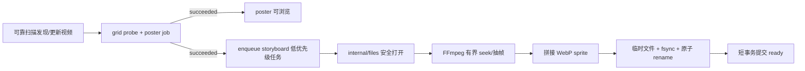

# FTR-VID-001：视频故事板悬停预览

## 文档状态

- Feature ID：`FTR-VID-001`
- 状态：VSP-301 Product Vertical Done；目标双架构候选复验中
- Change Record：[CR-2026-004](../changes/CR-2026-004-video-storyboard-preview.md)
- 需求：`FR-MED-009～011`、`FR-UI-008`
- 验收：`VSP-AC-001～008`
- 目标版本：`POST-MVP-1` / `Post-MVP/1`；[scope revision 1](../releases/POST-MVP-1-scope.md)
- 交付切片：`VSP`
- 产品负责人：产品用户
- 架构负责人：FolioPath maintainers
- Capability Owner：`internal/thumbnail`
- 交互 Owner：共享 `web/src/components/patterns/MediaCollection`
- 当前获准范围：[VSP-S3 Consumer/UI Ready](../gates/POST-MVP-1/vsp-s3-consumer-ui-ready.md)
  已 Go，允许 `VSP-301～304` 完成真实纵向 E2E、目标平台复验与版本交付

本 feature 是当前冻结 MVP 之后的新增能力。它不进入 `MVP-2026-07-23`，不改变当前
Release Candidate 的范围或结论。

## 用户问题与目标

用户在包含大量视频的目录或搜索结果中，只看一张 poster 很难判断视频内容。用户需要在不
打开播放器、不打断浏览和不读取整段原视频到浏览器的情况下，快速了解视频中不同时间点的
画面。

目标：

- 为受支持视频生成最多 10 帧、按时间均匀分布的故事板；
- 桌面精细指针悬停时在同一媒体卡片中依次展示这些帧；
- 不阻塞扫描、poster、浏览、搜索或原视频播放；
- 不修改、移动或转码原视频；
- 在大型媒体库中保持后台处理、缓存、网络和 DOM 成本有界。

## 稳定需求

| ID | 需求 |
| --- | --- |
| `FR-MED-009` | 系统必须为时长至少 2 秒且已成功探测的受支持视频生成最多 10 帧的均匀采样故事板；它是可重建派生资源，不是真实关键帧、镜头识别或视频转码。 |
| `FR-MED-010` | 故事板任务必须在现有 poster 可用之后以较低优先级异步执行；pending、failed、cancelled、offline 或缓存淘汰不得使 poster、索引或原视频播放不可用。 |
| `FR-MED-011` | 故事板必须绑定 asset identity、source fingerprint、`storyboard` variant 和 transform version，以临时文件加原子发布落盘，并受统一缓存配额、LRU 与安全磁盘余量约束。 |
| `FR-UI-008` | 在支持 hover 的桌面精细指针上，视频卡片停留达到意图延迟后按时间顺序播放故事板；移出、卡片回收或失去可见性时恢复 poster。触摸设备、键盘焦点和 reduced-motion 不得自动播放。 |

`FR-MED-009～011` 与 `FR-UI-008` 只属于 `Post-MVP/1`。当前
[产品需求](../product-requirements.md)中的 `FR-MED-001～008` 和 `FR-UI-001～007`
继续定义冻结 MVP。

## 范围

### 包含

- 现有 MP4、MOV、MKV 视频格式；
- `duration_ms >= 2000` 且 probe 成功的视频；
- 每个视频按已冻结时长档生成 4 或 10 个均匀采样画面；
- 单个 WebP sprite 交付；
- 后台 durable job、重启恢复、取消、有限重试、源变化失效；
- 统一缓存配额和 LRU；
- 浏览与搜索共用的 `MediaCollection` 卡片悬停行为；
- 简体中文、英文、reduced-motion、虚拟化和浏览器矩阵验证。

### 不包含

- 只提取编码 I-frame，或把均匀采样称为真实“关键帧”；
- 场景切换检测、内容去重、AI 摘要、人脸或对象识别；
- 视频转码、预览视频、音频、GIF 或 animated WebP 自动播放；
- 更改 poster 的现有生成与降级语义；
- 移动端长按、滑动、自动播放或新的手势；
- 用户可配置帧数、帧间隔、画质或开关；
- 在 API 请求线程同步运行 FFmpeg；
- 新的 worker 服务、外部队列、Redis 或新的部署单元。

## 体验与交互

### 默认状态

- 视频卡片继续显示现有 `grid` poster。
- storyboard 的 pending 或 failed 状态不显示卡片级错误徽标；poster 的状态仍由现有唯一
  媒体可用性策略决定。
- 列表加载时不下载所有 storyboard。

### 启动条件

以下条件必须同时成立：

1. 资产类型是 `video`；
2. storyboard 状态是 `ready`；
3. 浏览器匹配 `(hover: hover) and (pointer: fine)`；
4. 未匹配 `prefers-reduced-motion: reduce`；
5. 指针在同一卡片停留至少 `300ms`；
6. 卡片仍在虚拟窗口中且页面可见。

达到意图延迟后才请求 sprite。资源下载并成功 decode 前继续显示 poster，不闪烁空白或占位。

### 播放规则

- 按 `0..frameCount-1` 顺序展示；
- 每帧目标停留 `500ms`；
- 最后一帧后循环；
- 指针移出、卡片被虚拟化回收、页面隐藏、资源状态变化或组件卸载时立即停止；
- 停止后恢复 poster，不保留“停在中间帧”的视觉状态；
- 同一浏览器页面最多有一个活动 storyboard 动画；
- 快速掠过卡片不得触发请求或动画风暴。

### 无障碍与移动端

- storyboard 只作为 poster 的装饰性视觉替换，卡片可访问名称和 DOM 顺序不变；
- 键盘聚焦卡片不自动播放，避免无法预期的动态内容；
- 触摸/粗指针不模拟 hover，也不新增长按手势；
- reduced-motion 下始终使用 poster；
- 动画不创建 live region，不逐帧朗读；
- 卡片的单击、双击、选择、固定预览和焦点恢复规则不变。

## 采样合同

### 帧数

Contract Ready 已根据 spike 将首版收敛为两个有界档位。设视频时长毫秒数为 `D`：

```text
D < 2,000             → 不生成 storyboard
2,000 <= D < 5,000    → 4 帧
D >= 5,000            → 10 帧
```

首版 ready layout 的 `frameCount` 因此只能是 4 或 10。该规则已经写入
OpenAPI、capability 和 transform version，不得在同一 transform version 中静默改变。

### 时间点

把时长划分为 `N + 1` 个间隔，取内部的 `N` 个等分点：

```text
t(i) = floor(D × (i + 1) / (N + 1)), i = 0..N-1
```

规则不取 0% 和 100% 端点。实现必须 seek 到目标时间并解码目标
附近画面，不能使用会从头到尾完整解码长视频的无界 `fps + tile` 流程。

### 输出

- variant：`storyboard`
- transform version：首版 `1`
- 格式：静态 WebP sprite
- cell：保持原视频方向和宽高比，最长边不超过 `320px`
- 布局：最多 5 列，`rows = ceil(frameCount / columns)`
- 质量目标：WebP quality 75；最终参数以 spike 的质量/体积证据为准
- 不足一整行的尾部 cell 透明或使用不参与播放的空白区域

每个 ready 响应必须提供实际 `frameCount`、`columns`、`rows`、`cellWidth` 和
`cellHeight`；客户端不得根据文件总尺寸猜测布局。

## 后端架构

### 所有权

| 规则或行为 | 唯一 Owner | Adapter / 消费者 |
| --- | --- | --- |
| variant、transform version、采样计划、派生键、ready 条件、缓存/LRU | `internal/thumbnail` | API、jobs、SQLite/cache |
| 视频探测、目标时间 seek、解码、资源限制和安全错误 | `internal/media` | `videoffmpeg` adapter |
| 安全打开原视频 | `internal/files` | thumbnail job handler |
| claim、lease、重试、取消、公平和优先级调度 | `internal/jobs` | SQLite job repository |
| HTTP DTO、认证、ETag、202/200/304/409/422 | `internal/api` | generated client |
| 卡片 hover 状态机和 sprite 渲染 | 共享 `MediaCollection` | browse/search feature |
| 派生资源可用性映射 | `web/src/lib/media/availability.ts` | `MediaCollection` |

handler 不得直接访问 SQLite、解析路径或执行 FFmpeg。`videoffmpeg` 不决定任务优先级、
缓存路径、HTTP 状态或 UI 行为。

### 任务顺序



- 不为 storyboard 再扫描文件树；
- poster `grid` 未成功时不运行 storyboard；
- 扫描事务不等待媒体处理；
- 文件系统/FFmpeg/编码期间不持有 SQLite 事务；
- 发布前后都校验 source fingerprint；旧任务不得覆盖新源；
- 重启后 running lease 按现有任务协议恢复；
- library removal 使任务失效并只清理派生缓存。

### FFmpeg 执行策略

Contract Ready 前必须用短、中、长视频 fixture 比较至少两种实现：

1. 每个目标时间一次 fast seek，单个 storyboard job 管理总预算；
2. 一个有界命令内的多输入/多输出 seek，但不能完整顺序解码整段视频。

选型必须满足：

- 参数数组调用，不使用 shell；
- 原视频通过 `internal/files` 打开的继承 FD 提供；
- decoder/filter thread 固定为 1；
- 使用进程组取消；
- 单帧和整个 job 都有输出上限；
- 总超时、取消和内存峰值有实测；
- 任意部分文件不得发布为 ready。

首版采用 all-or-nothing：计划帧中的任一帧失败时整体失败并继续使用 poster，不发布残缺
sprite。该规则由 capability 拥有，adapter 不得自行接受部分成功。

## 数据模型与 migration 计划

现有 migration 8 和 9 都以 `CHECK (variant = 'grid')` 限制 `thumbnails` 与
`media_jobs`。实现必须新增只向前 migration，重建受约束的表以允许
`variant IN ('grid', 'storyboard')`，不得修改 migration 8 或 9。

计划增加：

- `thumbnails`：
  - 保留 `(asset_id, variant)` 主键；
  - storyboard ready 行增加或关联
    `frame_count`、`columns`、`rows`、`cell_width`、`cell_height`；
  - grid 行不伪造 storyboard 布局字段；
  - ready/pending/failed CHECK 同时验证 variant 对应字段完整性。
- `media_jobs`：
  - 保留 `(asset_id, variant)` 唯一约束；
  - 支持 `grid` 和 `storyboard`；
  - 增加由 `internal/jobs` 拥有的有界 priority/class 语义，保证 grid/poster 先于
    storyboard，同时保留跨库公平；
  - 旧数据库升级时不得一次事务为所有历史视频无界插入任务。

历史视频的 storyboard backfill 必须采用有界 admission：启动或后台 reconciliation 分批
排队，不能把 10 万资产一次性写入内存或在一个长事务中创建全部任务。

## API 契约

本节已由
[`VSP-S1 Contract Ready`](../gates/POST-MVP-1/vsp-s1-contract-ready.md)冻结；权威 wire
schema 为 [`api/openapi.yaml`](../../api/openapi.yaml)。

```http
GET /api/v1/assets/{assetId}/thumbnail?variant=storyboard
```

列表与详情中的资产派生状态增加：

```json
{
  "storyboard": {
    "status": "ready",
    "url": "/api/v1/assets/ast_example/thumbnail?variant=storyboard",
    "frameCount": 10,
    "columns": 5,
    "rows": 2,
    "cellWidth": 320,
    "cellHeight": 180,
    "errorCode": null
  }
}
```

状态语义：

- `200 image/webp`：ready sprite，带强 ETag、private immutable cache 和 nosniff；
- `202 application/json`：queued/running/backfill 尚未 admission，带有界 `Retry-After`；
- `304`：条件请求命中；
- `404`：资产不存在或资产不是适用视频；
- `409`：媒体库或源离线；
- `422`：稳定的 unsupported/invalid/processing failure/timeout；
- `429`：独立的缩略图读取限流；
- `500`：脱敏内部错误。

前端只能通过生成 client 与 hand-written domain adapter 消费状态；不得直接 `fetch` 或手写
平行 wire type。列表返回状态不代表自动下载二进制，sprite URL 只在 hover 意图成立时使用。

## 缓存与磁盘

- storyboard 与 grid 共用设置中的 thumbnail cache quota；
- ready storyboard 参与统一 90%→80% LRU 和 512 MiB 安全余量；
- LRU 以具体 variant 为淘汰单位，删除 storyboard 不删除 grid；
- HTTP 200/304 命中刷新该 variant 的访问时间；
- 数据库 ready 文件缺失或长度不符时，只把 storyboard 恢复为 pending 并重新排队；
- 临时文件位于 `/app/data`，取消、失败、重启和 ENOSPC 后可幂等清理；
- 备份不要求包含 storyboard；恢复后可重建。

## 失败、恢复与降级

| 情况 | 必须响应 |
| --- | --- |
| storyboard pending | poster 正常显示；hover 不轮询风暴 |
| storyboard failed | poster 正常显示；不影响视频索引/播放 |
| poster failed | 沿用现有媒体失败状态；不运行 storyboard |
| 视频源离线 | 保留可靠索引和已有派生状态；不把库解释为空 |
| 生成中源指纹变化 | 丢弃临时结果，旧任务不得提交，新 fingerprint 重新 admission |
| worker 取消/重启 | 不发布半成品；lease 恢复或有限重试 |
| 缓存文件缺失/损坏 | 仅该 variant 回到 pending；请求线程不现场生成 |
| 磁盘不足 | 停止发布并清理临时文件；优先保护 SQLite 和安全余量 |
| 个别时间点不可 seek | 整体失败，不发布部分 sprite，继续显示 poster |
| 浏览器 sprite decode 失败 | 当前 hover 回退 poster；不改变服务端 ready 事实，允许后续正常重试 |

## 性能与容量预算

Architecture/Contract Ready 必须用可重复 spike 固定数值，至少记录：

- 10 秒、10 分钟、2 小时视频的 wall time、CPU time、峰值 RSS、读取字节和输出大小；
- landscape、portrait、可变帧率、长 GOP、片头黑屏、损坏和不可 seek fixture；
- grid 与 storyboard 同时排队时 grid 的等待时间；
- 两个媒体库同时 backfill 时的公平性；
- 10 万资产中代表性视频比例下的队列深度、DB 写入和缓存增长；
- 浏览/搜索 API 在 storyboard backfill 中的 P95；
- 100 个可见视频卡片快速掠过时的请求数、活动动画数、帧稳定性和内存；
- Chromium、Firefox、WebKit 的 sprite decode 与 CSS 定位一致性。

在数据出现前不得承诺固定吞吐或总 backfill 时间。不能满足预算时的 fallback 顺序：

1. 降低 storyboard worker 占用或只在空闲时运行；
2. 降低 cell 尺寸或质量；
3. 把全库 eager backfill 改为有界按需 admission；
4. 暂停该 feature，保留现有 poster；不得牺牲扫描可靠性、原件安全或 API 可用性。

## 安全与隐私

- 继续要求认证；storyboard URL 不公开、不使用匿名 token；
- 公共 API 只接受 asset ID 和枚举 variant；
- 原视频必须通过 Linux `openat2` 锚定边界打开并拒绝 symlink/mount crossing；
- FFmpeg 输入视为不可信，保留大小、尺寸、超时、输出、并发和进程组取消限制；
- 错误和日志不得包含宿主机路径、原始 FFmpeg 输出、SQL 或堆栈；
- 生成结果是同源不可信媒体派生字节，响应使用准确 MIME 和 `nosniff`；
- 不新增网络请求、外部模型、遥测或第三方媒体处理服务。

## 验收标准

| ID | 验收结果 |
| --- | --- |
| `VSP-AC-001` | 支持视频在 poster 可用后最终生成符合采样合同的 4 或 10 帧 WebP sprite；原视频字节、mtime 和路径不变。 |
| `VSP-AC-002` | grid/poster 优先于 storyboard；storyboard backfill、失败或重启不会阻塞扫描、浏览、搜索和原视频 Range 播放。 |
| `VSP-AC-003` | 源指纹变化、取消、进程终止、缓存丢失和 ENOSPC 不会发布半成品或让旧任务覆盖新源，并能安全收敛。 |
| `VSP-AC-004` | 认证 API 的 ready/pending/offline/failed/304 响应与 OpenAPI 一致，不暴露路径或工具输出，请求线程不运行 FFmpeg。 |
| `VSP-AC-005` | 桌面精细指针停留 300ms 后按实际布局播放，移出/隐藏/回收后恢复 poster，同页最多一个活动动画。 |
| `VSP-AC-006` | 触摸、键盘焦点和 reduced-motion 不自动播放；卡片语义、DOM 顺序、单击/双击与焦点恢复无回归。 |
| `VSP-AC-007` | 浏览与搜索复用同一 `MediaCollection` 实现；快速掠过、虚拟滚动和分页不会产生无界请求、timer、DOM 或内存增长。 |
| `VSP-AC-008` | 在目标 amd64/arm64 和浏览器矩阵上通过固定 fixture、容量和视觉定位测试；缓存清理只删除可重建派生文件。 |

## Gate 与交付顺序

```text
VSP-S0 Architecture Ready
  → VSP-S1 Contract Ready
  → 后端实现与集成测试
  → VSP-S2 Backend Evidence Ready
  → 生成客户端与前端实现
  → VSP-S3 Consumer/UI Ready
  → VSP-S4 Integrated Slice Done
```

禁止事项：

- S1 前不修改生产 OpenAPI/migration；
- S2 前不把 feature UI 接入生产数据流；
- 前端不得用 mock 发明 `storyboard` 状态或错误；
- S4 前不得宣称 feature 已完成或进入发布版本。

详细执行项见[开发任务清单](video-storyboard-preview-task-list.md)。

截至 2026-07-29，`VSP-S2 Backend Evidence Ready` 与
`VSP-S3 Consumer/UI Ready` 均已 Go。生产 FFmpeg、durable backend、认证 API、生成
client、唯一 availability adapter 和共享 hover/sprite controller 已实现；
[VSP-301](../gates/POST-MVP-1/vsp-301-product-vertical.md) 又在真实生产镜像中贯通登录、
扫描、浏览/搜索 hover、预览/焦点恢复与 cache repair。下一步必须完成 `VSP-302～304`
的目标平台复验和版本收敛，只有 `VSP-S4` Go 才能宣称 feature 完成。

## 文档同步矩阵

| 事实变化 | 必须同步 |
| --- | --- |
| 产品范围/目标版本 | 本文、Change Record、产品需求、roadmap、版本 manifest |
| hover、移动端、reduced-motion | 本文、用户流程、UI 设计、组件工作台 |
| API 状态/字段/错误 | `api/openapi.yaml`、API 设计、生成客户端、契约测试 |
| variant/schema/migration | 数据模型、只追加 migration、升级/回滚测试 |
| job 优先级/恢复 | 架构模块、测试策略、风险登记、Backend Gate |
| FFmpeg/缓存资源预算 | 安全、风险、可行性/容量证据、部署限制 |
| 实际实现与证据 | traceability、任务清单、Gate、README |
