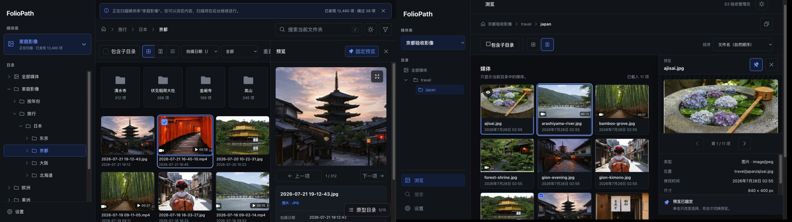
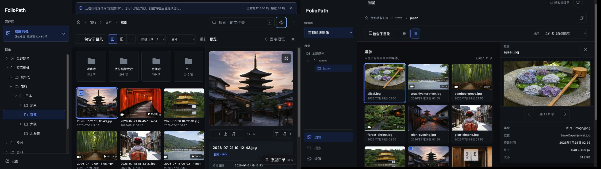

# Stage 1 authentication UI design QA

## Findings

No actionable P0, P1, or P2 differences remain in the reviewed Stage 1 states.

- Intentional contract difference: production administrator setup includes the
  required display-name field and required markers.
- Intentional safety difference: the production unavailable state replaces the
  prototype's internal path and SQLite diagnostics with a safe status summary.
- Intentional prototype-context difference: production omits the prototype directory,
  “continue viewing prototypes,” “return to prototype start,” and other prototype-only
  navigation.

## Source and implementation

- Source visual truth: `prototypes/foliopath-static-ui`, screens 1, 2, and 15.
- Implementation: `web/`, routes `/setup/admin`, `/login`,
  `/settings/general`, and `/system/unavailable`.
- Desktop captures: 1440 × 1024 CSS pixels, 1440 × 1024 source and implementation
  images, device scale factor 1.
- Mobile captures: 390 × 844 CSS pixels, 390 × 844 source and implementation images,
  device scale factor 1.
- Browser state: production Vite UI connected to a disposable real FolioPath backend
  with an empty synthetic `/library`; no developer media was read or changed.

## Full-view comparison evidence

### Desktop administrator setup

The source is on the left and implementation on the right. Card width, alignment,
palette, type hierarchy, form rhythm, primary action, and read-only footer follow the
accepted direction. The implementation is taller because the API contract requires a
display name and confirmation field.

### Mobile login and expired session

The implementation preserves the source hierarchy and full-width form treatment. Both
captures use the same viewport and density. The implementation has no page-level
horizontal overflow.

### Desktop startup unavailable

The source is on the left and implementation on the right. The production state keeps
the centered card, icon, hierarchy, diagnostic panel rhythm, and full-width retry
action while replacing unsafe internal diagnostics with a safe status summary.

Focused region comparisons were not needed: the 1440-pixel comparisons keep the form,
status panel, icon, type, and controls readable at their captured size, and the mobile
comparison is already a focused single-card view.

## Required fidelity surfaces

- Fonts and typography: the accepted system-font stack, weight hierarchy, line height,
  letter spacing, wrapping, and Chinese/English optical hierarchy are consistent.
- Spacing and layout rhythm: card widths, centering, padding, section gaps, control
  heights, borders, radii, and elevation are consistent across reviewed states.
- Colors and tokens: all reviewed states use the central semantic tokens; light/dark
  contrast passed axe at serious/critical severity.
- Image and asset fidelity: these states contain no raster product imagery. Visible
  icons use the shared Phosphor icon source and retain consistent size and weight.
- Copy and content: production copy follows the accepted flow while preserving the
  API-required display name and removing path, SQLite, and container diagnostics.

## Interaction and accessibility evidence

- Real backend journey: first-administrator setup, authenticated settings, logout,
  protected-route session-expired return, and login all passed.
- Readiness: contracted `application_data_unavailable` produces the safe blocking
  state without host paths, `/app/data`, SQLite text, stack traces, or raw responses.
- Theme: light/dark switching updates the document theme and exposes the inverse
  accessible action.
- Locale: English is selected from an English browser default; Simplified Chinese and
  English switching updates the whole Stage 1 interface and `html[lang]`.
- Responsive: 390, 768, 1024, and 1440 widths have no page-level horizontal overflow.
- Accessibility: automated Chromium axe checks report no serious or critical
  violations for setup, authenticated dark settings, expired login, English locale,
  and the startup unavailable state.

## Comparison history

1. Authentication comparisons passed with only the intentional API/prototype
   differences listed above.
2. The first automated axe pass found a P1 semantic defect: the named Toast viewport
   lacked a permitted role. The shared Toast owner now uses a named `region`; the
   follow-up axe pass is clean.
3. The first dark-settings axe pass found a P1 contrast defect caused by broad
   descendant selectors recoloring Button text. Descriptions and identity text now use
   explicit classes; the follow-up dark-state axe pass is clean.
4. The first unavailable-page comparison found a P2 visual drift: left-aligned content
   and a content-width retry button differed from the centered source. The
   implementation now centers the state and uses a full-width primary action; the
   post-fix comparison is `qa/unavailable-comparison-1440.jpg`.

## Residual release work

Stage 5 still owns the full target-browser matrix, final deployment image, trusted
proxy/network configuration, and release-candidate visual regression matrix.

## Stage 2 media-library and scan design QA

### Findings

No actionable P0, P1, or P2 differences remain in the reviewed Stage 2 states.

- Intentional data difference: the source library screen uses two fictional libraries
  to demonstrate scanning and offline rows; the implementation capture uses the one
  real library available in the disposable backend.
- Intentional contract difference: production exposes “view status” and “scan again”
  as separate actions and presents scan counters on a dedicated route.
- Intentional shell difference: production keeps the accepted theme control in the
  top bar and replaces the prototype's fictional online-library footer with the
  truthful read-only-media statement.

### Source and implementation

- Source visual truth: `prototypes/foliopath-static-ui`, screens 10–14.
- Implementation: `web/`, routes `/settings/libraries`,
  `/settings/libraries/:libraryId/status`, and `/settings/general`.
- Library full-view comparison:
  `qa/stage2-library-source-1440.png`,
  `qa/stage2-library-implementation-1440.png`, and
  `qa/stage2-library-comparison-1440.jpg`.
- Settings full-view comparison:
  `qa/stage2-settings-source-1440.png`,
  `qa/stage2-settings-implementation-1440.png`, and
  `qa/stage2-settings-comparison-1440.jpg`.
- Desktop library viewport and pixels: 1440 × 1024 CSS pixels, 1440 × 1024 source and
  implementation pixels, device scale factor 1.
- Desktop settings viewport: 1440 × 1024 CSS target; browser-rendered content captures
  are both 1425 × 1013 pixels after the same scrollbar/chrome exclusion, device scale
  factor 1. No cross-density scaling was used.
- Mobile implementation captures: 390 × 844 CSS pixels, device scale factor 1:
  `qa/stage2-library-implementation-mobile.png`,
  `qa/stage2-rename-dialog-mobile.png`,
  `qa/stage2-remove-dialog-mobile.png`, and
  `qa/stage2-scan-status-mobile.png`. The final long-name status regression is
  `qa/stage2-long-name-status-mobile.png`; browser content width is 375 CSS pixels
  after scrollbar exclusion and both client/scroll width are 375.
- Browser state: production Vite UI connected to a disposable real FolioPath backend
  and synthetic empty `/library`; no developer media was read or modified.

### Full-view and focused comparison evidence

The source is on the left and production on the right. Fixed navigation, top bar,
content width, heading hierarchy, primary action, card treatment, semantic status,
and row-action alignment follow the accepted screen 13 direction.

The source is on the left and production on the right. After the comparison-driven
fix, appearance and language share one panel, the content width matches the library
screen, and scanning/cache controls remain grouped in one save transaction.

The mobile dialog and scan captures are the focused comparisons: they keep the
destructive consequences, read-only guarantee, close control, status icon, counters,
timestamps, and primary action readable at the 390-pixel breakpoint. No additional
desktop crop was needed because controls and copy are readable in the full views.

### Required fidelity surfaces

- Fonts and typography: both source and implementation use the accepted system-font
  stack, Chinese/English fallback, weight hierarchy, line height, wrapping, and
  compact control text. Long library names wrap without hiding actions.
- Spacing and layout rhythm: sidebar and header proportions, content insets, card
  radii, borders, row gaps, dialog sections, and mobile one-column rhythm align.
- Colors and tokens: all visible colors come from the central semantic tokens.
  Success, warning, danger, focus, light, and dark states remain text/icon backed and
  do not rely on color alone.
- Image quality and asset fidelity: reviewed Stage 2 screens contain no raster product
  imagery. All visible interface icons use the shared Phosphor source; no emoji,
  text-glyph close icon, handcrafted SVG, or CSS-drawn substitute remains.
- Copy and content: production copy preserves the approved read-only promise and adds
  contract-specific ETag, asynchronous removal, reliable-index, validation, and
  retry behavior without exposing host paths or raw diagnostics.

### Interaction and accessibility evidence

- Real backend journey: create → rename → manual scan → status → save schedule/cache
  settings → logout/login → asynchronous remove passed in Chromium.
- Removal dialog enumerates configuration, index/directories, jobs, and reconstructible
  cache, then explicitly states that originals are not deleted, moved, or modified.
- Scan states implement queued, running, cancelling, succeeded, failed, cancelled,
  offline, and interrupted copy. Failed/offline/interrupted/cancelled states retain a
  visible reliable-index preservation message.
- Mobile at 390 × 844 keeps four library actions reachable, renders dialogs within the
  viewport, exposes semantic close controls, and keeps the scan page in one column.
- A 128-character library name and two deliberately long directory segments wrap
  without page-level overflow. The long-name status screenshot and automated
  390-pixel assertion both confirm the post-fix state.
- Theme/locale route behavior and automated axe serious/critical checks remain covered
  by the real-backend browser test.
- Browser console inspection after the final library/status/settings journey found no
  warnings or errors beyond Vite connection and React development informational logs.
- Success and error toasts now auto-dismiss after six seconds and remain manually
  dismissible, so transient feedback cannot indefinitely cover later actions.

### Comparison history

1. The first Stage 2 settings comparison found a P2 density/layout mismatch:
   appearance and language were split into separate narrow cards, pushing scanning,
   cache, and account actions below the source's first-view rhythm. Production now
   combines appearance/language and uses the shared content width. The post-fix
   evidence is `qa/stage2-settings-comparison-1440.jpg`.
2. The first completed-scan mobile capture found a P2 state mismatch: a succeeded scan
   with a null backend ratio rendered an indeterminate progress bar. Succeeded scans
   now force the semantic and visual progress value to 100%; terminal failure states
   retain their last reported ratio.
3. The first real-backend E2E pass found a P1 interaction obstruction: a success toast
   persisted over the logout action. The canonical Toast owner now auto-dismisses
   after six seconds, uses the shared Phosphor close icon, and has a regression test;
   the follow-up E2E passed.
4. The first repeated-submit pass found a P1 correctness defect: a rapid double-click
   on “Save name” sent two PATCH requests before the async loading state rendered.
   A shared synchronous submission guard now owns this interaction across create,
   rename, remove, scan/cancel, and settings. Component and real-browser regressions
   confirm one request per operation.
5. The first 128-character mobile scan-status pass found a P2 horizontal overflow:
   the unbroken name expanded the document from 390 to 1788 pixels. The status heading,
   metadata, and issue samples now use safe anywhere wrapping. Post-fix evidence is
   `qa/stage2-long-name-status-mobile.png`, with client and scroll width both 375.

### Residual Stage 2 work

Stage 2 is now Integrated Done. Stage 5 still owns the final Firefox/Safari/Chrome
release matrix, forced-colors/zoom release sweep, deployment topology, and
release-candidate visual regression.

## Stage 3 / S3-101 directory navigation QA

### Source and production comparison

- Confirmed source: static prototype catalog `5/15 主浏览界面` at
  `/libraries/family/browse/kyoto`.
- Production target: authenticated `BrowsePage` at
  `/libraries/:libraryId/browse/:directoryId?`, backed by the generated client and
  real catalog APIs.
- A same-viewport 1280 × 720 side-by-side comparison checked the fixed left rail,
  library picker, nested navigation rhythm, selected accent, breadcrumb header,
  semantic folder cards, central tokens, system type stack, light theme, and spacing.
- Production intentionally contains no fabricated media thumbnails, search controls,
  recursive toggle, sort/filter toolbar, or preview. Those visible source surfaces are
  owned by S3-102～106 and remain outside this completed slice.

### Interaction and accessibility evidence

- A real authenticated catalog restored the library root URL, rendered the directory
  rail and breadcrumb, switched light/dark themes, copied the direct URL, and announced
  success through the canonical Toast.
- Unit/component tests cover generated-client query mapping, safe breadcrumb mapping,
  deep-route recovery, ancestor auto-expansion, independent expand/select actions, and
  canonical direct links.
- Real-backend Chromium E2E covers a synthetic indexed child directory, root → child
  navigation, reload persistence, the 390 × 844 directory drawer, Escape focus return,
  the 1024 × 900 fixed sidebar, no page overflow, and axe serious/critical checks.
- Browser console review found no warning or error from production; only Vite
  connection, React development information, and a development-only hot-update debug
  event were present.
- The final dark-theme capture kept borders, muted text, selected navigation, focus,
  and success notification legible without replacing semantic icons or relying on
  color alone.

### Comparison-driven corrections

1. The first production capture exposed implementation-roadmap copy inside the visible
   media placeholder. It was replaced with neutral product copy:
   “此目录的媒体内容将在这里显示。”
2. The source uses the directory rail itself as the product sidebar. Production now
   passes the browse navigation through the canonical AppShell sidebar slot, so it
   becomes the same mobile drawer instead of nesting a second feature-local panel.
3. The source visually conflates expansion and selection in some directory rows.
   Production preserves the visual rhythm but separates the disclosure button from
   the navigable directory link, which keeps keyboard and URL semantics unambiguous.

### Residual Stage 3 work

S3-101 is complete. S3-102～108 still own recursive/current scope URL state, the real
asset grid and virtualization, complete collection states, non-modal preview,
capacity budgets, and Stage 3 Integrated Done. Release-wide browser and visual
regression matrices remain Stage 5 work.

## Stage 3 / S3-102 browse-scope QA

### Source and production comparison

- Confirmed source: static prototype catalog `6/15 递归浏览状态` at
  `/libraries/family/browse/kyoto?recursive=1`.
- Production target: authenticated `BrowsePage` with canonical
  `recursive=1&sort&order` state and real catalog asset pages.
- The same desktop state was compared side-by-side for the fixed library rail,
  selected directory treatment, breadcrumb hierarchy, toolbar rhythm, checked
  recursive control, sorting control, content section spacing, system typography,
  semantic tokens, and light theme.
- Production intentionally omits the source's grid/masonry/list controls, kind filter,
  search input, thumbnails, and preview selection because those surfaces remain owned
  by S3-103～106.

### Interaction and accessibility evidence

- The live authenticated page switched recursive scope, changed to non-default
  filename sorting, returned to direct scope, and restored the exact prior recursive
  URL/state with browser Back.
- A two-level synthetic-media real-backend E2E proves direct mode excludes descendant
  media, recursive mode includes it, source links return to the indexed source
  directory without recursive state, and reload preserves the deep URL.
- URL, adapter, and page tests cover mode-specific defaults, invalid-value
  normalization, bounded query parameters, source labels, and query reset.
- 390 × 844 and 1024 × 900 E2E assertions retain drawer/fixed-sidebar behavior, no
  document overflow, and no axe serious/critical findings.
- Browser console review found no production warning or error; only Vite connection,
  React development information, and hot-update debug entries were present.

### Comparison-driven corrections

1. The first production capture rendered the active recursive control as a solid
   primary CTA, while the confirmed source treats it as a persistent toolbar state.
   The canonical Button now keeps its secondary surface and adds selected border,
   accent-soft background, checked icon, and `aria-pressed=true`.
2. The implementation does not infer source navigation from visible path text.
   Source links preserve the source's compact secondary line but use the opaque
   `directoryId`, then intentionally return to direct mode.
3. Direct and recursive states originally shared placeholder media copy. They now
   expose distinct scope descriptions and a bounded indexed summary, making the mode
   change observable without fabricating the future thumbnail grid.

### Residual Stage 3 work

S3-101～102 are complete. S3-103～108 still own the virtualized thumbnail collection,
layout preference, full collection states, non-modal preview, capacity budgets, and
Stage 3 Integrated Done. Release-wide browser and visual regression matrices remain
Stage 5 work.

## Stage 3 / S3-103 media-collection QA

### Source and implementation

- Source visual truth:
  `prototypes/foliopath-static-ui`, confirmed catalog screen `5/15`, captured as
  `web/qa/s3-103-source-grid-light.png`.
- Production implementation: authenticated `BrowsePage` at
  `/libraries/lib_1/browse/dir_3`, connected to a disposable real backend built
  with libvips and an 11-item read-only JPEG library.
- Browser CSS viewport: 1280 × 720 at device scale factor 1. The source capture is
  1280 × 720 pixels. The browser-rendered implementation capture is 1265 × 712
  pixels because the in-app browser excludes its native scrollbar/chrome inset; the
  comparison pads it without scaling to 1280 × 720.
- State: Simplified Chinese, light theme, direct directory, filename ascending,
  adaptive grid. Additional captures cover remembered masonry and dark theme.

### Full-view comparison evidence

- Side-by-side truth:
  `web/qa/s3-103-comparison-grid-light-v2.png`.
- The fixed library rail, selected path, breadcrumb/tool rows, 5-column media density,
  4:3 image crop, compact two-line identity, system type stack, blue selected state,
  light canvas/surface balance, border radii and native scroll all remain coherent
  with the confirmed source.
- Source-only search/filter/list controls, scanning banner, item selection and preview
  chrome remain intentionally absent because S3-103 owns only the media collection;
  those surfaces are assigned to S3-104～106.

### Focused media comparison

- Focused side-by-side:
  `web/qa/s3-103-comparison-media-focus-v2.png`.
- Typography: production filename and timestamp weights/sizes preserve the source's
  scan hierarchy and truncate safely.
- Spacing/layout: both render five stable columns and two complete rows at desktop;
  production keeps a slightly stronger card boundary as accepted P3 polish.
- Colors/tokens: light/dark surfaces, muted metadata, accent selection and focus rings
  use the central theme tokens with readable contrast.
- Image quality: production displays real libvips-generated WebP from the same
  reference JPEG family, preserving crop, sharpness and subjects; no CSS/HTML image
  approximations are used.
- Copy/content: production uses real indexed filenames and filesystem modification
  times. Prototype-only counts and controls are not fabricated.

### Interaction and accessibility evidence

- Grid and masonry share one query and virtualized DOM; the selected IconButton exposes
  `aria-pressed`, survives reload through the canonical preference namespace, and does
  not alter the browse URL.
- The live page rendered all 11 ready thumbnail references, switched light/dark and
  grid/masonry, retained the active layout, and preserved source order.
- Unit evidence uses 200 items and proves the rendered list remains bounded. The
  repository E2E uses the libvips test image and real read-only JPEGs for ready WebP,
  390px/1024px overflow and axe serious/critical checks.
- Browser console review found no production warning or error; only Vite connection,
  React development information and expected hot-update debug entries were present.

### Comparison history

1. Initial comparison found a P2 vertical-density mismatch: a duplicated current
   directory heading and large “no subdirectories” card pushed the first media row
   below the fold. Evidence:
   `web/qa/s3-103-comparison-grid-light-v1.png`.
2. The visible heading became an accessible screen-reader heading, child-directory
   content now renders only when it exists/loads/errors, and content padding/gaps were
   tightened using existing tokens.
3. The revised same-state comparison
   `web/qa/s3-103-comparison-grid-light-v2.png` shows the media heading and two media
   rows above the fold; no actionable P0/P1/P2 difference remains.

### Residual Stage 3 work

S3-104 still owns the complete collection/thumbnail state and retry matrix. S3-105～106
own click/double-click, docked/pinned non-modal preview and focus restoration. S3-107
owns the 100k capacity budget, so this slice does not promote the 200-item component
test into a release-scale performance claim.

## Stage 3 / S3-106 pinned-preview interaction QA

### Findings

No actionable P0, P1, or P2 differences remain in the reviewed S3-106 state.

### Source and implementation

- Source visual truth: `prototypes/foliopath-static-ui`, the confirmed dark browse
  screen with the first asset pinned in preview and the second asset selected.
- Production target: `BrowsePage`, shared `MediaCollection`/`MediaCard`, and shared
  `MediaPreview`.
- Source capture: `qa/s3-106-source-pinned-dark.jpg`; implementation capture:
  `qa/s3-106-implementation-pinned-dark.jpg`; same-state side-by-side:
  `qa/s3-106-comparison-pinned-dark.png`.
- Browser CSS viewport: approximately 1280 × 720. The source scrollbar inset makes
  its native capture 1265 × 712; the comparison pads it without scaling.

### Same-state comparison evidence

Both sides show the same interaction state: the first asset remains in the docked
preview while the second asset is selected. The implementation deliberately makes
that distinction more explicit and accessible: an eye badge and inner accent identify
the previewed asset, while the outer selection border and `aria-pressed` identify the
selected asset. The pressed pin control and persistent status band explain why the
two states differ.

### Interaction, responsive and accessibility evidence

- Unpinned single click moves selection and preview together.
- After pinning, single click moves only selection; double click switches the only
  active preview. Unpinning immediately follows the current selection.
- Escape and the close button use the same close path. The virtual collection scrolls
  the current preview item back into its rendered window and restores focus to its
  semantic media button.
- Image/video branches are mutually exclusive. A keyed video node is unmounted on
  asset switch or close, so stale playback elements do not remain in the DOM.
- The parent list remains scrollable and operable beside the desktop dock. The
  existing ≤1024px rule places preview in content flow without a scrim or focus trap.
- Pin and selection expose pressed semantics; preview identity also has hidden text,
  so the state does not depend on color or icon recognition alone.
- Simplified Chinese dark mode was reviewed against the accepted prototype; the
  existing component and browser matrices retain light/dark, English/Chinese,
  responsive and axe coverage.

### Residual Stage 3 work

S3-107 owns the 100k-media DOM/request/scroll/playback-resource budget. S3-108 owns
the complete Stage 3 Integrated Done browser gate. S4-006～009 own the full viewer,
fullscreen/zoom, Range/codec/offline/deleted states and target-browser verification.

## Stage 3 / S3-105 shared media-preview QA

### Findings

No actionable P0, P1, or P2 differences remain in the reviewed S3-105 state.

- Intentional scope difference: the confirmed prototype shows pin, fullscreen and
  follow-selection help. S3-105 includes only media rendering, basic information,
  previous/next, close and width adjustment; pin/double-click/focus restoration is
  S3-106, and fullscreen is part of the complete viewer in S4-006.
- Intentional data difference: the source uses fictional mixed image/video entries;
  production uses the authenticated disposable backend's real read-only JPEG set.
  The shared component workbench and tests cover the native video branch without
  fabricating a video asset in the indexed library.

### Source and implementation

- Source visual truth: `prototypes/foliopath-static-ui`, confirmed browse screen
  `5/15`, media selected and preview open.
- Production: authenticated `BrowsePage` at
  `/libraries/lib_1/browse/dir_3`, connected to the disposable real backend and its
  `GET /api/v1/assets/{assetId}/content` endpoint.
- Browser CSS viewport: 1280 × 720, dark theme, Simplified Chinese. The source capture
  is 1280 × 720. The implementation capture is 1265 × 712 because the in-app browser
  excludes its native scrollbar/chrome inset; the comparison pads it without scaling.
- Captures:
  `qa/s3-105-source-preview-dark.jpg`,
  `qa/s3-105-implementation-preview-dark.jpg`, and
  `qa/s3-105-comparison-preview-dark.png`.

### Full-view comparison evidence

Both states preserve the fixed library rail, selected directory, compact browse
toolbar, bounded media grid, selected-card accent and a right-side preview separated
from the still-usable parent collection. The 406px production panel follows the
source's header/stage/navigation/information hierarchy and uses the real selected
asset rather than a placeholder.

### Required fidelity surfaces

- Typography and hierarchy: preview eyebrow, filename, navigation count and compact
  key/value metadata follow the source's system stack and muted/primary hierarchy.
- Spacing and geometry: header/control heights, 406px default width, stage padding,
  contain fit, centered navigation and dense details match the accepted rhythm.
- Colors and tokens: canvas, surface, border, scrim, accent selection, focus and
  light/dark behavior use central tokens; no feature-local theme mechanism was added.
- Assets: the production stage and cards use authenticated real source/thumbnail
  bytes. Visible controls use the established Phosphor family; no fake media, CSS art,
  handcrafted SVG or text-glyph icon was introduced.
- Content and privacy: production displays only library-relative location, indexed
  MIME/type, modification time, dimensions, size and optional duration. Host paths,
  raw errors and unsupported EXIF/download actions are absent.

### Interaction, responsive and accessibility evidence

- Live browser checks opened the image, switched to the next item, disabled the first
  previous action, updated `aria-pressed`, closed the panel and confirmed it no longer
  existed.
- The separator exposes orientation, 360/620 bounds and current width. ArrowLeft
  changed 406 → 430 in the real page; component tests cover the clamp boundary.
- At 760 × 900 the separator is removed and the preview enters the document flow at
  full content width. Its close, image, navigation and complete details remain usable.
- Unit tests cover the image, native video and failed-load branches. The production
  E2E uses the real authenticated content endpoint; repository axe/overflow checks
  remain active.

### Comparison history

1. The first same-state comparison found a P2 vertical-fit difference: the production
   panel used a full viewport height after beginning below the browse toolbar, so its
   information rows fell below the initial viewport.
2. The shared panel height now subtracts the shell, breadcrumb and toolbar bands, and
   its stage uses a bounded minimum. The revised capture shows image, navigation and
   all basic information together, matching the source hierarchy.

### Residual Stage 3 work

S3-106 owns pinned selection/double-click, Escape and exact trigger/virtual-anchor
focus restoration. S3-107 owns 100k media and playback-resource budgets. S3-108 owns
the complete Stage 3 Integrated Done browser gate. S4-006～009 own full viewer,
fullscreen/zoom, codec/Range/offline/deleted states and target-browser verification.

## Stage 4 / S4-006 complete media viewer QA

### Reviewed state

- Accepted source: static prototype screen `9/15`, route
  `/libraries/family/media/pagoda`.
- Production: authenticated isolated frontend route
  `/libraries/lib_1/media/:assetId`, reached from the real global-search preview.
- Desktop comparison: source and implementation captured at the same 1440×900 CSS
  viewport and combined side by side before judgment.
- Mobile verification: production captured at 390×844 with the information surface
  open.

### Same-viewport comparison

- The implementation preserves the accepted near-black canvas, fixed dark header,
  centered filename, bounded media stage, edge previous/next controls, right
  information panel and compact footer.
- The production image uses the real content endpoint and its indexed 640×400
  dimensions. It occupies the same 640×400 fitted slot as the source image; no
  stretching, substitute asset or fabricated placeholder is present.
- Production uses the canonical icon button primitive for fit, 1:1, zoom, information
  and fullscreen. This is intentionally denser than the prototype's three text
  controls while preserving the same hierarchy and adding the required zoom actions.
- The visible close focus ring is intentional accessibility state: the close control
  receives focus on route entry so keyboard users have a deterministic exit.
- No actionable P0, P1 or P2 visual difference remains in the combined comparison.

### Responsive and interaction evidence

- At 390×844 the header wraps into a compact two-row toolbar, the image remains
  contained between reachable edge controls, and information becomes a bounded
  bottom sheet above the footer. No filename, control or metadata row is clipped.
- Component tests cover fit, 1:1, zoom, image/video branches, information, fullscreen,
  previous/next, Escape and focus protection.
- Page and URL-codec tests cover real asset-detail queries, bounded source sequences,
  direct routes, cross-library/global-search movement, safe return validation and
  return-focus state.
- Real-backend browser coverage enters from the shared preview, changes view mode,
  zooms, hides information, returns to the preserved browse URL and restores the
  original virtual media button focus.
- Shared viewer and preview stories build successfully; no raw color, spacing,
  z-index or motion value was introduced outside the central token source.

### Residual Stage 4 work

S4-007 still owns GIF/codec and source-unavailable/corrupt/deleted states. S4-008 owns
the target browser, touch, Range and error matrix. S4-009 owns the complete Stage 4
Integrated Done gate.

final result: passed

## Stage 4 / S4-008 media interaction matrix QA

### Review steps

1. At 1280×800, opened the authenticated production viewer with the Close button
   auto-focused and exercised `I`, ArrowRight and Escape without moving focus first.
2. Repeated the information toggle with the toolbar focus ring visible, then focused
   the native video element and confirmed conflicting navigation keys are preserved
   for the media control.
3. Loaded a real synthetic MP4 through a byte-range route and observed a browser
   `Range: bytes=…` request followed by `206 Content-Range` and metadata readiness.
4. At 390×844 Pixel 5 touch emulation, opened and closed information, tapped offline
   recovery, and verified Close/Previous/Next remain visible without horizontal
   overflow.
5. Reviewed unsupported-codec, offline and deleted outcomes for stable hierarchy,
   useful recovery, and absence of an invalid player or retry action.

### General health

- The viewer keeps one clear visual hierarchy across ready and degraded states:
  persistent Close/name/actions, a bounded media stage, visible adjacent navigation,
  and optional basic information.
- Desktop keyboard and mobile touch paths expose the same essential operations.
  The mobile information panel is initially collapsed, so it does not hide recovery
  or navigation.
- Axe reported no serious or critical violations in the stable desktop and mobile
  test states. No reviewed viewport had page-level horizontal overflow.

### Finding and resolution

- The initial browser pass found a P1 keyboard defect: Close receives deliberate
  initial focus, but the old conflict selector classified every button as a control
  that should suppress viewer shortcuts. A user opening the viewer could therefore
  not use `I` or arrows until focus moved elsewhere.
- The conflict owner now limits suppression to native video, form fields and editable
  content. Toolbar buttons retain their own activation while viewer-level shortcuts
  remain immediately available. Component and real-browser regression tests fix this
  behavior.

### Evidence and limits

- `qa/s4-008/01-desktop-viewer-keyboard.jpg`
- `qa/s4-008/02-desktop-keyboard-info-toggle.jpg`
- `qa/s4-008/03-mobile-offline-recovery.jpg`
- `qa/s4-008/04-desktop-unsupported-codec.jpg`
- Static screenshots demonstrate layout and focus visibility; the real `Range`/206
  exchange and touch semantics are asserted by Playwright rather than inferred from
  images.
- This Gate covers Desktop Chrome and Pixel 5 Chromium touch emulation. Firefox,
  Safari/WebKit release versions and physical-device media stacks remain Stage 5
  release evidence.

final result: passed

## Stage 4 / S4-007 media strategy and degraded-state QA

### Reviewed state

- Accepted source: static prototype route `/libraries/family/media/offline`, added to
  the prototype catalog as the explicit offline-viewer state.
- Production: shared `MediaViewer` offline story using the same filename, indexed
  details, dark theme, open information panel and retry action.
- Source and implementation were captured at the exact same 1440×900 CSS viewport and
  combined side by side before judgment:
  `qa/s4-007-source-offline-viewer.png`,
  `qa/s4-007-implementation-offline-viewer.png`, and
  `qa/s4-007-comparison-offline-viewer.png`.

### Comparison and findings

- Both states preserve the accepted near-black stage, fixed header/footer, centered
  filename, visible close/fullscreen controls, edge navigation, indexed information
  and a centered non-modal state surface. The original media is never replaced with a
  fabricated image or a blocking page.
- Production intentionally uses the canonical icon/button primitives and the shared
  semantic accent token. Its cloud-offline icon is more specific than the prototype's
  generic warning icon while preserving the same size, hierarchy and tone.
- The state card copy matches the filesystem invariant: offline is not empty, the last
  reliable index remains available, and retry does not imply modifying the original.
- Initial 390×844 review found a P1 overlap: the default-open information bottom panel
  covered the state card's retry action. Mobile viewer entry now starts with information
  collapsed; the revised capture
  `qa/s4-007-implementation-offline-viewer-mobile.png` keeps close, information,
  fullscreen, previous/next, reason and retry fully reachable without clipping.
- No actionable P0, P1 or P2 visual difference remains.

### Behavior and accessibility evidence

- One pure policy owns offline/missing/unreadable, invalid, unsupported and
  unsupported-codec precedence for browse, search and viewer consumers.
- GIF remains a normal authenticated original image; native video uses controls,
  playsInline, metadata preload and the ready thumbnail URL as poster. No client
  transcode or frame extraction was introduced.
- Persistent states use an icon, heading and explanation rather than color alone.
  Viewer close and bounded previous/next remain available; retry exists only where it
  can re-read state. Component/page tests cover the policy and deleted/offline paths.

final result: passed

## Stage 3 / S3-104 browse-state QA

### Findings

No actionable P0, P1, or P2 differences remain in the reviewed S3-104 states.

- Intentional contract difference: the confirmed prototype suggests a generic retry
  for some failures, but the frozen thumbnail API has no write operation that
  regenerates a terminal transform. Production therefore retries first-page and
  pagination reads, polls only pending thumbnails, and does not show a fake per-card
  regeneration action.
- Intentional context difference: the source visual demonstrates empty/offline/error
  in the search screen; production reuses the same accepted state hierarchy inside
  the browse media section with directory-specific copy.

### Source and implementation

- Source visual truth: `prototypes/foliopath-static-ui`, catalog screen `8/15`
  `/libraries/family/search/empty` plus the confirmed main browse screen `5/15`.
- Production target: `BrowsePage`, shared `AsyncState`, and shared
  `MediaCollection`/`MediaCard`.
- Source empty capture: `qa/s3-104-source-empty.png`; implementation empty capture:
  `qa/s3-104-implementation-empty.png`; side-by-side:
  `qa/s3-104-comparison-empty.jpg`.
- Additional implementation evidence:
  `qa/s3-104-skeleton-light.png`,
  `qa/s3-104-thumbnail-states-light.png`,
  `qa/s3-104-thumbnail-states-dark.png`,
  `qa/s3-104-offline-dark.png`, and the real-backend ready page
  `qa/s3-104-implementation-ready-dark.png`.
- Browser CSS viewport: 1280 × 720. The in-app browser reported device pixel ratio 2
  but returned CSS-pixel-normalized screenshots. State/workbench captures are
  1280 × 720 pixels. The source empty capture is 1265 × 712 pixels because its native
  scrollbar inset is excluded; the comparison pads it to 1280 × 720 without scaling.

### Full-view and focused comparison evidence

The side-by-side comparison checks the centered icon/title/description/action
hierarchy, calm surface treatment, system typography, neutral border, canvas balance,
and concise recovery copy. The browse implementation intentionally occupies the media
section rather than repeating the source search controls.

Focused state captures are required because individual thumbnail labels and icons are
too small in the full browse view. The light/dark thumbnail captures verify stable 4:3
geometry, pending/failed/unavailable differentiation, icon consistency and the
post-fix video badge. Skeleton and offline captures verify collection density,
semantic warning color and preserved vertical rhythm.

### Required fidelity surfaces

- Fonts and typography: the central system stack, 600/650 title hierarchy, compact
  metadata, line height, Chinese fallback and truncation match the accepted UI.
- Spacing and layout rhythm: empty/offline frames, 4:3 thumbnail geometry, two-line
  card identity, six-column desktop skeleton and section gaps use central spacing,
  radius and border tokens.
- Colors and tokens: neutral, accent-soft, danger-soft and warning-soft states work in
  light/dark themes; the new `--color-on-scrim` token keeps video controls legible.
- Image quality and asset fidelity: state placeholders use the shared Phosphor icon
  family and do not imitate product imagery. The real ready page continues to render
  libvips WebP assets without CSS, SVG or text-glyph substitutes.
- Copy and content: offline copy states that a preserved index with no visible media
  does not prove the source directory is empty and originals remain unchanged;
  pagination copy explains that already loaded items are preserved; no raw tool
  output, absolute path or unsupported action appears.

### Interaction, responsive and accessibility evidence

- Empty state exposes its contextual “include subdirectories” action; first-page and
  next-page failures expose separate retry surfaces.
- Pending-only query policy refreshes every 2.5 seconds and stops for ready, failed or
  unavailable terminal states.
- Skeleton and pending shimmer stop under reduced motion. Loading is announced once;
  offline is a persistent status and first-page failure is an alert.
- Component and production pages showed no console error; only Vite connection,
  hot-update debug messages and React development information were present.
- Repository Chromium evidence covers 390 × 844 and desktop overflow plus axe
  serious/critical checks for the stable browse states.

### Comparison history

1. The first dark thumbnail pass found a P2 contrast defect: the video badge inherited
   the dark surface foreground over the dark scrim, hiding its play icon. A central
   `--color-on-scrim` token now owns that foreground; the revised dark capture shows
   the white play icon clearly.
2. The first skeleton pass found a P2 density shift: its 10.5rem minimum produced seven
   columns where the final collection caps at six. The skeleton now uses the
   collection's 11.25rem track basis; the revised capture has six aligned columns.
3. The first empty-state pass found a P2 surface mismatch: the accepted source uses a
   bounded state region while the shared implementation floated directly on canvas.
   EmptyState now uses the central border/radius/surface tokens, and the revised
   side-by-side comparison has no actionable P0/P1/P2 difference.

### Residual Stage 3 work

The later S3-105～106 evidence above completes selection and the docked/pinned
non-modal preview. S3-107 owns the 100k capacity budget, and S3-108 owns the Stage 3
Integrated Done browser gate.

## Stage 4 / S4-004 search interface QA

### Reviewed states

- Accepted static source: `7/15 搜索结果` and `8/15 搜索无结果`.
- Production implementation: current-library and all-library results, type-filtered
  no result, loading, offline, request failure, long library names, and next-page
  failure with loaded results retained.
- Theme and viewport review: source and implementation were captured in the in-app
  browser at the same 1280×720 desktop viewport; automated browser evidence covers
  the stable 1024px responsive state and horizontal-overflow guard.

### Source comparison

- The production shell, persistent search command, filter grouping, media hierarchy,
  light/dark tokens, restrained borders, icon treatment, and bounded empty state
  match the accepted direction.
- Production intentionally adds explicit name/modified-time sort controls because the
  accepted backend contract exposes stable search sorting.
- The API does not expose a total count, so production reports loaded results rather
  than inventing the prototype's fixture total. The shared virtual collection may
  fit a different column count while preserving the accepted adaptive density.
- When a query has no active filters, the empty-state action returns focus to editing
  the query; “clear filters” remains available only when it can change the result.

### Accessibility and behavior

- Search, scope, recursive-directory, type, date, sort, and order controls retain
  semantic labels and keyboard focus visibility.
- Result cards preserve DOM order and virtualized focus semantics; visible source
  links use server IDs and never expose absolute filesystem paths.
- Real Chromium E2E reports zero axe serious/critical violations and no page-level
  horizontal overflow for the reviewed search flow.

## Stage 4 / S4-005 shared search-preview QA

### Reviewed state

- Selected source: the accepted Stage 3 dark pinned-preview capture
  `qa/s3-106-source-pinned-dark.jpg`.
- Production state: an isolated real backend/library/search flow at 1265×712 with
  a real indexed JPEG, search controls and results visible beside the pinned preview.
- Interaction matrix: unpinned click, pinned single selection, pinned double-click
  switch, filter replacement, outside-current-results status, clear filter, close,
  Escape and virtual focus restoration.

### Same-state comparison

- Search uses the exact shared preview header, pin/close controls, media stage,
  previous/next navigation, basic details and persistent pin explanation already
  accepted for browse; it does not introduce a search-only panel or modal overlay.
- The desktop workspace preserves the source relationship of a scrollable parent
  collection beside a bounded right preview. At ≤1024px the existing shared
  responsive rule moves the preview into document flow.
- The search command remains full width above the results/preview workspace so query,
  scope, kind, date and sort stay operable while media is visible or playing.
- The isolated browser console contained only Vite connection and React development
  information; no warning or error was introduced.

### Findings and resolution

- The first real E2E assertion found duplicate visible filename text after the preview
  opened. This was test ambiguity, not a product defect; the assertion now targets the
  semantic media article and therefore protects the intended card surface.
- Filtering a pinned image out of search initially risked losing result-position
  context. The shared controller now retains the media snapshot, disables unavailable
  previous/next movement and shows “Pinned preview is outside the current results”.
- No actionable P0, P1 or P2 visual, interaction or accessibility difference remains.
  Real Chromium reports no page-level horizontal overflow and zero axe
  serious/critical violations in the reviewed search path.

final result: passed
