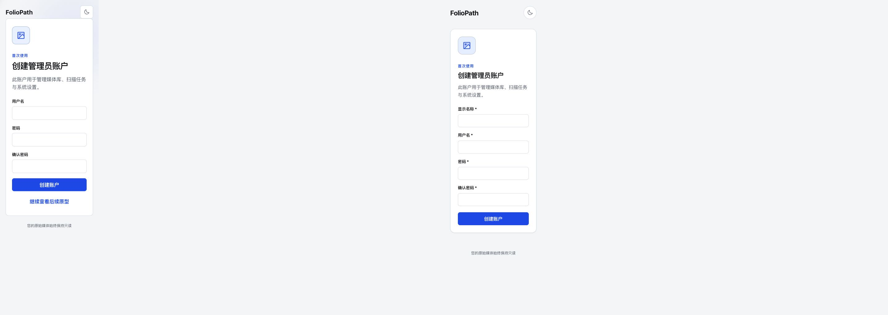
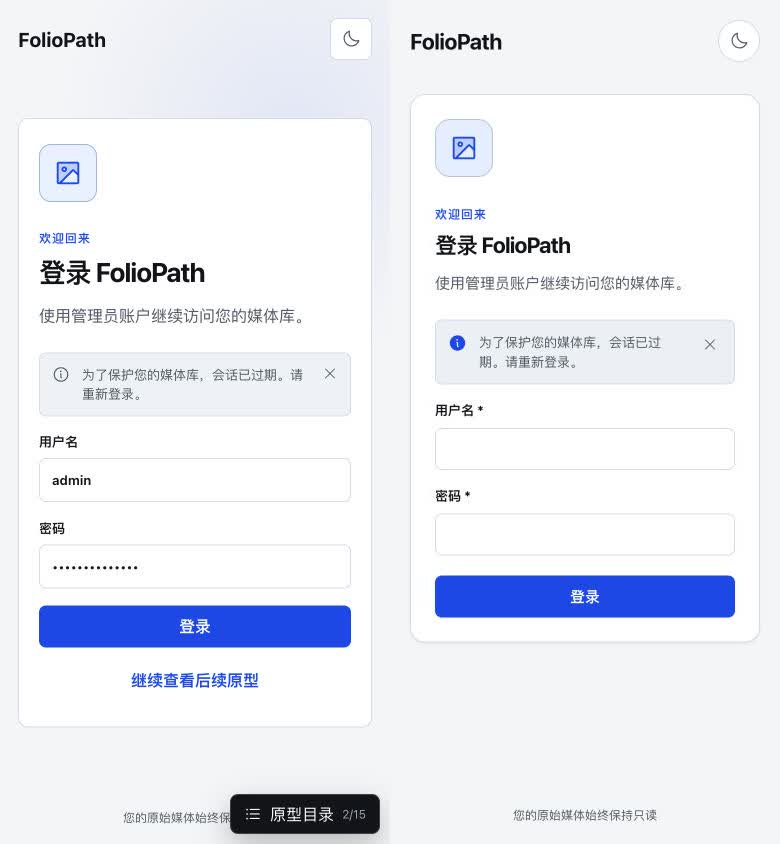
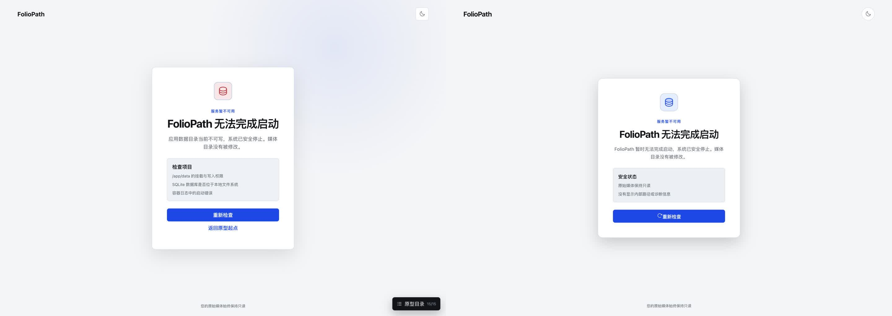
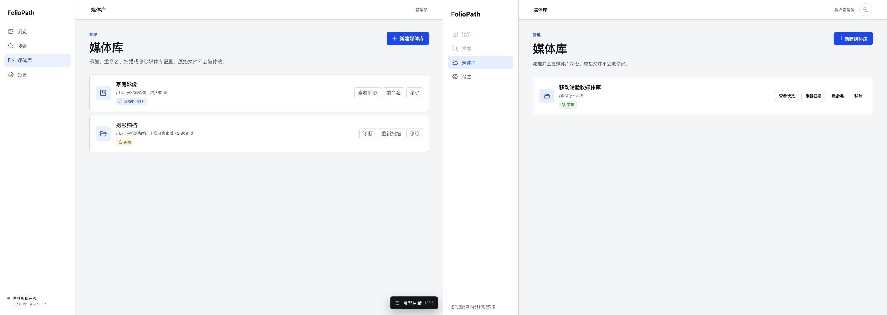
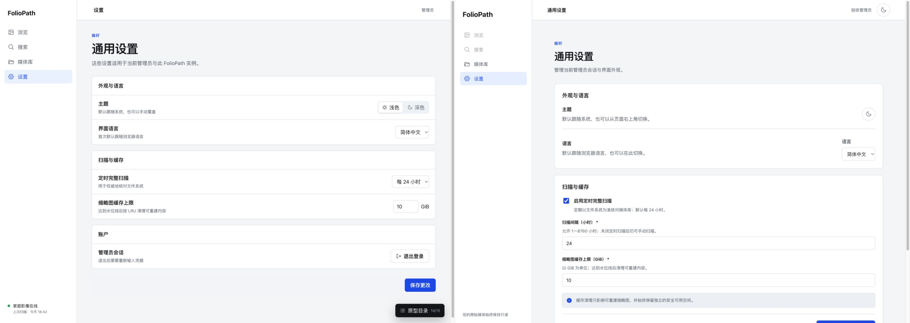

# Stage 1 authentication UI design QA

## Findings

No actionable P0, P1, or P2 differences remain in the reviewed Stage 1 states.

- Intentional contract difference: production administrator setup includes the
  required display-name field and required markers.
- Intentional safety difference: the production unavailable state replaces the
  prototype's internal path and SQLite diagnostics with a safe status summary.
- Intentional prototype-context difference: production omits the prototype directory,
  “continue viewing prototypes,” “return to prototype start,” and other prototype-only
  navigation.

## Source and implementation

- Source visual truth: `prototypes/foliopath-static-ui`, screens 1, 2, and 15.
- Implementation: `web/`, routes `/setup/admin`, `/login`,
  `/settings/general`, and `/system/unavailable`.
- Desktop captures: 1440 × 1024 CSS pixels, 1440 × 1024 source and implementation
  images, device scale factor 1.
- Mobile captures: 390 × 844 CSS pixels, 390 × 844 source and implementation images,
  device scale factor 1.
- Browser state: production Vite UI connected to a disposable real FolioPath backend
  with an empty synthetic `/library`; no developer media was read or changed.

## Full-view comparison evidence

### Desktop administrator setup

The source is on the left and implementation on the right. Card width, alignment,
palette, type hierarchy, form rhythm, primary action, and read-only footer follow the
accepted direction. The implementation is taller because the API contract requires a
display name and confirmation field.

### Mobile login and expired session

The implementation preserves the source hierarchy and full-width form treatment. Both
captures use the same viewport and density. The implementation has no page-level
horizontal overflow.

### Desktop startup unavailable

The source is on the left and implementation on the right. The production state keeps
the centered card, icon, hierarchy, diagnostic panel rhythm, and full-width retry
action while replacing unsafe internal diagnostics with a safe status summary.

Focused region comparisons were not needed: the 1440-pixel comparisons keep the form,
status panel, icon, type, and controls readable at their captured size, and the mobile
comparison is already a focused single-card view.

## Required fidelity surfaces

- Fonts and typography: the accepted system-font stack, weight hierarchy, line height,
  letter spacing, wrapping, and Chinese/English optical hierarchy are consistent.
- Spacing and layout rhythm: card widths, centering, padding, section gaps, control
  heights, borders, radii, and elevation are consistent across reviewed states.
- Colors and tokens: all reviewed states use the central semantic tokens; light/dark
  contrast passed axe at serious/critical severity.
- Image and asset fidelity: these states contain no raster product imagery. Visible
  icons use the shared Phosphor icon source and retain consistent size and weight.
- Copy and content: production copy follows the accepted flow while preserving the
  API-required display name and removing path, SQLite, and container diagnostics.

## Interaction and accessibility evidence

- Real backend journey: first-administrator setup, authenticated settings, logout,
  protected-route session-expired return, and login all passed.
- Readiness: contracted `application_data_unavailable` produces the safe blocking
  state without host paths, `/app/data`, SQLite text, stack traces, or raw responses.
- Theme: light/dark switching updates the document theme and exposes the inverse
  accessible action.
- Locale: English is selected from an English browser default; Simplified Chinese and
  English switching updates the whole Stage 1 interface and `html[lang]`.
- Responsive: 390, 768, 1024, and 1440 widths have no page-level horizontal overflow.
- Accessibility: automated Chromium axe checks report no serious or critical
  violations for setup, authenticated dark settings, expired login, English locale,
  and the startup unavailable state.

## Comparison history

1. Authentication comparisons passed with only the intentional API/prototype
   differences listed above.
2. The first automated axe pass found a P1 semantic defect: the named Toast viewport
   lacked a permitted role. The shared Toast owner now uses a named `region`; the
   follow-up axe pass is clean.
3. The first dark-settings axe pass found a P1 contrast defect caused by broad
   descendant selectors recoloring Button text. Descriptions and identity text now use
   explicit classes; the follow-up dark-state axe pass is clean.
4. The first unavailable-page comparison found a P2 visual drift: left-aligned content
   and a content-width retry button differed from the centered source. The
   implementation now centers the state and uses a full-width primary action; the
   post-fix comparison is `qa/unavailable-comparison-1440.jpg`.

## Residual release work

Stage 5 still owns the full target-browser matrix, final deployment image, trusted
proxy/network configuration, and release-candidate visual regression matrix.

## Stage 2 media-library and scan design QA

### Findings

No actionable P0, P1, or P2 differences remain in the reviewed Stage 2 states.

- Intentional data difference: the source library screen uses two fictional libraries
  to demonstrate scanning and offline rows; the implementation capture uses the one
  real library available in the disposable backend.
- Intentional contract difference: production exposes “view status” and “scan again”
  as separate actions and presents scan counters on a dedicated route.
- Intentional shell difference: production keeps the accepted theme control in the
  top bar and replaces the prototype's fictional online-library footer with the
  truthful read-only-media statement.

### Source and implementation

- Source visual truth: `prototypes/foliopath-static-ui`, screens 10–14.
- Implementation: `web/`, routes `/settings/libraries`,
  `/settings/libraries/:libraryId/status`, and `/settings/general`.
- Library full-view comparison:
  `qa/stage2-library-source-1440.png`,
  `qa/stage2-library-implementation-1440.png`, and
  `qa/stage2-library-comparison-1440.jpg`.
- Settings full-view comparison:
  `qa/stage2-settings-source-1440.png`,
  `qa/stage2-settings-implementation-1440.png`, and
  `qa/stage2-settings-comparison-1440.jpg`.
- Desktop library viewport and pixels: 1440 × 1024 CSS pixels, 1440 × 1024 source and
  implementation pixels, device scale factor 1.
- Desktop settings viewport: 1440 × 1024 CSS target; browser-rendered content captures
  are both 1425 × 1013 pixels after the same scrollbar/chrome exclusion, device scale
  factor 1. No cross-density scaling was used.
- Mobile implementation captures: 390 × 844 CSS pixels, device scale factor 1:
  `qa/stage2-library-implementation-mobile.png`,
  `qa/stage2-rename-dialog-mobile.png`,
  `qa/stage2-remove-dialog-mobile.png`, and
  `qa/stage2-scan-status-mobile.png`. The final long-name status regression is
  `qa/stage2-long-name-status-mobile.png`; browser content width is 375 CSS pixels
  after scrollbar exclusion and both client/scroll width are 375.
- Browser state: production Vite UI connected to a disposable real FolioPath backend
  and synthetic empty `/library`; no developer media was read or modified.

### Full-view and focused comparison evidence

The source is on the left and production on the right. Fixed navigation, top bar,
content width, heading hierarchy, primary action, card treatment, semantic status,
and row-action alignment follow the accepted screen 13 direction.

The source is on the left and production on the right. After the comparison-driven
fix, appearance and language share one panel, the content width matches the library
screen, and scanning/cache controls remain grouped in one save transaction.

The mobile dialog and scan captures are the focused comparisons: they keep the
destructive consequences, read-only guarantee, close control, status icon, counters,
timestamps, and primary action readable at the 390-pixel breakpoint. No additional
desktop crop was needed because controls and copy are readable in the full views.

### Required fidelity surfaces

- Fonts and typography: both source and implementation use the accepted system-font
  stack, Chinese/English fallback, weight hierarchy, line height, wrapping, and
  compact control text. Long library names wrap without hiding actions.
- Spacing and layout rhythm: sidebar and header proportions, content insets, card
  radii, borders, row gaps, dialog sections, and mobile one-column rhythm align.
- Colors and tokens: all visible colors come from the central semantic tokens.
  Success, warning, danger, focus, light, and dark states remain text/icon backed and
  do not rely on color alone.
- Image quality and asset fidelity: reviewed Stage 2 screens contain no raster product
  imagery. All visible interface icons use the shared Phosphor source; no emoji,
  text-glyph close icon, handcrafted SVG, or CSS-drawn substitute remains.
- Copy and content: production copy preserves the approved read-only promise and adds
  contract-specific ETag, asynchronous removal, reliable-index, validation, and
  retry behavior without exposing host paths or raw diagnostics.

### Interaction and accessibility evidence

- Real backend journey: create → rename → manual scan → status → save schedule/cache
  settings → logout/login → asynchronous remove passed in Chromium.
- Removal dialog enumerates configuration, index/directories, jobs, and reconstructible
  cache, then explicitly states that originals are not deleted, moved, or modified.
- Scan states implement queued, running, cancelling, succeeded, failed, cancelled,
  offline, and interrupted copy. Failed/offline/interrupted/cancelled states retain a
  visible reliable-index preservation message.
- Mobile at 390 × 844 keeps four library actions reachable, renders dialogs within the
  viewport, exposes semantic close controls, and keeps the scan page in one column.
- A 128-character library name and two deliberately long directory segments wrap
  without page-level overflow. The long-name status screenshot and automated
  390-pixel assertion both confirm the post-fix state.
- Theme/locale route behavior and automated axe serious/critical checks remain covered
  by the real-backend browser test.
- Browser console inspection after the final library/status/settings journey found no
  warnings or errors beyond Vite connection and React development informational logs.
- Success and error toasts now auto-dismiss after six seconds and remain manually
  dismissible, so transient feedback cannot indefinitely cover later actions.

### Comparison history

1. The first Stage 2 settings comparison found a P2 density/layout mismatch:
   appearance and language were split into separate narrow cards, pushing scanning,
   cache, and account actions below the source's first-view rhythm. Production now
   combines appearance/language and uses the shared content width. The post-fix
   evidence is `qa/stage2-settings-comparison-1440.jpg`.
2. The first completed-scan mobile capture found a P2 state mismatch: a succeeded scan
   with a null backend ratio rendered an indeterminate progress bar. Succeeded scans
   now force the semantic and visual progress value to 100%; terminal failure states
   retain their last reported ratio.
3. The first real-backend E2E pass found a P1 interaction obstruction: a success toast
   persisted over the logout action. The canonical Toast owner now auto-dismisses
   after six seconds, uses the shared Phosphor close icon, and has a regression test;
   the follow-up E2E passed.
4. The first repeated-submit pass found a P1 correctness defect: a rapid double-click
   on “Save name” sent two PATCH requests before the async loading state rendered.
   A shared synchronous submission guard now owns this interaction across create,
   rename, remove, scan/cancel, and settings. Component and real-browser regressions
   confirm one request per operation.
5. The first 128-character mobile scan-status pass found a P2 horizontal overflow:
   the unbroken name expanded the document from 390 to 1788 pixels. The status heading,
   metadata, and issue samples now use safe anywhere wrapping. Post-fix evidence is
   `qa/stage2-long-name-status-mobile.png`, with client and scroll width both 375.

### Residual Stage 2 work

Stage 2 is now Integrated Done. Stage 5 still owns the final Firefox/Safari/Chrome
release matrix, forced-colors/zoom release sweep, deployment topology, and
release-candidate visual regression.

## Stage 3 / S3-101 directory navigation QA

### Source and production comparison

- Confirmed source: static prototype catalog `5/15 主浏览界面` at
  `/libraries/family/browse/kyoto`.
- Production target: authenticated `BrowsePage` at
  `/libraries/:libraryId/browse/:directoryId?`, backed by the generated client and
  real catalog APIs.
- A same-viewport 1280 × 720 side-by-side comparison checked the fixed left rail,
  library picker, nested navigation rhythm, selected accent, breadcrumb header,
  semantic folder cards, central tokens, system type stack, light theme, and spacing.
- Production intentionally contains no fabricated media thumbnails, search controls,
  recursive toggle, sort/filter toolbar, or preview. Those visible source surfaces are
  owned by S3-102～106 and remain outside this completed slice.

### Interaction and accessibility evidence

- A real authenticated catalog restored the library root URL, rendered the directory
  rail and breadcrumb, switched light/dark themes, copied the direct URL, and announced
  success through the canonical Toast.
- Unit/component tests cover generated-client query mapping, safe breadcrumb mapping,
  deep-route recovery, ancestor auto-expansion, independent expand/select actions, and
  canonical direct links.
- Real-backend Chromium E2E covers a synthetic indexed child directory, root → child
  navigation, reload persistence, the 390 × 844 directory drawer, Escape focus return,
  the 1024 × 900 fixed sidebar, no page overflow, and axe serious/critical checks.
- Browser console review found no warning or error from production; only Vite
  connection, React development information, and a development-only hot-update debug
  event were present.
- The final dark-theme capture kept borders, muted text, selected navigation, focus,
  and success notification legible without replacing semantic icons or relying on
  color alone.

### Comparison-driven corrections

1. The first production capture exposed implementation-roadmap copy inside the visible
   media placeholder. It was replaced with neutral product copy:
   “此目录的媒体内容将在这里显示。”
2. The source uses the directory rail itself as the product sidebar. Production now
   passes the browse navigation through the canonical AppShell sidebar slot, so it
   becomes the same mobile drawer instead of nesting a second feature-local panel.
3. The source visually conflates expansion and selection in some directory rows.
   Production preserves the visual rhythm but separates the disclosure button from
   the navigable directory link, which keeps keyboard and URL semantics unambiguous.

### Residual Stage 3 work

S3-101 is complete. S3-102～108 still own recursive/current scope URL state, the real
asset grid and virtualization, complete collection states, non-modal preview,
capacity budgets, and Stage 3 Integrated Done. Release-wide browser and visual
regression matrices remain Stage 5 work.

## Stage 3 / S3-102 browse-scope QA

### Source and production comparison

- Confirmed source: static prototype catalog `6/15 递归浏览状态` at
  `/libraries/family/browse/kyoto?recursive=1`.
- Production target: authenticated `BrowsePage` with canonical
  `recursive=1&sort&order` state and real catalog asset pages.
- The same desktop state was compared side-by-side for the fixed library rail,
  selected directory treatment, breadcrumb hierarchy, toolbar rhythm, checked
  recursive control, sorting control, content section spacing, system typography,
  semantic tokens, and light theme.
- Production intentionally omits the source's grid/masonry/list controls, kind filter,
  search input, thumbnails, and preview selection because those surfaces remain owned
  by S3-103～106.

### Interaction and accessibility evidence

- The live authenticated page switched recursive scope, changed to non-default
  filename sorting, returned to direct scope, and restored the exact prior recursive
  URL/state with browser Back.
- A two-level synthetic-media real-backend E2E proves direct mode excludes descendant
  media, recursive mode includes it, source links return to the indexed source
  directory without recursive state, and reload preserves the deep URL.
- URL, adapter, and page tests cover mode-specific defaults, invalid-value
  normalization, bounded query parameters, source labels, and query reset.
- 390 × 844 and 1024 × 900 E2E assertions retain drawer/fixed-sidebar behavior, no
  document overflow, and no axe serious/critical findings.
- Browser console review found no production warning or error; only Vite connection,
  React development information, and hot-update debug entries were present.

### Comparison-driven corrections

1. The first production capture rendered the active recursive control as a solid
   primary CTA, while the confirmed source treats it as a persistent toolbar state.
   The canonical Button now keeps its secondary surface and adds selected border,
   accent-soft background, checked icon, and `aria-pressed=true`.
2. The implementation does not infer source navigation from visible path text.
   Source links preserve the source's compact secondary line but use the opaque
   `directoryId`, then intentionally return to direct mode.
3. Direct and recursive states originally shared placeholder media copy. They now
   expose distinct scope descriptions and a bounded indexed summary, making the mode
   change observable without fabricating the future thumbnail grid.

### Residual Stage 3 work

S3-101～102 are complete. S3-103～108 still own the virtualized thumbnail collection,
layout preference, full collection states, non-modal preview, capacity budgets, and
Stage 3 Integrated Done. Release-wide browser and visual regression matrices remain
Stage 5 work.

## Stage 3 / S3-103 media-collection QA

### Source and implementation

- Source visual truth:
  `prototypes/foliopath-static-ui`, confirmed catalog screen `5/15`, captured as
  `web/qa/s3-103-source-grid-light.png`.
- Production implementation: authenticated `BrowsePage` at
  `/libraries/lib_1/browse/dir_3`, connected to a disposable real backend built
  with libvips and an 11-item read-only JPEG library.
- Browser CSS viewport: 1280 × 720 at device scale factor 1. The source capture is
  1280 × 720 pixels. The browser-rendered implementation capture is 1265 × 712
  pixels because the in-app browser excludes its native scrollbar/chrome inset; the
  comparison pads it without scaling to 1280 × 720.
- State: Simplified Chinese, light theme, direct directory, filename ascending,
  adaptive grid. Additional captures cover remembered masonry and dark theme.

### Full-view comparison evidence

- Side-by-side truth:
  `web/qa/s3-103-comparison-grid-light-v2.png`.
- The fixed library rail, selected path, breadcrumb/tool rows, 5-column media density,
  4:3 image crop, compact two-line identity, system type stack, blue selected state,
  light canvas/surface balance, border radii and native scroll all remain coherent
  with the confirmed source.
- Source-only search/filter/list controls, scanning banner, item selection and preview
  chrome remain intentionally absent because S3-103 owns only the media collection;
  those surfaces are assigned to S3-104～106.

### Focused media comparison

- Focused side-by-side:
  `web/qa/s3-103-comparison-media-focus-v2.png`.
- Typography: production filename and timestamp weights/sizes preserve the source's
  scan hierarchy and truncate safely.
- Spacing/layout: both render five stable columns and two complete rows at desktop;
  production keeps a slightly stronger card boundary as accepted P3 polish.
- Colors/tokens: light/dark surfaces, muted metadata, accent selection and focus rings
  use the central theme tokens with readable contrast.
- Image quality: production displays real libvips-generated WebP from the same
  reference JPEG family, preserving crop, sharpness and subjects; no CSS/HTML image
  approximations are used.
- Copy/content: production uses real indexed filenames and filesystem modification
  times. Prototype-only counts and controls are not fabricated.

### Interaction and accessibility evidence

- Grid and masonry share one query and virtualized DOM; the selected IconButton exposes
  `aria-pressed`, survives reload through the canonical preference namespace, and does
  not alter the browse URL.
- The live page rendered all 11 ready thumbnail references, switched light/dark and
  grid/masonry, retained the active layout, and preserved source order.
- Unit evidence uses 200 items and proves the rendered list remains bounded. The
  repository E2E uses the libvips test image and real read-only JPEGs for ready WebP,
  390px/1024px overflow and axe serious/critical checks.
- Browser console review found no production warning or error; only Vite connection,
  React development information and expected hot-update debug entries were present.

### Comparison history

1. Initial comparison found a P2 vertical-density mismatch: a duplicated current
   directory heading and large “no subdirectories” card pushed the first media row
   below the fold. Evidence:
   `web/qa/s3-103-comparison-grid-light-v1.png`.
2. The visible heading became an accessible screen-reader heading, child-directory
   content now renders only when it exists/loads/errors, and content padding/gaps were
   tightened using existing tokens.
3. The revised same-state comparison
   `web/qa/s3-103-comparison-grid-light-v2.png` shows the media heading and two media
   rows above the fold; no actionable P0/P1/P2 difference remains.

### Residual Stage 3 work

S3-104 still owns the complete collection/thumbnail state and retry matrix. S3-105～106
own click/double-click, docked/pinned non-modal preview and focus restoration. S3-107
owns the 100k capacity budget, so this slice does not promote the 200-item component
test into a release-scale performance claim.

final result: passed
